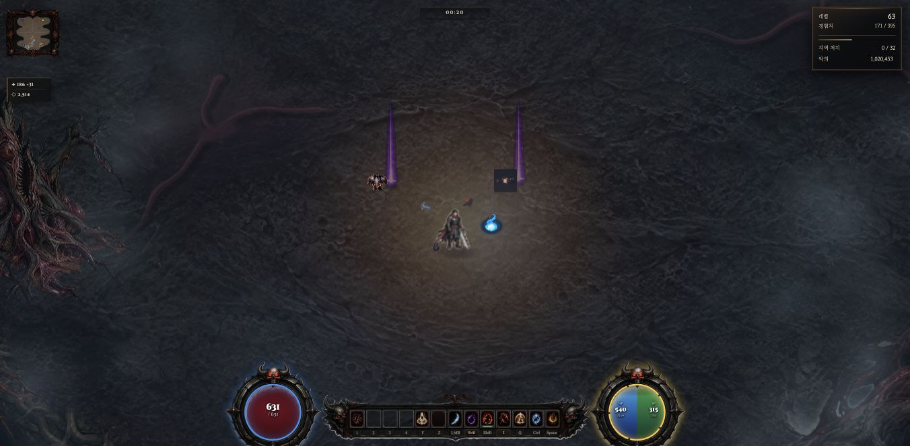
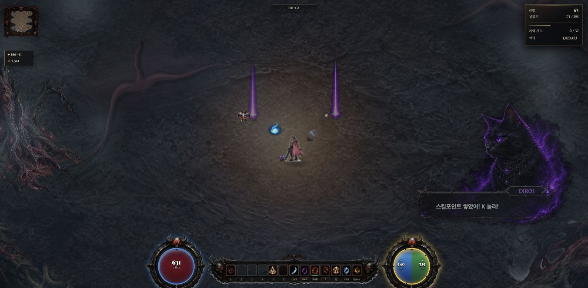

# ITEM 월드 드롭 폴백 마스킹 수정 — 2026-10-01

판정: **컷아웃 실패 후 물리 PNG 마스킹 누락 수정 PASS**. 신규 고유 원화 채택·전종 34px 가독성·NW.js 패키지·최초 처치 CPU 문제의 완료 판정은 아니다.

## 변경과 보호 범위

인수 복구 지점은 `7ad4d52cfaa56b23e7e9ef30aa479f584e3fdb97`이다. 총괄 §18.9에 실패 재현과 소유권을 기록한 뒤 root가 본편 `game.html`의 `_worldItemSkin` 두 줄만 바꿨다. 최초 `img.src`를 할당한 직후 정규화된 주소를 `_worldDropCutoutSrc`에 저장하고 현재 주소와 같을 때만 밝기 마스킹을 생략한다. 컷아웃 실패 후 물리 PNG는 마스크 캐시를 사용한다. 기존 `onload`/폴백 시작 캐시 무효화와 준비되지 않은 이미지의 null 반환은 유지한다.

쉬운판 전체 바이트와 검수에 사용한 원화 3개의 HEAD/디스크 SHA가 같다. DOM `_itemSkin`, 아이템 ID·확률·경제·저장·전투·마스크 임계 24/72·드롭 크기 34px·빛기둥은 변경하지 않았다. 기존 정규화 22항목과 타 작업 인덱스를 보존한다.

## 실제 검사

| 구분 | 수정 전 | 수정 후 | 범위 |
|---|---:|---:|---|
| 기존 ITEM 감사 | 25 PASS / 1 FAIL | 26 PASS / 0 FAIL | 실제 함수 AST + DOM/Image/canvas 스텁 |
| 새 회귀 | 7 PASS / 2 FAIL | 9 PASS / 0 FAIL | 실제 함수 + native canvas 픽셀, 이미지 로딩만 제어 |
| 관측기 회귀 | 폴백을 cutout-bypass로 오분류 | 15 PASS | actualSrc/실제 반환객체로 miss·hit·raw-fallback-unmasked 구분 |
| BUILD 입력 감사 | 이번 변경 전 결과 별도 이력 | 25 PASS / 2 WARN | 필수 참조·캐시·95파일 입력, 패키지 실행 아님 |

회귀는 정상 컷아웃 무마스킹, 초기/폴백 대기 null, 물리 폴백 마스크 1회/재사용, 양쪽 실패 null, 일반 이미지 재로드 무효화, 동일 Image의 컷아웃→물리→컷아웃 전환과 쉬운판 기존 구조를 검사했다. BUILD 경고는 선택 항목 credits.html/forge-tabs-v3 부재이며 이번에 파일을 만들지 않았다.

## 단일 실제 브라우저 검수

Chrome의 `http://localhost:3340/game.html?test=1&testchar=1&slot=item-fallback-qa`를 사용했다. 저장은 기존 QA 서버의 `tmp/mac-migration-runtime/saves`로 격리되며 사용자 127.0.0.1 원본 슬롯과 PC는 건드리지 않았다. 게임은 1개, 동시 빌드·인코딩·이미지 생성은 0개다. 정상 부팅과 튜토리얼 건너뛰기 UI 후 테스트 드롭 두 개를 메모리에 배치했다. 자연 처치 드롭 확률 검사는 아니다.

지원되는 CDP Network.setBlockedURLs로 belt 컷아웃만 임시 차단했다. 이미지 파일을 삭제/이동/대체하지 않았다. 수정 전 실제 디스크 코드로 재현했고 수정 후 정상 새로고침으로 새 Image 캐시에서 검사했다. 같은 시작 위치/카메라에서 정상 갑옷은 왼쪽, 대체 허리띠는 오른쪽이다. 시간·펫 대사·애니메이션은 달라 전체 프레임 픽셀 비교 자료는 아니다.

| 이미지 | 수정 전 | 수정 후 |
|---|---|---|
| 정상 armor 컷아웃 1254² | IMG, 마스크 없음, 모서리 alpha0 | 같은 IMG 경로·마스크 없음·동일 픽셀 집계 |
| belt 물리 폴백 256² | IMG, 전체 65536px alpha255 | CANVAS, 완전투명2365/불투명3469/중간알파59702px |
| 물리 PNG 모서리 | RGBA [21,20,28,255] | readback [24,24,24,21] |

입력 maxRGB28에 기존식 `(28−24)/48×255`를 적용하면 alpha21이다. 출력 RGB는 낮은 알파 readback 반올림의 영향을 받을 수 있다. 출력 RGB/alpha를 다시 임계값과 비교해 마스크 오류로 해석하지 않는다. 정상 컷아웃 집계 일치는 전체 픽셀 해시 대조를 뜻하지 않으며 원화 SHA와 무마스킹 반환도 함께 확인했다.

우측 불투명 사각형은 해소됐다. 대체 벨트 원화가 작고 희미해 34px에서 정밀한 형태 식별은 남은 아트 과제다. 이 결과를 전종 가독성 PASS로 확대하지 않는다. 기존 임계를 임의로 바꾸거나 새 고유 원화를 연결하지 않았다.

물리 벨트 캐시를 한 번 비운 별도 계측에서 256² 마스크 1회 **2.9ms**, 후속120호출이 같은 canvas이며 추가 마스크 0회였다. 초기 전체 마스크 3회 기록에는 빛기둥 마스크가 섞여 있으므로 아이템 3회로 보고하지 않는다. 이 단일 표본은 소스 처리 비용 관측이며 매프레임 비용·디코드 시간·전체 프레임 향상·PC329ms 해결을 뜻하지 않는다.

boots 컷아웃과 물리 PNG를 모두 임시 차단한 경우 `naturalWidth=0`, 반환 null이었다. 정상/폴백 두 장비는 실제 R키 입력으로 획득하여 bag10→12, 두 객체 포함 true, 월드 잔여0을 확인했다. 짧은 자동화 R 입력 일부는 처리되지 않아 재입력했다. 이는 별도 입력 경계 관찰이며 이번 이미지 수정으로 입력 안정성까지 해결했다고 하지 않는다. 마지막에는 요청 차단을 빈 목록으로 복원하고 원래 마스크 함수를 되돌린 뒤 임시 probe 제거·게임 이탈을 확인했다.

## 협업·증거·다음 작업

기존 ITEM/QA/UIUX/ART/BUILD CLI 세션을 실제 상태 조회 후 읽기 검토에 재사용했다. 새 CLI 팀은 만들지 않았다. 지원 QA가 회귀 파일을 작성·실행했고, 지원 ART가 관측기 오분류 회귀를 실제 수정·실행했으며, 지원 BUILD가 docs 검색과 미완료 목록을 정리했다. 생산 HTML·실제 게임·Git은 root 소유다. 팀 보고 중 왼쪽 정상 대상을 검/물약으로 부른 오류와 알파 임계 해석 오류는 정정 보고까지 받았으며 이 문서에는 실제 대상과 식을 기록했다.

[원자료 묶음](item-fallback-evidence/evidence.zip)에 red/green, 전후 소스·이미지 집계, 캐시·양쪽 실패·획득·정리 JSON, 입력 해시, docs 검색, 팀 영수증을 보존한다. [11팀 다음 작업 감사](item-fallback-evidence/다음작업-감사.md)는 제안과 실행 완료를 구분한다. 이번 ITEM 수정 뒤 우선 확인할 별도 항목은 짧은 R 입력 경계이며, 전체 MAP020·M5 경로·GL/부활·음악 청취·패키지는 각각 기존 미완료 게이트다.

양쪽 HTML의 JavaScript inline 6개씩 acorn 구문 검사 통과. 첫 검사 명령은 importmap JSON을 JavaScript로 오인해 실패했으며 type별 분리 후 통과했다. BUILD 원문 중 “Windows x64 대상이라 Mac에서 산출 불가”는 이 검수로 입증되지 않은 추론이므로 채택하지 않는다. 이번에는 플랫폼 간 패키지 생성/Windows 실행을 시도하지 않았다는 사실만 유지한다.
