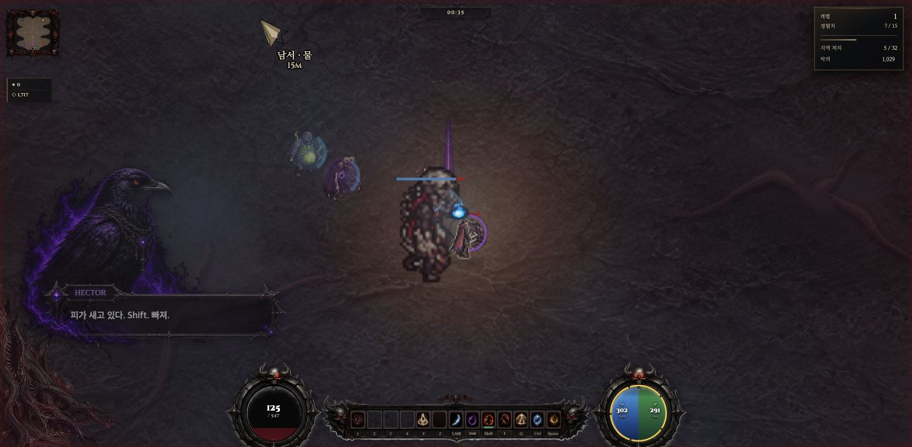

# QA-B01 — 드롭 빔 20타일 부트 준비 (2026-10-01)

**본편 구현·검수 완료. 전투 중 최초 빔 타일 마스킹을 기존 캐시의 부트 생성으로 이동했다. 전체 프레임 지연 해결이나 FPS 개선율을 의미하지 않는다.** 쉬운판·NW.js 패키지·배포에는 적용하지 않았다.

기준 원격 `972477e1995ba6dd3eccf5b28e2dcd7840fbabc2`, 검수 생산본 SHA256 `78c3a0c763eb32cb39056835d3eaf30f3402bc054a463028bde783bf4e4f0e28`. 수정은 `game.html`의 준비 함수·공통 부트 await·부트 세대 번호와 관련 테스트/guard baseline/docs다. 기존 `_worldDropFxTile`, `_maskWorldDropBlack`, `_getWorldDropBeamTier` 본문은 원본과 바이트 동일하다.

## 구현과 보호 계약

| 항목 | 최종 동작 |
|---|---|
| 준비 위치 | 공통 `_boot`의 `_preloadAssets()` 이후, `_bootRenderer()` 이전에 `_prepareWorldDropFx()` await. G.on 이전 |
| 대상 | 기존 v3 PNG 2장·각1024×2560, 2열 정사각512², 표시 가능한 단수1~10의 총20타일. 크기·유효 행은 이미지에서 확인 |
| 캐시 | 기존 `_worldDropFxTiles`만 사용. 성공한 객체는 재사용하고 동일 세션 재호출의 타일 가공0 |
| 분산 | 준비된 이미지의 유효 타일을 한 task에 최대1개 처리, 다음 타일 전 setTimeout(0). 이미지 대기만 남으면30ms 재확인 |
| 예산 | **새 선택적 준비 예산5000ms**. 기존 `_preloadAssets`의15000ms와 별개이며 뒤 시작경로의 최소 표시시간에 자동 흡수되지 않음 |
| 시간 한계 | 타일 시작 전 deadline 확인. 실행 중 동기 가공은 선점하지 않으므로 마지막 타일·백그라운드 타이머 지연만큼 5초를 넘을 수 있음. 무한 이미지 재시도 없음 |
| 취소·실패 | G.on/로딩 종료/kill/새 부트 세대에서 다음 task 중단. 처리 예외는 failed로 종료하고 이미 만든 캐시 보존. 이미지 실패·타일 부족은 partial, 미완료는 기존 lazy/null 폴백 |
| 재진입 | 진행 중에는 같은 Promise. 새 세대의 동시 호출도 이전 cancelled 결과를 공유하며 자동 재시작하지 않음. settle 뒤 재호출 가능. 실제 공통 부트는1회 호출 |
| 진단 | 준비 구간의 created/reused/unavailable/processingMs/maxTileMs/elapsedMs/pixelBytes 기록. 프레임 루프에 새 계측 없음 |
| 외형 | 알파24/72·색/합성·2프레임180ms·60×160·타일순서·layerLv 우선/rarity 폴백 그대로 |
| 게임 | 드롭 생성/개수/확률·아이템 데이터·획득·RNG·저장·사망/파편 함수 변경0 |

`ready`는 기존 함수가 캐시를 반환했다는 의미다. 원래 마스크 함수는 내부 읽기/쓰기 예외를 삼키므로 ready만으로 픽셀 정확성을 보장하지 않는다. 새 코드에서 그 기존 처리 계약을 바꾸지 않았으며 성공 경로 픽셀을 별도 확인했다. 지연·실패로 준비되지 못한 타일은 전투 중 최초 생성 비용이 남을 수 있다.

## 픽셀·회귀 검수

- Chrome 실제 Canvas에서 기준 커밋의 lazy 함수와 준비 결과 **20타일×1,048,576바이트 전체 비교: 차이0, 최대 채널 차이0**. 같은 캐시 객체 재사용20/20, 두 번째 준비 created0/reused20/processing0. 성능 전투와 별도 페이지에서 readback했다.
- 테스트30/30: 준비 전용9개(공유 Promise, 타일별 yield, 객체 재사용, 이미지 지연/실패/짧은 크기, timeout, 전투/취소/새 부트, 예외 후 재시도, deadline 초과, 부트 연결), 기존 ITEM/부트/머리 준비 회귀21개.
- guard PASS, 실행 가능한 inline script6개 구문 PASS. 별도 최초 구문 추출은 JSON 데이터 블록을 JS로 파싱해 실패했고, 실행 script만 선택하도록 검증 명령을 바로잡아 통과했다. 게임 코드 구문 오류가 아니었다.
- 실제 부트 준비20개, 원본 이미지 규격 확인. 픽셀 페이지의 준비 시간은 별도 격리 조건 값이며 전투 성능으로 쓰지 않는다.

## 로딩 비용·메모리

| 실행 | 준비 elapsed | 가공 합계 | 타일 최대 | 준비 개수 |
|---|---:|---:|---:|---:|
| 생산 game.html 새 원점 실제 부트 |339.5ms|81.5ms|34.6ms|20|
| 총 로딩 측정용 진단 사본 |372.8ms|84.2ms|36.1ms|20|
| 저장 재실행 진단 사본 |425.5ms|66.9ms|16.2ms|20|

진단 사본은 검수 생산본에 `<base href="/">`와 show/hide/prepare의 읽기 계측 wrapper만 추가했다. 최초 부트 시작688.6ms→첫 hide11592.9ms, **관측기 시작→최초 로딩 숨김10904.3ms** (첫 show→hide10904.2ms, 당시G.on=false; 플레이 가능까지의 전체 시간은 아님). 준비 구간은5483.0→5856.1ms이며 이후 DEMO 로딩이 별도로 시작됐다. hide가 같은 timestamp에2번 호출되는 기존 동작은 중복 합산하지 않았다. 비교용 동등 무수정 부트 표본이 없으므로 총 로딩 증가율은 계산하지 않는다. 준비 await의339.5~372.8ms는 이번 관측의 직접 추가 구간이다.

최대20타일의 RGBA 명목 용량은**20,971,520바이트(20MiB)**다. 전투에서 쓰이지 않을 타일까지 미리 할당해 첫 처치 지연을 줄이는 비용이며, 다른 캐시와 GPU 텍스처/드라이버 복사본을 포함한 총 메모리 상한이 아니다. 진단 준비 앞/뒤 `performance.memory.usedJSHeapSize`는259,415,553→366,080,876바이트(+106,665,323; 약101.72MiB). 이는 동시에 진행되는 에셋·임시 ImageData·GC/프로세스 공유 영향을 포함하는 JS 힙 관측값으로 **타일의 순수 추가 상주 메모리로 귀속할 수 없다**. `measureUserAgentSpecificMemory` 미지원·crossOriginIsolated=false, GPU/브라우저 총 메모리는 미측정이다. 메모리 누수/장시간 안정성 판정은 하지 않는다.

## 정상 전투 관측 — 전 시도 보존

Chrome152 기존 프로필, 전경·보이는 게임1개, Mac3340·격리 .localhost 원점, viewport1352×663/DPR1/canvas1352×662, WebGL(webgpu=0), high/res100/SSAA1/fpsCap0/parts80/diff5. 입력 구간 atmos1 유지. 초기 부트 atmos2→1은 기존 자동 품질 동작이며 수동으로 바꾸지 않았다. 팀11개done·별도 빌드/인코딩/생성 없음. VS Code 및 OS 백그라운드 프로세스 부하는 존재해 통제된 전용 머신 비교가 아니다.

처음 계획은 최대2회였으나 두 표본의 빔 호출이0이라 수락 조건 미충족이었다. plan.json에 이유를 남기고 **추가1회**를 실행했다. 모든 표본을 보존하며 성공 표본만으로 전체 개선율을 산출하지 않는다.

| 표본 | 코드·입력 | 관측 시간 | 처치 | 빔 호출 | 판정 |
|---|---|---:|---|---:|---|
| 1 | 실제 game.html, 새Lv1 HP582, native click/W |19.6956s 자연 사망|0→7|0|장비2개 모두rarity0, 빔 경로 검증 불가 |
| 2 | 같은 게임 정상 재시작, native click/W |25.0021s|7→7|0|추가 처치/드롭 없음, 빔 검증 불가 |
| 3 | 위 진단 사본, 부트 wrapper 복원 후 새Lv1 HP547, native click/W/drag |25.0077s|0→7|620|자연 rarity3 장비의 첫 빔 캐시 적중 |

장비·조우는 랜덤이고 기록했다. 강제 HP·무적·품질·RNG·tick·적 생성 없음. W 입력은 약1.0/1.6ms, native drag의 마우스 유지252.5ms로 사람이 연속 조작하는 표본과 다르다. 자동석궁/펫과 수동공격의 막타 기여는 분리하지 않았다. 입력 직후 AX 확인 이후26초 동안 게임 조회·스크린샷·빌드 없이 관측했다.

### 빔 수락 결과와 잔여 지연

표본3 최초 빔은 kill2의 frame1/tile3(4단 보라), 이어 frame0/tile3. 모든620호출의 포함 경과시간 최대**0.1ms**, 합계2.1ms. 별도 cache probe는 관측 종료 후 회수까지980호출·miss0·객체 변경0·최대0.1ms를 기록했으므로620과 구분한다. 원자료에 `_worldDropFxTile` 부모의 마스크 span은0이다. 실전 확인은 자연 rarity3의 tile3·두 프레임으로 한정하며20종 전부의 실전 검증은 아니다. 즉 종전79.7/66.6ms의 첫 타일 마스킹 경로가 이 성공 부트 표본의 전투에서는 실행되지 않았다. 서로 다른 장면의 총 성능 개선율은 주장하지 않는다.

| 표본 | 실제 draw 시작 간격 p95/p99/max | >50/>100ms | draw 경과시간 p95/p99/max |
|---|---|---|---|
| 1 |36.9/40.7/111.7|3/2|1.7/2.9/109.1|
| 2 |28.1/29.5/51.1|1/0|0.8/1.5/1.9|
| 3 |38.8/50.6/143.7|8/2|1.0/5.5/140.0|

표본3:799loop/draw·1486update, skip0, 독립rAF p95/p99/max41.7/50.3/141.8ms, >50/>100은9/2. draw 호출률31.95Hz는 화면 표시 FPS가 아니다. dropped0, 옵션initial/final동일, focus/visibility조건 유지.

**잔여:** 표본3의 `_worldItemSkin` 안 마스크86.7/136.5ms, 별도draw105.6ms·loop밖73.6ms 미귀속. 표본1에도 스킨 마스크105ms. 이전draw124.3/loop밖62.8 및 PC329ms를 해결로 표시하지 않는다. CPU 사용량·GPU시간은 측정하지 않았으며 경과시간끼리 중첩 합산하지 않는다. 다음 분리 대상은 QA-B01의 월드 아이템 스킨 최초 가공이며 이번에는 수정하지 않았다.

## 획득·저장 기능 검수 (성능 표본과 분리)

표본3 관측 종료 후 게임은 계속 진행되어 수거 조작 전에 자연 사망했다. 따라서 정상 재시작 후 같은 자연 rarity3 장비 데이터를 캐릭터 근처에 `_wiPush`로 재주입한 **기능 fixture**를 사용했다. 실제 입력 핸들러에 합성 R80ms를 전달해 update의 수거→pickupItem→저장 경로를 실행했다. 자연 드롭 성능 표본·사용자 물리 입력으로 주장하지 않는다.

가방10→11, 월드 미수거 객체 제거, 획득 알림 `영웅 녹슨 해머 획득!`, 가방·`hellsave_demo`의 아이템ID 동일. 새로고침 후 같은 ID·수치·어픽스가 복원됐고 기존 마이그레이션 필드 `_nameMig:1`, `_spdMig:3`이 추가됐다. 전체 JSON 동일로 주장하지 않는다. 사용자 기존 저장 원점·서버 저장은 건드리지 않았다. 재실행 후 설정창에는 diff10이 표시됐으나 세 전투 표본은 initial/finaldiff5였다. 이번 변경 밖의 저장 설정/재실행 현상으로 남기며 원인을 확정하거나 이번 수정으로 해결했다고 하지 않는다.

## 정리·인수

기존 qa_review 독립 검토에서 정상 단일 부트의 차단 결함 없음, 예산/ready 의미/재진입 경계를 확인했다. 원자료 통계·테스트를 별도 근거로 구분한다. 계측 observer 전 binding 복구true·cleanupErrors0, 별도 타일 wrapper 복구true, 진단 부트 wrapper도 전투 전에 복원했다. 검수 탭 about:blank 이탈 및 viewport원상복구, 기존22경로·공용인덱스·PC/원래3333·VSCode신뢰대기 보존. 세이브는 격리 QA 원점에만 남아 있다. 대형 패키지 빌드는 하지 않았다.

원자료·사전계획/추가시도 사유·픽셀 fixture·진단 부트 계측·30테스트·독립검토는 `drop-prewarm-evidence/evidence.zip`와 manifest에 보존한다. 원격 체크포인트는 push 뒤 현장 outputs/drop-prewarm-20261001/checkpoint.json에 기록한다.

