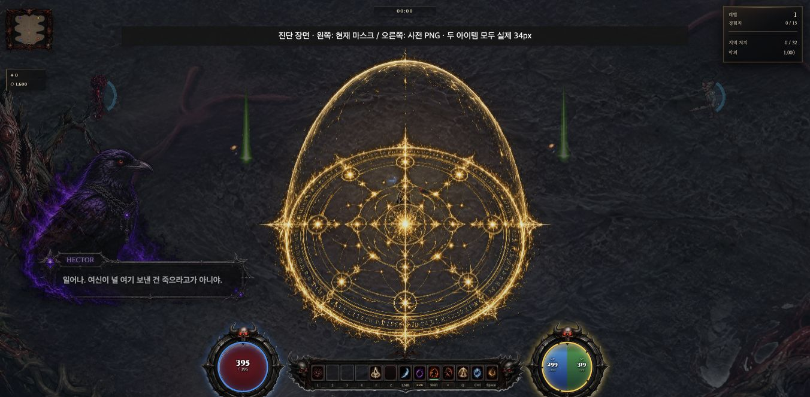

# Mac ring_phys 사전 마스크 PNG 재사용 진단

2026-10-01. 기준 원격 `61d3b1ec6b6c7a1c8cc12888d380229fe6a7d132`. **판정: 물리 반지에 한정한 PNG 재사용은 적용 가능한 후보다. 생산 반영은 0이다.** 세부 관측기를 뺀 동일 원점 내 paired 대조 3회 모두 요청→최초 제출 반환까지 후보가 짧았다. 중앙값 기존9.9ms/후보4.9ms. 실제 Canvas·PNG 재디코드 RGBA 차이0, 34px 시각 및 폴백 계약을 확인했다. 자연 전투의97.4ms·전체FPS·PC329ms 해결은 아직 검증하지 않았다.

## 착수·출처·소유권

최신 AGENTS·총괄18.18·연속진행·백업정책 및 ITEM/QA 문서를 확인했다. root가 단일 게임과 독립 진단도구·증거·관련 문서를 소유했다. 기존 qa_review는 읽기 검토만 재사용했으며 새 팀/채팅/CLI는0이다. 실제 CLI 조회는 background11 done/interactive1 idle이었다. 사용자 VSCode·초안·3333·PC를 조작하지 않았다.

| 자원 | 확인 결과 |
|---|---|
| 현재 물리반지 원본 | `output/imagegen/item-skins/ring_phys.png`, RGB8 256², 52,346바이트, SHA256 `2f3a05692db24dbd36562681921ac72613fd97e44c3210083a4324805355137e` |
| 실제 로드 근거 | 직전 생산 정상전투의 ring phys 행: 초기 pending→같은 원본 URL 로드→마스크97.4ms. 아이템ID·currentSrc·단계시간을 prior-natural-ring.json에 보존. 이번 fixture와 별개 |
| 생성 출처 한계 | 보존된 최초 Git 이력은 `955a2758fa2f1865a9c1c5d3900418d543f3a3d3` 안전 스냅샷. 원 생성 모델·프롬프트는 보존 JSON/Markdown에서 찾지 못했으며 imagegen 경로 이름으로 추정하지 않음 |
| 기존 컷아웃 | `img/ui/item-cutouts/ring_phys_cutout.png`와 `output/imagegen/item-cutouts/ring_phys.png` 모두 없음. `_ITEM_CUTOUT_BASES` 기존14종에 ring 없음 |
| 기존 생성 도구 | `tools/build_item_cutouts.py`는20/70·bbox crop·224내용/256재배치·LANCZOS. 현재24/72·원래 위치/크기와 달라 실행·재사용하지 않음 |
| 진단 PNG | 원래 Image를 기본2D Canvas에 draw하고 현행 `_maskWorldDropBlack`를 그대로 호출한 실제 Canvas를 PNG로 직렬화. 크롭/리사이즈/새 아트 생성 없음 |
| 파생 결과 | RGBA8 256², 69,119바이트, SHA256 `812b47358d293d3dc2c154ab5989470add22eb3f1bb7f2edf9f78cde16da0a96`. 원본보다16,773바이트/약32.0% 증가 |

원본 게임·easy·원화·생성 도구 해시는 착수/종료 동일하다. 본편 SHA256 `593a7a9d84c78402f04c50c94ae169e237e49751ad58d8640e78e672850728f2`. PNG는 `tmp/ring-png-20261001/`에서만 읽고 증거 폴더에 보존했다. 본편이 이 경로를 참조하지 않는다.

## 비교 방법과 비용

Chrome152/Mac, WebGL, webgpu=0, 1352×663/DPR1, 부트 종료·G.on=false의 통제 fixture다. 새 원점은 같은 브라우저 프로세스와 GPU를 공유하므로 완전 cold가 아니다. 재접속도 HTTP/디코드/GPU warm을 보장하지 않는다. 코드/원화는 같은 입력이며 원점마다 두 경로를 순서 교대해 비교했다. 두 함수는 같은 기존 캐시를 사용하되 원본과 PNG 키가 다르며, 각 측정 시작 전 해당 키와 resource entry가 없음을 검사했다.

원래 함수와, 메모리에 복제한 동일 함수의 `base==='ring'&&el==='phys'` URL 선택만 다른 진단 함수를 비교했다. 게임의 생산 함수는 시간 측정 중 후보로 교체하지 않았다. load 이벤트 다음 양쪽 모두 명시적 `Image.decode()`를 기다리고, 반환→34² `X.drawImage/_flush`→동일객체120회 반환을 측정했다. 이는 자연 경로에 없는 decode 확인 대기를 포함한 통제 실험이다. decodeSettleMs는 load 중 이미 수행된 작업을 제외한 **추가 완료 대기**이며 순수 디코드 CPU시간이 아니다.

원자료 필드 `firstDisplayMs`는 이름과 달리 **요청 시작→drawImage/_flush 반환까지**다. 실제 디스플레이 표시 완료나 GPU 완료 시간이 아니다. totalMs는 그 뒤120회 반환까지 포함하는 단일 구간이다. get 안의 draw/read/loop/write 시간을 total에 다시 더하지 않는다. 표의 각 단계 중앙값도 서로 다른 표본이므로 합산하지 않는다.

### 관측기 없는 주 대조: 새 원점3쌍

세부 관측기 비대칭 오버헤드 우려를 발견해 계획에 이유를 기록하고 추가3쌍을 수행했다. 세 쌍 모두 diff5/atmos2, 같은 쌍 안의 옵션은 동일하다. 마지막 plain3은 측정 전후 focus=true/hidden=false도 기록했다. 앞 표본들의 focus/visibility를 개별 저장하지 않은 한계가 있다. 동시에 다른 게임·빌드·인코딩·대형 생성 작업은 실행하지 않았다.

| 표본/순서 | 기존 최초제출 ms | PNG 최초제출 ms | 기존/PNG total ms |
|---|---:|---:|---:|
| plain1 raw→PNG |13.7|8.0|13.9 / 8.2|
| plain2 PNG→raw |9.9|4.9|10.1 / 5.1|
| plain3 raw→PNG |9.7|3.9|9.9 / 4.0|
| 중앙값 |9.9|4.9|10.1 / 5.1|

| 별도 단계 중앙값 ms | 기존 | PNG | 해석 |
|---|---:|---:|---|
| 요청 함수 반환 |0.1|0.1|src 지정과 초기 반환 포함 |
| 요청 뒤 load 대기 |3.3|2.7|네트워크·이벤트·일부 디코드가 섞인 경과시간 |
| load 뒤 decode 확인 대기 |1.1|0.8|전체 디코드 CPU 비용 아님 |
| 로드 뒤 skin 반환 |6.8|0.1|기존 Canvas 마스크 / PNG는 Image 바로 반환 |
| 첫 X.drawImage/_flush 호출 |0.2|1.1|**PNG 쪽 증가**, 업로드/제출 경과이며 GPU 완료 아님 |
| 반복120회 반환 |0.2|0.2|모두 같은 객체 반환 |

### 세부 단계 관측: 새 원점3쌍+재접속3쌍

기존 경로에만 world-item-skin-observer를 붙인 초기6쌍은 단계 원인 관측으로 유지하고 주 성능 결론은 위 비관측3쌍에 둔다. 원래 함수 wrapping·snapshot 오버헤드는 정량 분리하지 않았다. raw 요청→최초제출5.4–15.3ms, PNG3.4–6.6ms로6쌍 모두 후보가 낮았으나 이를 무편향 벤치마크로 주장하지 않는다. 재접속 시 기존 앱 동작으로 diff10이 되어 새 원점diff5와 cold/warm 개선율을 직접 비교하지 않는다(모두G.on=false/atmos2, 각pair내동일).

| 표본 | 원본/PNG 최초제출 ms | 원본 draw / read / read→put / put ms |
|---|---:|---:|
| pair1-new |15.3 / 6.6|0.2 / 4.1 / 1.0 / 0.0|
| pair1-revisit |13.8 / 5.4|0.0 / 7.9 / 1.2 / 0.1|
| pair2-new |5.4 / 3.5|0.0 / 1.7 / 0.9 / 0.0|
| pair2-revisit |11.6 / 4.6|0.1 / 5.8 / 1.2 / 0.1|
| pair3-new |10.1 / 3.4|0.0 / 4.5 / 0.9 / 0.0|
| pair3-revisit |14.3 / 5.6|0.0 / 7.8 / 2.0 / 0.1|

각 원본마스크1회, PNG 성공은 Canvas마스크를 만들지 않았다. 0.0은 시간 해상도 이내다. read→put은 픽셀루프 포함 구간이다. 최초 재접속 부트 대기 CDP가3초 타임아웃한 설정 시도도 기록했다. 그 시점은 측정 시작 전이며 부트 종료를 다시 확인한 후 표본을 수집했다. 불리한 표본이나 시도를 폐기하지 않았다.

### 사전 처리·부팅·메모리 대가

- 파생 PNG 제작22.2ms: 로드5.8 / decode확인1.5 / draw0.3 / mask10.6 / PNG직렬화4.0. 파일시스템 기록·패키징은 제외다. 한 번의 제작 비용이며 게임 부트 시간으로 숨겨 옮기지 않았다.
- PNG 파일69,119바이트는 원본보다32.0% 크다. 프로덕션에 채택하면 원본 폴백도 유지하므로 설치 자산69,119바이트가 추가된다. 실제 전송 크기는 HTTP 캐시/압축에 따라 다르며 원자료 resource timing을 보존했다.
- 두 경로의 해상도는256²다. 기존은 디코드 Image 외에 마스크 Canvas 명목262,144바이트가 필요하고 PNG 성공은 그 Canvas가 없다. 이 값은 잠재적 Canvas 한 장 차이일 뿐 **실제 메모리 절감량이 아니다**. 디코드·GPU 업로드·캐시·GC 총량 미측정, PNG실패/다른속성경로는 원래 Canvas를 만들 수 있다.
- 이번 진단은 부트 뒤 실행했고 본편 부트·준비종수·원화는 변경0이다. 추가 부트 선가공을 제안하지 않는다. 생산 부팅시간 A/B와 실행 패키지는 미검증이다.

## 픽셀·실크기·보호 계약

실제 마스크 Canvas의 PNG 저장→재디코드→Canvas 비교에서256² RGBA262,144바이트 차이0/알파차이0, 34² 축소4624바이트 차이0. 이 검사들은 타이밍 뒤/별도 작성 원점에서 실행했다. 최종 실제게임 캐시 Canvas 자체를 직접 읽은 비교도262,144바이트0diff다. 두 종류 검사와 직접비교 snippet을 모두 보존했다. putImageData 이전의 배열을 기준으로 삼지 않았다.

시간측정 뒤 원래mkItem을 사용한 동일물리반지2개를 `_wiPush`로 배치한 **주입된 시각 fixture**다. 한 아이템만 메모리 wrapper에서 PNG 후보로 선택해 실제 월드draw를 통과했다. 각987회 호출, 기존반지/PNG반지 같은 실루엣·색과 투명배경을34px로 확인했다. 처음 생성된 보호막과 겹쳐 두 fixture만 좌우265px로 이동했다. 게임월드/HP/옵션을 바꿔 자연 성능 표본을 만들지 않았다. 일시정지 시각 fixture이며 자연 전투 인수가 아니다. 이후 wrapper/마스크/경로함수·관측기 복구, about:blank 이탈·viewport reset 완료.

| 계약 | 결과·범위 |
|---|---|
| PNG성공·반복 | 실제Image반환, 같은객체120회/각표본 재사용. 성공시추가마스크없음 |
| PNG404→raw | 실제없는PNG URL에서 원본phys로1번폴백, 최종Canvas와같은캐시 재사용 |
| 양쪽404 | 실제둘다없는URL에서최종null/naturalWidth0, onerror해제·재시도루프없음 |
| PNG↔raw | 실제소스교체후loadedURL에따라Image/Canvas분기복귀. 캐시된소스로즉시전환하면complete가true여서pendingNull=false였음 |
| 늦은load무효화 | 실제따뜻한PNG→raw교체에서즉시가공→onload초기화→가공으로2회. 기존동작잔여이며PNG후보가고쳤다고하지않음 |
| 진짜pending·지연 | ControlledImage 회귀에서complete=false동안null,성공뒤가공/반환. 실제브라우저의느린응답전환을강제한시험은아님 |
| 다른속성·컷아웃 | 후보테스트에서dark/ice ring의원래경로와기존swordcutout보존. ring을전역cutout목록에추가하지않음 |

새 진단계약7개 + 기존 폴백9개 + 관측기4개 = **20/20 PASS**. 독립 qa_review는 코드/원자료 읽기 검토만 했고 실제 검사 실행은root가 했다. 자연 전투는 직전 기록의97.4ms가 문제 근거이며 이번에는 재현·개선 표본을 새로 주장하지 않는다.

## 다음 최소 제안·완료 상태

다음 한 건은 `_worldItemSkin`에서만 `base==='ring' && el==='phys'`일 때 검증된 PNG URL을 선택하고 기존 실제src일치 컷아웃 우회/폴백을 재사용하는 좁은 생산 후보다. `_ITEM_CUTOUT_BASES`나 `_itemSkinSrc` 전역 변경은 dark 등속성 및 DOM스킨까지바꿀수있으므로제안하지않는다. **현재는 제안과독립진단만완료,본편연결0**이다. 자연드롭·획득저장·패키지·원격 PC 검수는 실제 생산 후보 단계에서 별도 수행해야 한다.

기존22경로 상태·빈 공용인덱스와 원본 게임/easy/PNG 해시를 확인했다. 자기범위 도구·7회귀·문서·파생PNG·원자료만 커밋/푸시하고원격ref SHA를대조한다. 현장 `outputs/ring-png-20261001/checkpoint.json`에원격영수증을남긴다. 게임측정종료, 빌드실행가능이며이번패키지빌드없음. 원자료 [evidence.zip](ring-png-evidence/evidence.zip)과 [재현 절차](ring-png-evidence/README.md)를 따른다.
