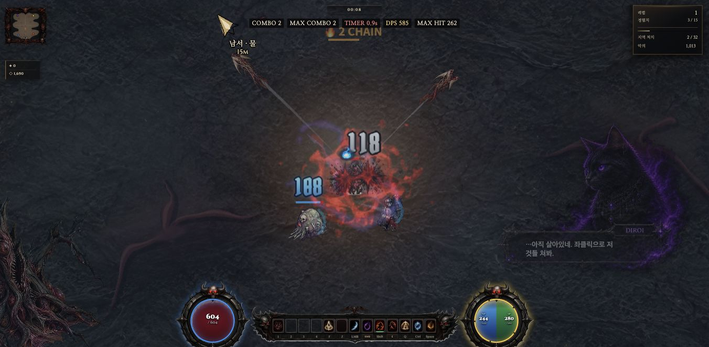

# Mac 첫 시체 캡처 준비 — 2026-10-01

판정: **첫 머리 파편 복사에서 관측한 동기 지연을 전투 전 로딩으로 이동하는 최소 변경을 채택**했다. 전체 FPS·모든 환경·PC329ms 해결 판정은 아니다. 기준 커밋 `389f5758d2f2510a10af3e2b7cf5880095191259`, Mac migration 체크아웃·3340·격리 저장 경로를 사용했다.

## 원인 분리

정상 WebGL 자연 처치 7건을 소스/대상 객체 ID와 함께 관측했다. 첫 `_addCorpse` 9.2ms 중 `_addHeadGib` 8.9ms, 그 안의 `_gibC`48×48 → `_splits[0]`64×64 `drawImage`가 8.6ms였다. 뒤의 새 슬롯1–4는 0.3/0.1/0.1/0.3ms, 슬롯0/1 재사용은 각각0.1ms였다. 중첩 시간은 합산하지 않는다.

원본 south atlas는2048×1280, complete=true이며 기존 GL warm Set에 있었다. scratch는 이미 willReadFrequently=true이고 split은false다. 따라서 기존 옵션·GL 캐시를 중복 추가하지 않았다. 다른 새 대상에서도 빠르다는 결과는 공통 첫 사용 준비 후보를 지지하지만 PNG 디코드·GPU flush 등 내부 원인 자체를 확정하지 않는다. 활성 `_addHeadGib`는 뒤쪽 선언이며 앞 선언이 중복 실행되는 것은 아니다.

## 구현 계약

| 항목 | 실제 구현 |
|---|---|
| 범위 | 본편 game.html에 helper24줄 + 부트 완료 호출1줄 변경. 쉬운판·배포 패키지 미적용 |
| 호출 | setBootLoading의pct>=100에서 `_warmHeadCapture2d()` 후 hideBootLoading. optional 예외도 로딩 종료 유지 |
| 실행 조건 | WebGL, G.on=false, deathFx=true, 준비된 CH1 south atlas, 기존slot0 비활성, 세션 내 미완료 |
| 복사 | 실제atlas cell(기본256)의0,0→기존scratch48², scratch의(0,0,48,14)→기존split64² |
| 정리 | 양쪽캔버스 clear를 각각시도. draw/정리실패시done=false로재시도가능. 성공때만done=true |
| 진단 | `_headCaptureWarmMs`가 해당 준비의 동기시간 기록. 프레임별 계측 아님 |
| 보존 | 새 캐시·canvas·타이머·강제readback·GL업로드 없음. RNG·active/life/물리·개수·크롭·사망·보상·저장·품질 수치 변경0 |
| 미준비 경로 | 이미지미완료/활성슬롯/이미전투중이면생략. 다음부트완료에서재시도가능, 모든세션예열보장아님 |

본편 전체에서 helper와 부트 한 줄을 제외한 바이트가 이전 소스와 동일함을 검증했다. 최종 SHA256 `4fe6a6e0806126a595c2933beb925233eba03174832a216b78928fe9ec8e897e`.

## 실제 측정과 한계

| 항목 | 수정 전 진단 | 수정 후 후보 관측 |
|---|---:|---:|
| 자연 처치 표본 | 7 | 3 |
| 첫 scratch→split 복사 | 8.6ms | 0.3ms |
| 첫 머리 함수 포함 | 8.9ms | 0.3ms |
| 첫 시체 함수 포함 | 9.2ms | 0.6ms |
| 후속 복사 | 0.1–0.3ms | 0.3/0.1ms |
| 전투 전 준비 | 없음 | 8.9ms |
| 입력 관측 시간 | 12.6126초 | 15.0295초 |
| rAF p95/p99/max | 41.7/42.7/116.7ms | 34.6/41.8/83.4ms |

두 실행은 Chrome152, viewport1352×663/DPR1, canvas1352×662, Lv1/high/res100/SSAA1/fpsCap0/parts80/diff5, 정상시작·nativeW2/좌클릭2다. CPUProfiler/GPUtimer/강제HP/스폰/피해/RNG/품질변경0. 막타 피해원은 자동석궁/펫과 분리하지 않았다. 원점별저장만분리했으며 OS프로필·GPU캐시를초기화한것은아니다.

수정 전 초기atmos1 유지, 후보는안내준비중2→1이며첫전투입력이전전환이다. 랜덤시작장비 때문에 HP597/544·조우·처치수도다르다. 따라서 프레임 수치의 차이를 개선율로 계산하지 않는다. 동일한2D복사의 첫동기대기 이동만 제한적으로 채택한다. 기존16:53 관측은DPR2·CPU프로파일 포함으로 이번DPR1과 직접A/B하지 않는다. 기존draw76.7ms·PC329ms와이번116.7ms/83.4ms공백의원인은여전히미귀속이다.

관측기는 설치/입력구간을분리하며8처치또는첫처치10초뒤종료(입력25초·설치120초상한), 반환/예외보존·원본복구를검사했다. baseline.raw와candidate-raw에원자료가있다. no native-code 여부는 복구기준으로부적절하다: 게임자체drawImage 이미지ready검사wrapper가원래있어그wrapper로복구된다.

## 시행 내역·회귀

실제게임4회: 수정전진단1, 초기hook미실행제외1, 로딩hook후후보관측1, 최종오류격리강화후기능회귀1. 초기 `_warmupEnsAtlas` 연결은 일반standalone에서전투전warm=false여서삭제했고 최종로딩완료hook로대체했다. 숨긴성공표본선택이아니다.

- 독립검토가정리예외와부트연결테스트누락을지적했고반영했다. 최종독립검토추가차단이슈0. 별도팀/게임생성없이기존qa_review재사용.
- 관련7테스트파일 **21PASS/0FAIL**, guard전체PASS·인라인스크립트6개문법검사PASS. guard.baseline의행수만63126→63151갱신. 중간실패1은prepared선언패치가다른동일문자열에맞은것으로,잘못추가한선언제거·올바른위치반영후재통과했다.
- 최종기능회귀는새게임정상부트warm=true/8.5ms, kills0/G.on=false에서실제RGBA읽기로scratch48²/split64²모든값0·slotactive=false/life0확인. 이readback실행은성능표본에서제외했다.
- 이어정상W이동·공격·자연처치로시체3·활성파편2/life96/ml180·HP604를확인했다. 실제화면에서전투·HUD·드롭과연출이보였으며부트예열잔상이없었다. 스크린샷과상태조회사이에처치2→3이므로완전히동일프레임으로표기하지않는다. 전체사망유형픽셀동등성/장시간플레이검수는아니다.
- 관측복구·게임about:blank이탈·viewport복구완료. final-natural-combat.png는실제전투화면, candidate-post-observation.png와before-post-observation.png는관측종료뒤사망화면이다.

## 인수·보호 범위

기존정규화22경로상태바이트동일·공용인덱스빈상태확인. 사용자세이브·PC·원래Mac3333·VSCode신뢰대기보존. Claude기존11팀done, 신규실행0;Codex기존지원qa_review만읽기검토후완료. 원자료·최종diff·테스트·독립검토는evidence.zip,핵심요약·실화면은인접파일에보존한다. 원격SHA는푸시뒤현장outputs/corpse-capture-20261001/checkpoint.json에기록한다.

후속우선순위: 별도조율된일반전투에서남은긴프레임의update/draw/드롭경로를동일시간축으로분리한다. 이번변경을근거로고주사율·Windows패키지·전체첫처치문제를완료처리하지않는다.

