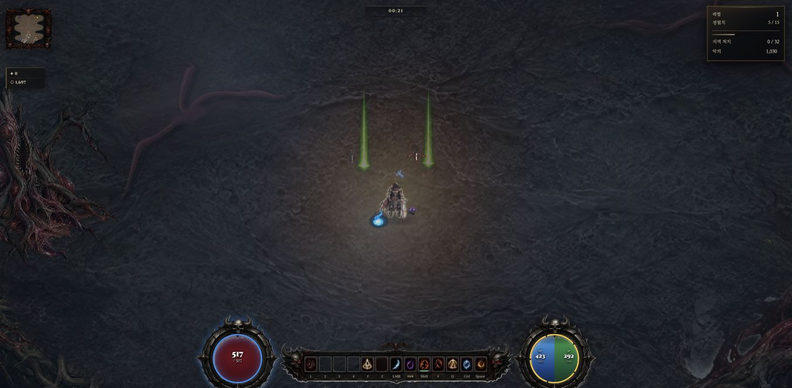
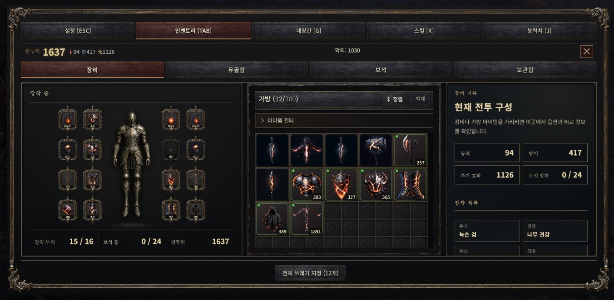

# Mac 월드 아이템 스킨 2종 부트 준비 검수

2026-10-01. 입력 원격 `cd31c6363a3750d0ae070c2793221b086b8384fe`. **단검·연사석궁 phys의 최초 마스크 가공을 부트로 이동하는 제한적 변경을 채택했다. 총비용 감소 목표는 부분 달성·미확정이며 QA-B01 전체 완료가 아니다.** 실제 생산 부트 비용 37.6ms를 지불했고, 별도 실제 월드 표시 fixture 846호출에서 추가 마스크 0과 동일 Canvas 재사용을 확인했다. 다른 스킨의 91–104.6ms 가공 지연은 남는다. 전체 FPS·PC329ms·GPU 시간·패키지 개선으로 해석하지 않는다.

## 소유 범위와 보호 계약

| 항목 | 현재 구현·제한 |
|---|---|
| 변경 | 본편 `game.html`에 `_prepareWorldItemSkins` helper와 부트 await 1개, 총49줄 추가. 원래 `_worldItemSkin`/`_maskWorldDropBlack` 함수는 바이트 그대로 |
| 호출 위치 | `_preloadAssets` → 기존 `_prepareWorldDropFx` → 새 두 스킨 준비 → `_bootRenderer` |
| 대상 | `output/imagegen/item-skins/dagger_phys.png`, `repeater_phys.png` 각256×256. 정상 부트당 신규요청 최대2개. 실제 첫 드롭을 예측하거나 모든137종을 준비하지 않음 |
| 예산 | 시작부터250ms의 협력적 deadline. 동기 Canvas 호출·브라우저 타이머 지연은 선점하지 못하므로 엄격한 최대 정지시간 보장 아님 |
| 메모리 | 기존 `_worldItemSkinCache`의 Image·마스크 사용, 별도 캐시 없음. 최종 두 RGBA Canvas 명목524,288바이트(512KiB). Image/디코드/GPU/임시재가공을 포함한 전체 메모리·최대치 미측정 |
| 기존 항목 | cache.has면 건드리지 않고 existing으로 집계. 로드 예정/실패/마스크유무와 무관하게 ready로 선언하지 않음 |
| 새 항목 | 기존 함수로 요청 → native load/error 또는 잔여 deadline 대기 → 부트/epoch/시간/소스/256² 재검사 → 기존 함수로 최종 마스크 |
| 취소·실패 | G.on·부트종료·kill·epoch변경 시 후속 가공 중단. 대기 중 취소는 이벤트/잔여 deadline까지 지연될 수 있음. 예외는 선택 준비만 failed 처리. 성공분과 원래 lazy/null/폴백 경로 보존 |
| 재진입 | 진행 중 Promise 공유, 종료 후 해제. 새 부트가 이전 취소를 공유하면 그 부트의 준비는 건너뛸 수 있고 lazy로 작동 |
| 로드 무효화 | dd3bdc의 원래 onload 마스크 초기화 유지. 따뜻한 픽셀의 즉시마스크→뒤늦은 load→최종마스크 중복 가능. 언제나 1회 가공이라는 보장 없음 |
| 불변 | willReadFrequently 힌트 없음. 원화/알파24·72/34px월드표시·컷아웃/드롭확률/아이템ID/경제/RNG/저장/전투/easy 불변 |

`_preloadAssets`에는 이 두 이미지가 없고 `_itemSkin`의 HTML lazy 이미지가 월드 Canvas를 소유하지 않는다. 실제 소유자는 `_worldItemSkinCache`다. helper+부트 한 줄을 제거하면 입력 파일과 바이트 일치한다. 기준 SHA256 `78c3a0c763eb32cb39056835d3eaf30f3402bc054a463028bde783bf4e4f0e28`, 생산 `593a7a9d84c78402f04c50c94ae169e237e49751ad58d8640e78e672850728f2`. 디스크/3340 응답 일치 확인.

## 동일 원화 fixture 비교와 실패한 시도

Chrome152 / Mac / WebGL / webgpu=0, 1352×663 DPR1. 각 variant는 별도 localhost 하위 원점이며 cold는 새 원점이지 새 브라우저 프로세스·GPU가 아니다. warm은 같은 원점 재접속으로 캐시 상태를 보장하는 용어가 아니다. 픽셀 검사는 타이밍 밖에서 실행했다. 한 번에3340게임1개, 빌드·인코딩·생성 동시 실행 없음. 첫 baseline은 부트 후 viewport 변경으로 주 비교에서 제외하고 원자료 보존.

아래 후속 fixture는 두 이미지를 원래 함수로 요청/로드/반환하고 34² X.drawImage 제출·flush, 각120회 동일객체 반환과 이벤트 yield까지 포함한다. get+draw만 집계하여 로딩 시간을 숨기지 않았다. 합계는 준비 구간+후속 fixture의 합이며 사이의 전체 부트 시간을 포함하지 않는다.

| 버전 | 새 원점 준비 / 후속 / 합계 ms | 재접속 준비 / 후속 / 합계 ms | 판정 |
|---|---:|---:|---|
| 원래 lazy 기준 | 0 / 34.4 / 34.4 | 0 / 35.1 / 35.1 | 기준 |
| v1:5ms상태 polling+추가yield | 41.7 / 4.2 / 45.9 | 36.4 / 2.8 / 39.2 | 총비용 증가, 미채택 |
| v2:중복yield 제거 | 36.9 / 3.9 / 40.8 | 19.9 / 3.8 / 23.7 | 변동·cold 증가, 미채택 |
| v3:native load/error+deadline | 8.4 / 2.5 / 10.9 | 5.2 / 2.4 / 7.6 | 유망한 진단 후보. 생산에는 기존cache건너뛰기 추가 |
| 최종 생산 새 원점 | 37.6 / 1.2 / 38.8 | 준비만6.2, 후속동일fixture 미측정 | 전체 총비용 감소 증명 아님 |

**실제 생산 38.8ms는 기준34.4ms보다 크다.** 마지막 행의 후속fixture는 자연전투 사망 뒤 최초 해당스킨 제출이어서 앞 진단 직후fixture와 같은 장면도 아니다. v3의 좋은 두 수치만으로 보편적 총비용 개선을 선언하지 않는다. 채택 근거는 추가 부트37.6ms가 설정한250ms 준비 예산 안이며, 준비한 두 스킨의 전투 중 동기 마스크를 회피하는 좁은 지연 이동이다. 부트 전체 소요의 대응 A/B·GPU 업로드 완료·메모리 전체량은 미측정이다.

| 동일 원화 첫 처리 | drawImage | getImageData | read→put 구간 | putImageData | `_worldItemSkin` ms |
|---|---:|---:|---:|---:|---:|
| 기준cold dagger |0.2|9.2|1.8|0.0|11.4|
| 기준cold repeater |0.2|6.3|0.5|0.1|7.2|
| 기준warm dagger |0.1|7.6|1.1|0.0|9.2|
| 기준warm repeater |0.1|5.1|0.6|0.0|6.0|
| v3cold 부트 dagger |0.0|1.2|0.1|0.0|1.3|
| v3cold 부트 repeater |0.0|1.1|0.1|0.0|1.3|

0.0은 타이머 해상도 내 값이다. read→put은 루프를 포함한 구간이지 순수 루프 CPU 시간 보장은 아니다. warm v3는 두 항목 모두 늦은 load 무효화 때문에 2회 마스크가 기록됐으며 전체 준비5.2ms에 포함된다. 최종 생산의 별도 관측기 없는 준비처리 합2.8ms/max1.6ms, 후속 두 아이템 get0ms·draw제출각0.1ms·각120회같은객체·추가마스크0. GL 최초 업로드 비용은 부트에서 예열하지 않는다.

## 정상 전투와 기능·픽셀 검수

정상 생산 URL에서 튜토리얼을 건너뛴 뒤 native W2회·좌클릭 입력, HP·RNG·옵션을 바꾸지 않았다. 입력 이후13.0961초에 자연사로 종료(계획25초 미충족), 7처치. loop/draw403·update774, loop 시작 간격 p95/p99/max37.8/43.4/108.0ms, >50ms4건/>100ms3건. loop 실행시간 최대106.4ms. 옵션initial/final동일(diff5/atmos1), focus전경·dropped0·관측기복구true·cleanupErrors0.

자연 드롭은 arcane holy, ring phys/dark이며 첫 처리91/97.4/104.6ms. **준비 대상 자연 드롭은 0건**이다. 이 표본으로 단검·연사석궁 자연 첫 드롭이나 전체프레임 개선을 주장하지 않는다. 준비 Canvas는 전투 전후 객체동일이었다.

성능 관측 종료 뒤 정상재시작하여 원래 mkItem으로 두 장비를 만든 분리fixture에서 `_wiPush`와 실제 월드draw를 사용했다. 화면에 두 기존스킨과빔 표시, 검은사각형 없음. 표시 관측846호출·추가마스크0·두 기존Canvas동일. 이후 원래 입력처리기에 합성 R80ms 두 번을 전달해 update→pickupItem→dbSave 경로로 가방10→12. `hellsave_demo` 저장 후 새로고침하여 두ID·원래수치·어픽스 복원 확인. 단검에 기존 `_nameMig:1`/`_spdMig:3`만 추가, 연사석궁은 추가필드없음. 사용자 원점/서버 세이브는 건드리지 않았다. 재접속 diff10/atmos2는 기존 재실행 동작으로 남기며 정상성능표본과 섞지 않는다.

동일 로드 Image에 원래 draw+마스크를 별도 수행해 최종 두 준비Canvas와 524,288바이트 비교: **0diff**. 이 검사의 별도읽기 비용은 성능표에 포함하지 않는다. 기존137종 힌트 후보의0diff는 이번 생산 검사를 대신하지 않는다.

## 회귀·정리·남은 작업

- 새13개 준비회귀 + 기존25개 = **38/38 PASS**. 성공·지연·실패·oversize후속가공금지·예외·전투/부트취소·재진입·load무효화·기존캐시보존·cutout↔phys·404/null·표시 계약 포함.
- 최초37PASS/1FAIL은 빔 테스트가 렌더러 바로 앞 줄을 강제한 정적 assertion이었다. assets→beam→renderer의 await 순서를 검사하도록 바꿔 두 종류 준비 사이 공존을 허용했다. 생산로직 변경 없이 재실행38PASS. 실패로그 보존.
- guard 전체PASS,6inline구문PASS. baseline 라인수63194→63243. 기존qa_review 읽기검토에서 안전상 차단결함 없음; 전체비용·메모리·중복가공 한계 명시 의견 반영.
- 관측기 복구, 게임 about:blank 이탈, viewport reset 완료. 원래3333·PC·VSCode 조작없음. Claude사전조회11done/대화형1idle, 새세션0. 과거VSCode신뢰대기를 현재 상태로 다시 주장하지 않음.
- 기존정규화22경로 상태와 빈공용인덱스 보존. 자기범위만 커밋·push 후 원격ref 대조. 체크포인트 SHA는 현장 `outputs/item-skin-prepare-20261001/checkpoint.json` 기록.

**다음 한 건:** 관측된 비대상 `ring_phys` 첫 가공의 draw/read 비용을 같은 원화에서 비교해, 미리 마스킹한 투명 PNG 재사용이 비용 이동 없이 유리한지 진단한다. 이는 이번 구현이나 원화 변경 승인이 아니며 실패/소스교체·픽셀·캐시 보호를 유지한다. 전스킨 준비 확장, 새 아트 생성, PC/패키지 인수는 하지 않았다.

원자료·모든 시도·테스트·review는 [evidence.zip](skin-prepare-evidence/evidence.zip)과 manifest. 재현은 저장소 루트에서 `node docs/0마스터플랜/mac-resume-20261001/skin-prepare-evidence/make-repro.mjs tmp/skin-repro v3` 실행 후 생성페이지를3340에서 한 번에 하나 열고 `measure.js`를 로컬 개발 검증으로 실행한다. 생성기는 현재생산파일 대신 고정입력cd31의Git객체와SHA를 검사하며 이전variant v1/v2도 보존한다.
