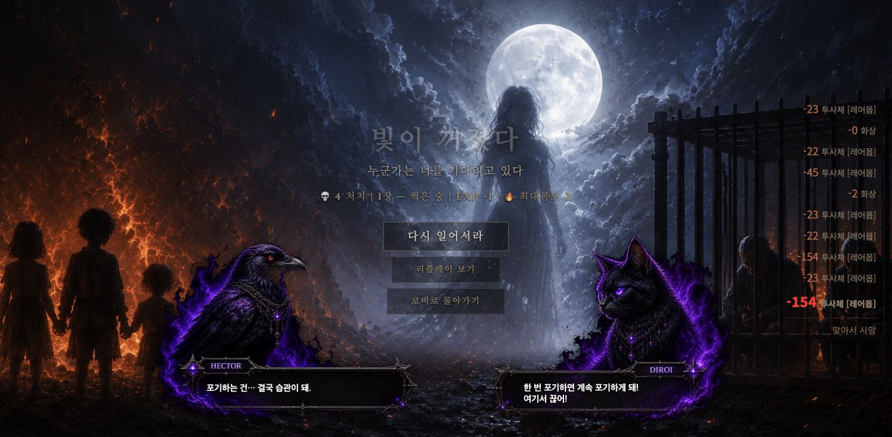

# Mac 일반 전투 긴 프레임 시간축 분리 — 2026-10-01

**판정: 남은 긴 간격 중 두 건을 드롭 빔 타일의 최초 마스킹 처리로 분리했다. 다음 수정 후보는 기존 20타일의 부트 사전 생성 한 건이다. 이번 생산 코드 변경은 0이다.** 가장 긴 draw 내부 지연과 별도 loop 밖 공백은 아직 미귀속이다.

## 기준과 이전 값의 구분

입력 소스와 원격 기준은 `479cf55c0a6422551e11762e117c5ff737b371cf`, 본편 SHA256은 `4fe6a6e0806126a595c2933beb925233eba03174832a216b78928fe9ec8e897e`다. 측정 종료 뒤에도 동일하다. 기존 첫 머리 캡처 준비 변경은 유지하며 easy/패키지에는 미반영 상태다.

| 기존 값 | 정의·조건 | 이번 취급 |
|---|---|---|
| 76.7ms | 앞선 정상 첫 처치의 실제 draw 시작 간격. DPR2·CPU profiler 포함, 약4.658초 입력 관측 | 새 표본과 합치거나 원인을 소급 확정하지 않음 |
| 116.7ms | 시체 진단 이전 코드의 독립 rAF timestamp 간격. DPR1·CPU profiler 없음, 7처치 | 새로운 loop 실행시간과 다른 값 |
| 83.4ms | 시체 예열 후보의 독립 rAF timestamp 간격. DPR1·3처치·장비/HP/조우 차이 | 개선율이나 같은 문제의 해결 근거로 쓰지 않음 |

기존 QA/성능 SSOT와 QA-B01 §7.1을 확인했다. Track A/B/D1 LOCK, preserveDrawingBuffer/depth는 조사·변경하지 않았다. Chrome에 동시 게임 탭이 없고 기존 Claude11팀 done, 별도 빌드·인코딩 실행이 없음을 확인한 뒤 root 단일 게임으로 실행했다.

## 사전 종료 기준과 실제 조건

- 게임 1회만 실행. 목표는 첫 native W 또는 월드 좌클릭부터25초, 자연 HP<=0 또는 진행 중 G.on=false면 조기 종료. 설치 상한120초, 최대 반복2회로 계획했지만 원인 한 건이 분리되어 반복하지 않았다.
- 정상 새 Lv1·webgpu=0, 기존 Chrome152 프로필 내 별도 loopback 원점. viewport1352×663/DPR1, 게임canvas1352×662, high/res100/SSAA1/fpsCap0/parts80/diff5, atmos1 유지.
- 3340·`tmp/mac-migration-runtime/saves`, 원래 Mac3333·PC·사용자 저장·VS Code 신뢰 대기는 보존했다.
- 실제 native W2·좌클릭2로 이동·공격했다. 도구의 W 유지시간은0.7–0.8ms이며 사람이 누르는 길이를 대표하지 않는다. 자동석궁/펫의 막타와 수동 공격은 분리하지 않았다.
- HP596→0, kills0→4, worldItems0→3. **17.2154초에 자연 사망으로 조기 종료**하여 목표25초는 미충족이다. 생존을 위해 HP·무적·적수·공격·품질·RNG·tick을 바꾸지 않았다.
- 입력 직후 AX 확인 이후25초 대기 동안 새 스크린샷·CDP조회·빌드·다중게임을 실행하지 않았다. 종료 후 회수/스크린샷/게임 이탈을 수행했다.

## 관측 방법

`loop` 바인딩과 update/draw, 사망·드롭·일부 프레임 말 작업을 임시 래핑했다. 콜백 timestamp와 실제 performance.now 진입/종료, 각 loop의 update/draw 횟수, cap/hidden 분기, 입력·옵션·상태 이벤트를 기록한다. Canvas/WebGL API와 전역 requestAnimationFrame은 래핑하지 않았고 강제 GPU readback/finish, CPU profiler, GPU timer를 쓰지 않았다. 별도 rAF 콜백과 PerformanceObserver의 longtask/long-animation-frame을 같은 timeOrigin에 기록했다.

상세 span은 update/draw/사망/마스크와1ms 이상 선택 함수에 기록한다. 짧은 호출도 시간 측정·loop별 합계 비용은 있으므로 무계측 기준점이 아니다. 모든 시간은 동기 대기·OS 중단을 포함할 수 있는 **경과시간**이며 CPU 사용량이나 GPU 실행시간이 아니다. raw의 `previousLoopCPU` 필드는 이 의미의 loop 경과시간으로만 해석한다. 중첩 함수 시간은 합산하지 않는다.

설치 후933loop 중 입력 이후600loop, 독립rAF599콜백, spans2414개를 회수했다. dropped0. loop/rAF 각각5000개 한도는 입력 전 대기도 포함하므로 고주사율 장시간용으로 일반화하지 않는다.

## 입력 이후 통계

단위ms, 백분위는 nearest-rank. 경계 부동소수점 오차를 피하려고50/100ms 초과 판정에0.000001ms 허용치를 쓴다. 시작 간격은 인접 두 관측이 입력 이후에 있는 경우만 계산한다.

| 구분 | 표본 수 | p95 | p99 | 최대 | >50ms | >100ms |
|---|---:|---:|---:|---:|---:|---:|
| 독립 rAF timestamp 간격 | 598 | 33.80 | 40.10 | 123.80 | 4 | 1 |
| 실제 loop 진입 간격 | 599 | 33.10 | 36.80 | 126.20 | 4 | 2 |
| 실제 draw 진입 간격 | 599 | 33.10 | 37.20 | 126.40 | 4 | 2 |
| loop 포함 경과시간 | 600 | 3.40 | 7.80 | 125.50 | 3 | 1 |
| update 1회 경과시간 | 1025 | 0.90 | 1.90 | 5.80 | 0 | 0 |
| draw 1회 경과시간 | 600 | 2.00 | 5.60 | 124.30 | 3 | 1 |

600loop 모두 draw1회, cap/hidden/no-game-draw 스킵0. update는 총1025회이며 loop당0/1/2/3회가 각각7/174/406/13번이었다. 고정 물리 스텝은1000/60ms, 누적 시간이 부족한7회는 update0이지만 draw는 수행했다. **draw 호출률34.85Hz**, 독립rAF 인접 간격 기준34.87Hz다. 이번 낮은 호출률을 앱 FPS 제한 분기의 결과로 볼 근거는 없지만, 실제 화면 표시율·OS 제한·GPU backpressure 원인은 측정하지 않았다.

입력 구간 옵션 변화·focus/visibility/resize 이벤트0, 모든 loop에서focus=true/hidden=false. 기록 누락 없이 종료까지 관측했다.

## 긴 간격 4건의 분해

loop 시작 간격 = 이전 loop 경과시간 + 이전 종료→다음 진입 간격이다. 후자는 브라우저 작업·다른 콜백·렌더·대기·계측 잔여 등을 포함하며 GPU 시간으로 단정하지 않는다.

| 이전→다음 loop ID | 시작 간격 | 이전 loop | update | draw | loop 내 나머지 | loop 밖 |
|---|---:|---:|---:|---:|---:|---:|
| 623→624 |126.2|125.5|1.0|124.3|0.2|0.7|
| 479→480 |102.7|89.4|2.7|86.6|0.1|13.3|
| 484→485 |71.5|68.3|0.5|67.7|0.1|3.2|
| 339→340 |65.1|2.3|1.7|0.4|0.2|62.8|

- **479:** 첫 kill0→1·드롭0→2. draw86.6ms 중 `_worldDropFxTile`79.9ms, 그 안의 `_maskWorldDropBlack`79.7ms. 동일 loop의 시체0.4ms·머리0.2ms는 주된 비용이 아니다.
- **484:** kill1 유지, 타일66.7ms 중 마스크66.6ms. 코드상 마스크는 해당 캐시가 없을 때만 실행한다. 두 타일의 frame/tile 인수는 이번에 기록하지 않았으므로 구체적인 색상/타일 번호는 확정하지 않는다.
- **623:** kill3·드롭2 유지, draw124.3ms에서 선택한 하위 함수의 긴 호출이 없었다. **draw 내부 미계측 부분124.3ms의 세부 원인은 미확정**이다. 셰이더·업로드·컴포지터로 임의 귀속하지 않는다.
- **339:** 입력 직후170.3ms 지점, loop 밖62.8ms. 브라우저 long-animation-frame62.1ms/blockingDuration0/scripts[]와 겹친다. 초기 입력·AX 확인 시간대와 가까우나 그 도구가 원인이라고 입증하지 않았다.

브라우저 longtask92/71/125ms가 각각479/484/623의 긴 draw와 겹쳐 main-thread 경과시간 관측을 뒷받침한다. long-animation-frame은 브라우저 프레임 전체 정의이므로 loop 시간과 같지 않다. script/attribution 하위 객체는 JSON에서`{}`로 저장되어 상세 스크립트 귀속에 사용할 수 없다.

별도로 loop481의 `_worldItemSkin`27.3ms 안에서 마스크27.2ms를 관측했다. 타일 마스크 두 건과 다른 후속 범위다. `_maskWorldDropBlack` 내부 getImageData/픽셀 루프/putImageData의 각각 비용은 계측하지 않았으므로 읽기백 대기 자체를 확정하지 않는다.

## 다음 수정 후보 한 건 — QA-B01 드롭 빔 20타일 준비

기존 QA-B01 §7.1 우선안과 일치한다. 새로운 캐시나 CPU canvas 옵션을 만들지 않고 **동일 `_worldDropFxTile` 처리와 `_worldDropFxTiles` 캐시에 부트 중 한 장씩 미리 생성**하는 후보를 제안한다. 현재 본편 참조 검색에서는 최초draw에서 이 캐시를 채우며 별도 사전 생성은 없다.

| 항목 | 구체안·보호 계약 |
|---|---|
| 대상 | game.html `_worldDropFxTile`, `_worldDropFxTiles`, 정상 부트의 이미지 준비 이후·G.on 이전 단계. QA 소유, ITEM/VFX 표시 계약 보존 |
| 규모 | 기존v3 PNG2장, 각각1024×2560, COLS2로512² 타일10개씩. 최대20개 RGBA 픽셀 용량20MiB; 총 브라우저/GPU 메모리 상한은 아님 |
| 작업 | 기존 성공 캐시는 재사용. 준비된 이미지의 유효 타일만 한 장씩 처리·yield, 전투 시작 후 새 일괄 작업 금지. 부트 대기·중단은 기존 로딩 실패/시간제한 정책과 연결 |
| 미준비/실패 | 완료로 오표기하지 않음. 기존 null·나중 lazy 생성 폴백을 보존하고 무한 로딩을 만들지 않음 |
| 외형 | 기존24/72 밝기 알파식, 색상/합성,2프레임180ms 선택, 타일순서,60×160 표시,layerLv/rarity 정책 보존 |
| 전투 | 드롭 생성·개수·확률·아이템 데이터·획득·RNG·저장·사망처리 불변 |
| 검수 | cold/warm 픽셀 전체 동일, 같은 캐시 객체 재사용, 재호출 가공0, 이미지 실패/지연 회귀, 부트 총비용/장당 최장시간·메모리 증가 기록, 정상 첫 드롭에서 해당 타일 경로≤5ms 확인 |
| 제외 | worldItemSkin/holyDome·미귀속draw124.3ms·loop 밖62.8ms·GPU실행시간·easy/패키지는 별도 |

이번에는 후보를 구현하지 않았다. 이전 격리 CPU canvas 실험에서 픽셀 ±1 차이가 보고돼 있으므로 단순 willReadFrequently 전환을 제안하지 않는다. 사전 생성은 계산을 제거하지 않고 준비 시점으로 이동하므로 부트 비용과 메모리 검수가 필수다.

## 검수·정리·백업

기존qa_review가 원자료·집계를 독립 재계산했고 수치가 일치했다. 도구의 PO 정리 예외가 나머지 복원을 막을 수 있음을 지적하여 관측 종료 뒤 독립try/cleanupErrors/선택함수 복구 상태를 보강했다. **실제 표본은 observer-used.js(보강 전)**이며 최종 도구는 단위테스트4PASS만 수행했다. 보강본 브라우저 재실행을 했다고 보고하지 않는다. 분석 스크립트 재생산 결과는 최초summary와 바이트 동일하다.

raw의 loop/update/draw 복구true와 정상 stop의 전체undo 순회 완료를 확인했다. 나머지 선택함수 각각의 런타임 identity는 이 표본에 따로 저장되지 않았다. 이후 게임about:blank이탈·viewport원상복구를 확인했다. 옵션은 처음/종료 동일하고 변경하지 않았다. 생산본/easy diff0, 기존22경로 상태바이트 동일, 공용인덱스 보존, 신규팀·PC 메시지·신뢰승인 대행0.

원자료·실측 관측기·최종 관측기·독립검토·테스트·재분석 도구는 인접 evidence.zip에 보존한다. 원격 복구 SHA는 push 뒤 현장 outputs/combat-timeline-20261001/checkpoint.json에 기록한다. PC329ms·전체FPS·고주사율·패키지 완료 선언은 없다.

