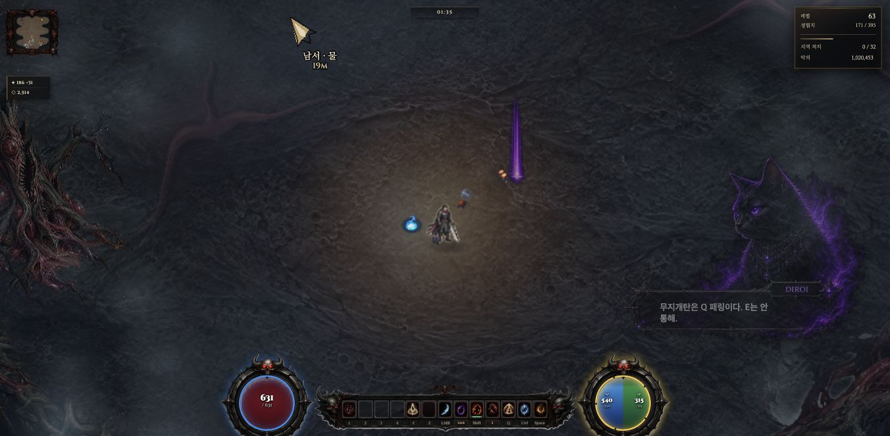

# R 입력 원인 분리와 정규 GL 후속 검수 — 2026-10-01

**판정: 일반 사용자 R 입력 결함 미입증, 생산 코드 수정 없음.** 도구의 초단 입력 누락을 재현·분리했다. 이어 정규 WebGL 옵션에서 실제 피격·사망·동일 객체 부활 첫 렌더를 관측했다. 고주사율·전체 전투 품질 완료를 뜻하지 않는다.

## 출발점과 보호 범위

원격 `dd3bdc1888e506ec4c418d3679461f0491823728`를 직접 조회하고 기존 변경22항목·빈 인덱스를 확인했다. [착수 대장](R-입력-작업대장.md)에 root의 단일 게임 소유권과 기존11팀의 실제 전달을 기록했다. 본편/easy·원화·보호 전투·확률·저장 계약은 변경하지 않는다. 실행은 Mac 이관 저장소의 3340 서버, localhost QA 출처와 서버의 격리 저장 경로다. PC·원래 Mac 체크아웃/3333·사용자127.0.0.1 슬롯은 보존했다.

## R 입력: 관측과 통제 가정 구분

새 `tools/qa/r-input-followup/input-probe.js`는 keydown/up 뒤의 K/KH, update 시작/끝, isJust/isHeld 반환, pickupItem 결과와 독립 rAF를 같은 performance.now 타임라인에 기록한다. 이미 게임에 존재하는 함수의 래퍼이며 종료 때 복원한다. 가방/월드 정리는 `_rInputQA` 태그가 붙은 이번 QA 장비만 대상으로 한다.

| 관측 입력 | 횟수 | 실제 전달 간격 | 입력 사이 update | 획득 |
|---|---:|---:|---:|---:|
| native 도구, trusted, 성공 | 3 | 3.6 / 3.9 / 8.5ms | 1 / 1 / 2 | 3 |
| native 도구, trusted, 누락 | 9 | 0.6–0.9ms | 전부0 | 0 |
| DOM20/50/100ms 각2회×무제한/60 설정 | 12 | 20.2–105.6ms | 전부1회 이상 | 12 |
| DOM0ms 각 설정 | 2 | 0.0 / 0.1ms | 0 | 0 |
| DOM600ms 홀드 각 설정 | 2 | 600.5 / 602.0ms | 36 / 35 | 5 / 4 |

28시행·3317이벤트 원자료에서 산출했다. native는 자동화 도구가 만든 trusted 이벤트이며 사람의 물리 키 입력을 뜻하지 않는다. 시간 조절 native keydown/up API는 지원되지 않았다. 20/50/100/600ms는 명시적으로 untrusted DOM fixture다. 이 차이를 숨기거나 isTrusted를 위조하지 않았다. 입력 간격은 수신 관측 시각이며 event.timeStamp의 생성 간격과 별도다. 상세 타임라인은 증거의 `qa/summary.json`에 있다.

native60-4는 입력 사이 독립 rAF1회가 있었어도 update0이므로 획득하지 않았다. FPS 설정값을 rAF 주파수나 update 횟수로 대체하지 않는다. 테스트 위치·가방 공간·필터·기본 KeyR/보조키 없음·BODY 포커스·isComposing false·on true/paused false 조건을 기록했다. 정규 화면 설정 슬라이더로 무제한→60→무제한을 변경·복원했다. 홀드 픽업은 약150ms 간격이며 이번 DOM 홀드에는 OS repeat keydown이 없다.

소스는 keydown에서 K/KH를 세우고 keyup에서 둘을 지우며 `_chkJust`가 K를 소비한다. 따라서 두 이벤트 사이 update가 없다면 누름 사실이 남지 않는다. 그러나 이번 실제 기록에서 일반 길이 입력 누락은 재현되지 않았다. 전투 부하에 따른20–100ms update 공백이나 사람의 물리 키 입력 전체를 보증하지 않는다.

`interact-diagnostic.mjs`는 실제 입력 콜백·R 획득 블록·고정스텝 루프를 추출해 **강화된 계약 가정**과 비교한다. 26개 중16개 만족/10개 미충족, 예상 exit1이다. 8개는 update 없는0/20/50/100ms, 2개는 repeat keydown 가정이다. 인위적 update 공백을 실제 발생한 사용자 결함으로 주장하지 않는다. 일반 CI 회귀로 오인하지 않도록 test/에서 수동 진단 경로로 옮겼고, 기존 RED 기대값을 뒤집어 GREEN으로 만들지 않았다. 패널·blur/hidden·재매핑·보조키·여러 고정스텝과 홀드 검사는 범위 안에서 확인했다. 생산 입력 버퍼 수정안은 채택하지 않았다.

## 정규 WebGL 피격·부활 경로

Mac 기본 부팅은 WebGPU가 선택되어 GL=null인 것이 정상 분기다. `_bootRenderer`가 지원하는 URL `webgpu=0`으로 정상 새로 부팅했다. WebGL2 활성·WebGPU 비활성·GL 객체 존재·isContextLost=false·프로그램/VAO 생성·warmDone=true·bootActive=false를 직접 확인했다. 옵션/부팅 플래그를 강제로 완료 처리하지 않았다.

첫 준비 시도는 fixture가 플레이어를 죽여 on=false가 됐고, 관측 타이머 종료 뒤 적중을 호출했다. `gl-revive-raw.json`과 해당 사망 화면은 **무효 표본**으로 보존하며 PASS에 포함하지 않는다. 이후 UI의 ‘다시 일어서라’로 재시작했다.

두 유효 구간은 정규 WebGL 부팅에서 mkEn으로 type0 적4개를 가까운 보행 가능 위치에 배치했다. 관측 분리를 위해 적 방어막0·비치명 hurtE100,180ms 뒤 HP100·치명 hurtE1000000을 사용했다. 실제 hurtE와 update/draw를 실행했고 부활 난수·확률·타이머는 바꾸지 않았다. 플레이어의 QA 무적600틱은 측정 격리 조건이다. 자연 조우/사용자 공격 입력 검수와 구분한다. fixture 처치·부활은 QA 캐릭터 진행을 바꿨으며 사용자 저장에 반영하지 않았다.

| 실제 관측 | 무제한 설정 | 60fps 설정 |
|---|---:|---:|
| 원자료 행 | 1224 | 1206 |
| 피격 flash를 관측한 fixture | 4 | 4 |
| 같은 객체 본모습 부활 | 3 | 2 |
| 새 객체 구울 경로(동일 객체 판정 제외) | 1 | 2 |
| 같은 객체 부활 첫 after-draw hf0·GL 증거 | 3/3 | 2/2 |

비치명 `_hitFlash=6`은 양쪽 모두6 update에서0으로 감쇠했다. 사망 상태 첫 after-draw는 hf0/mode0이며 본모습 부활5건의 첫 after-draw는 hf0와 glDrawEvidence=true다. runtimeGate는 유효 원자료 전행 true, dropped/samplingErrors/conflicts는0이다. 구울은 별도 객체이므로 같은 객체 부활 검증에 포함하지 않는다. 60fps 표본에 추가 생존 flash1회가 있어 최초 비치명 수명 비교와 분리했다.

실제 독립 rAF 약29.5/30.6Hz, draw 약30.0/31.2Hz, update 약56.8/59.5Hz다. 설정이 무제한이어도 이번 GL 기록은 **고주사율 조건을 충족하지 않는다**. 초기 hit부터의 정확한100ms나120Hz 품질 검수로 확대하지 않는다. 상세 수명/첫 렌더 행은 `qa/gl-summary.json`을 따른다. 관측기를 제거하고 FPS0을 복원한 뒤 게임에서 이탈했다.

## 기존11팀의 신규 산출 인수

11팀 모두 기존 세션의 종료 상태를 먼저 조회한 뒤 새 한 건을 실제 전달했고, Read/Glob/Grep와 최종 산출까지 받았다. 지원3명은 root 포함4개 슬롯 안에서 소유를 나눠 실제 파일 작성·검사를 수행했다. CLI 초안의 제출과 총괄 측 실제 파일/브라우저 실행을 구분한다.

| 팀 | 이번 산출·실제 실행 | 미완료/다음 게이트 |
|---|---|---|
| ITEM·UIUX·QA | R 조건·포커스·입력 타임라인 계약, root28시행·지원 진단 실행 | 일반 사용자 입력 결함 미입증, 생산 수정 없음 |
| ANIMVFX | GL 원인 분리 probe, root 정규 WebGL 관측 | 고주사율·자연 전투·새 구울 객체 시각 인수 |
| BUILD | 새 자식 매니페스트 도구 실행:957파일 SHA·2,078,759,459B | LFS 포인터3개, 실제 패키지 미검수 |
| BALANCE | 실제 hurtE36적중:8 PASS/2 SKIP | onHitFireball 조회/투사체0, 훅 부재. 재귀 NOT_REACHED |
| MAP | M5 경로 후보를 실제 JS 파일로 추출·구문 검토 | 후보가 순간배치/K쓰기·cleanup 없음. 그대로 실행 금지 |
| ENEMY | 자연 type3 발사 후보를 JS 파일로 추출·구문 검토 | 전역 let 접근·projT 리셋 시점 오류 수정 선행 |
| ART·SKILL | 타임라인/취소 관측기 후보를 파일로 추출·정적 검토 | 후보 매니페스트의 게이트 해소 후 root 단일 게임에서 실행 |
| SOUND | 루프 A/B 청취 페이지를 실제 파일로 작성 | 기본 UI·390px 검수 완료. 파일 권한으로 재생·청취 대기 |

BUILD 포인터는 CH1_1_PRODUCTION_MASTER.png/outer90_patch.png 제작 원본2개와 outer76_81-provenance.zip 출처 자료1개다. 현재 assets 재귀 복사 계약에서는 포인터가 복사된다. 참조 검색상 직접 런타임 경로는 아니며 실제 청크/관련 스프라이트는 실바이트다. 단순히 게임 자산 누락·패키지 실패로 확대하지 않는다. 자동 LFS 다운로드·원본 변경·재베이크는 하지 않았다.

BALANCE의8 PASS는 미연결 상태를 정확히 관측한 진단 통과다. `onHitFireball` 효과 완성이 아니다. 실제 `_eqAffix`/hurtE를 추출했으며 단/강제복수 장착과 결정적 난수에서도 조회0·생성0이다. 정상 롤은 무기 한 곳이며 복수 조건은 강제 fixture다. 현재4/7/11/16/22% 데이터와 다른 실제 fireOnHit 훅은 보존했다.

## 증거와 체크포인트

[원자료 묶음](r-input-evidence/evidence.zip)에 R 타임라인·소스 RED·수동 진단·GL 무효/유효 표본·BUILD/BALANCE 실제 결과·11팀 수신/도구/최종 원문·후보 매니페스트를 보존한다. 전체 후보를 실행 완료로 세지 않는다. source/manifest 입력 해시와 기존22항목·빈 인덱스·원격 ref 일치는 최종 현장 `outputs/r-input-20261001/checkpoint.json`에 기록한다. 자연 M5 이동·wa24 시각·iceStorm 실제 입력·type3 자연 발사·음악 청취·Windows 패키지·PC329ms는 각각 별도 미완료다.

## SOUND UI 인수와 Mac 가시화

사운드 페이지 기본 선택/볼륨/재생잠금·390px 배치를 확인하고 작은 화면의 재생 버튼을 전체 행 폭으로 수정했다. 파일 선택 API는 Chrome 확장의 파일 URL 접근 권한으로 차단되어 실제 음원 재생·청취는 미검수다. 메모 JSON 다운로드 시도는 도구 시간초과로 성공 미확인이다. 권한을 우회하지 않았다.

[Mac 상태판](../MAC_AGENT_DASHBOARD.md)은 실제 Claude11팀 PID·Opus4.8·end_turn과 Codex 지원3명 완료를 기록한다. Codex 패널 열기는 queued, VS Code 별도 EXODUSER-11팀 작업공간의 실제 탐색기·Markdown 미리보기는 확인했다. 기존11팀 attach 태스크는 준비했으며 VS Code가 Trust Workspace & Continue를 요구해 사용자 승인 대기다. 이 시점 VS Code 팀 터미널 연결0/11이며 백그라운드 세션 존재와 구분한다.
