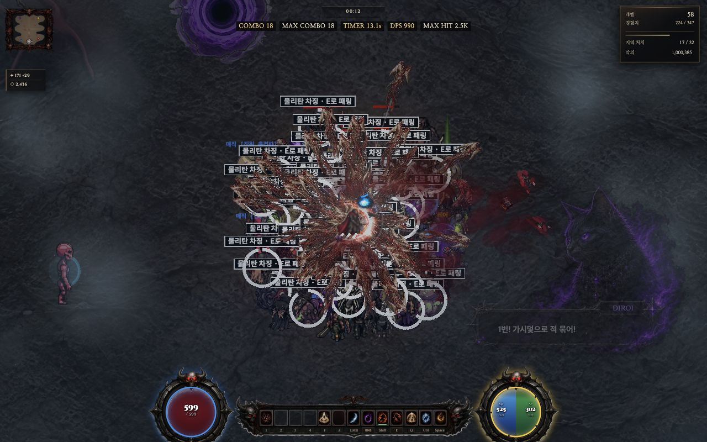
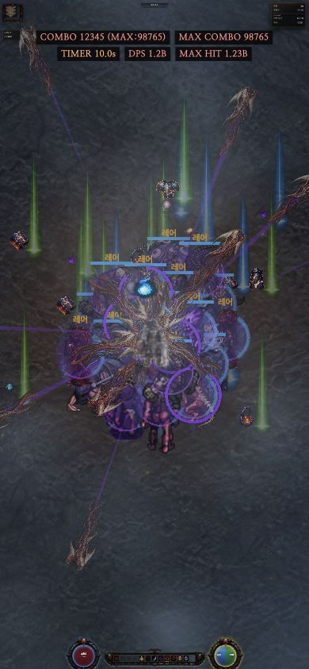

# UI03 상단 전투 상태 가독성 검수 — 2026-10-01

상단 COMBO / MAX COMBO / TIMER / DPS / MAX HIT의 대비·작은 화면 배치를 수정했다. 본편 실제 공격과 새로고침, 본편·쉬운판 390×844 및 설정 재진입을 확인했다. UI03 전체 중 이 상태 표시만 완료 범위이며 레벨·목표·자원 및 중앙 피해숫자 가림은 별도다.

## 코드 계약

| 항목 | 최종 값/보호 계약 |
|---|---|
| 소유 | ui-refinement.css의 #hudTop 20줄, 두 HTML 각 HUD 색 5줄 + CSS 캐시 1줄 + top 위치 1줄 |
| 캐시 | ui-refinement.css?v=20261001-combat-status22 |
| 표시 | #hudTop.on opacity 1. 각 리프만 rgba(9,8,9,.88) 배경·2px radius. 외곽 패널 없음, 부모/리프 pointer-events:none |
| 글꼴 | max(1rem, 11px / scale), weight600, line-height1.25, tabular-nums, letter-spacing .035em. 기존 동적 글꼴 크기 대신 같은 최소 판독 크기 적용 |
| 여백 | 변환 후 수평5px/수직2px padding, 행3px/열6px gap |
| 넓은 화면 | 중앙 앵커, top=inset+safe-area+48px×scale. 변환 후 최대 폭 viewport−480px×scale로 양쪽 HUD 공간 예약 |
| 600px 이하 | top=inset+safe-area+180px×scale, 변환 후 폭 viewport−24px, 가운데 줄바꿈 |
| 색 | bone #f3e5ce / gold #ffda87 / ember #ffb17a / hot #ff9290. 모든 글자 4방향 검정 그림자 |
| 콤보 색 | combo <10 bone, 10~19 gold, 20~49 ember, ≥50 hot. record <50 bone, 50~99 ember, ≥100 hot |
| 피해 색 | peak <1e5 bone, <1e6 gold, <1e7 ember, 그 이상 hot. DPS <1e5 gold, <1e6 ember, 그 이상 hot |
| 타이머 | comboTimer<300 hot, <600 ember, 나머지 gold. 60프레임/초 및 toFixed(1), 느린 HUD 30프레임 갱신 유지 |
| 보호 | 라벨·수치 산식·표시 조건·색 전환 임계값·키 바인딩·저장 포맷·전투/맵은 불변. 색 리터럴·top32→48·CSS cache만 제거한 두 HTML은 이전 HEAD와 바이트 텍스트 동일 |

## 실제 검수

| 검수 | 증거/결과 |
|---|---|
| 기준선 | e58e6e6d 원격 복구점. before-dense.png: 실제 공격, COMBO59 / TIMER15.9s / DPS387 / MAX HIT1.1K, opacity .58, 타이머 그림자 없음. 레벨505 적/기절로 수치가 안 뜬 최초 준비 샷은 폐기해 증거에서 제외 |
| 수정 후 본편 | CSS21 중간본을 새로고침한 실제 게임 1280×800·WebGPU·높음·무제한. 120적 생성 후 실제 마우스 공격5초, 250ms×20표본 적71~101, 콤보46→54, 전경/포커스 유지. 중간본 COMBO54/TIMER16.4s/DPS810/MAX HIT3.5K가 한 줄로 판독 가능 |
| 통제 조건/한계 | 테스트 적 HP800·쉴드0, 플레이어 무적6000f, QA 위치4020,6600·seed20261001·반경140~420. 레벨/처치 이력이 전후 달라 픽셀 동일 A/B나 성능/밸런스 비교가 아님. 정지 비교 미리보기와 최종 디스크 새로고침을 구분 |
| 일반 전투 | 5적 fixture 실제 공격2초 및 normal-combat.png. 캐시21 확인, 수치 갱신과 조건별 숨김 유지. QA 최대 콤보 이력98765가 남은 테스트 세이브임 |
| 좁은 화면 | 본편·쉬운판390×844, COMBO12345(MAX98765), DPS1.2B/MAX HIT1.23B를 QA 상태로 주입. 5개 값2행, 넘침0, 리프끼리/미니맵·레벨·시계와 겹침0. 실제 표시 폰트 약11px. 본편 각 리프 중심 elementFromPoint는 모두 게임 canvas c |
| 타이머 | 실제 update 감소615→254f, 25표본에서 gold/ember/hot 3색 확인. 샘플 첫 행은 재설정 직후 이전 표시가 남아 있음: 30프레임 느린 갱신/소수 첫자리 반올림 유지. 599f가10.0s·299f가5.0s로 표시될 수 있으므로 색 판정은 원시 프레임 기준 |
| 설정 | 양쪽 실제 Esc·닫기·재열기, settings.on 및 HUD display:none 확인. 390px 가로 넘침0. 옵션/리셋/키설정 변경 버튼 미실행 |
| 오류 | 관찰창 window error 수집0. 준비용 개발 콘솔 식의 cam 미정의1건과 입력 도구 실패는 수정해 재실행한 QA 도구 오류이며 생산 JS 오류로 세지 않음. 부팅 전체 콘솔 무오류 선언 아님 |
| 회귀 | Node24.15.0 HUD·설정·배율·구문11파일54/54 PASS, 쉬운판 executable inline4개 추가 구문 PASS. validation.json 참조 |
| 정리 | 테스트 게임 about:blank 이동, 임시 viewport reset. localhost:3340/격리 save 경로만 사용. 기존127.0.0.1 저장·PC·원래 Mac 체크아웃 보존 |

## 남은 범위

독립 UIUX 판정은 ui03-evidence/UIUX-팀검토.md에 인수한다. 전체 UI03, 중앙 피해숫자/적 이름표 겹침, 매우 긴 자릿수·보스바 동시 표시·다국어 전체·게임패드·NW.js 패키지 검수와 성능 측정은 이번 PASS에 포함하지 않는다. 게임 로직/저장 변경 없이 상단 가독성 한 건을 마감한다.

## 독립 검수 후 최종 위치 수정

UIUX는 상태 표시 가독성을 PASS했으나 stageClock 배경과 8px 겹침을 발견했다. 두 HTML의 top32→48px×scale, 캐시22로 추가 수정하고 관련5검사를 재실행해 전부 통과했다. 최종 파일을 새로고침한 본편 실제 공격5초·20표본과 쉬운판1280×800·390×844를 다시 확인했다. 시계 하단35.996→상태 상단38.664, 간극2.668px, 겹침/넘침0. 독립 최종 재판정도 PASS. final-* 파일이 최종본이며 after-*·normal-*·기존 easy-*는 이전 캐시21 증거다. 쉬운판 최종 wide 캡처는 부팅·페인트가 완료된 프레임으로 다시 저장했다.

UIUX 원문은 첫 판정과 후속 정정을 함께 보관한다. elementFromPoint5개 실측 존재 및 타이머599f의 주황색 정정 반영. 원문 최종 “17표본”은 오기이며 실제 JSON은20표본이다. [11팀 인수·미실행 후보](11팀-UI03-병행후속.md).
