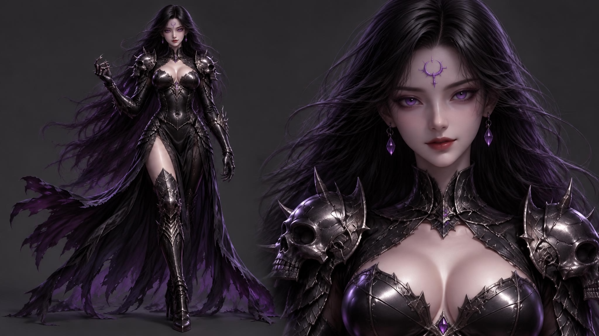
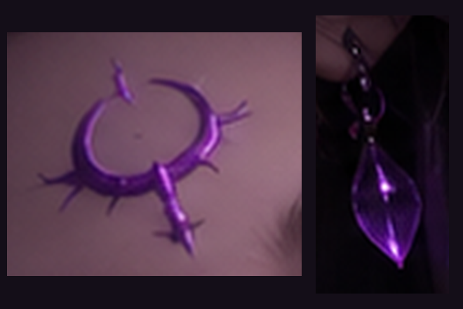

# 네메시아(여신) 디자인 고정 — 중요 (DESIGN LOCK)

> **디자인·디테일 통일은 필수다.** 같은 캐릭터가 컷마다 얼굴 문양·장신구·갑옷이 달라지면 안 된다. 특이점(문양)은 좋지만 **문신처럼 항상 같은 모양·같은 위치**여야 한다. (사용자 지시 2026-09-30)
>
> **이미지에 점(잔점·점묘·디더링·반짝이 점)이 절대 나오면 안 된다.** 머리카락·갑옷·피부 어디에도 금지. (사용자 지시 2026-09-30)

## 고정 사양 (모든 컷 동일)

| 항목 | 고정값 | 프롬프트 문구 |
|---|---|---|
| 인상 | K-pop 아이돌풍 미모, 작은 V라인 얼굴, 올라간 고양이 눈매 | `K-pop idol beauty: small V-line face, cat eyes glowing violet` |
| 눈 | 보라색 발광 | 위와 동일 |
| 피부 | 깨끗한 도자기 피부 | `clean porcelain skin` |
| **문신(특이점)** | **이마 정중앙, 작은 보라색 가시 초승달 문양 1개. 그 외 얼굴 문양 없음** | `one small violet thorned-crescent tattoo at forehead center, no other face marks` |
| 귀걸이 | 작은 보라색 물방울 귀걸이 양쪽 | `small violet drop earrings` |
| **목** | **높은 가시 칼라, 칼라 중앙 보라 보석 1개** | `high spiked black collar with one violet gem at center` |
| **가슴** | **V자 가슴 장식, 하단 보라 보석 1개** | `V chest ornament with violet gem` |
| 머리 | 길고 매끈한 윤기 흑발 | `sleek glossy long black hair` |
| 갑옷 | 광택 흑칠 판금, 어깨에 작은 해골 장식, 그물·세공 무늬 없음 | `polished black lacquered plate armor, small skull pauldrons, no mesh or filigree` |
| 비율 | 전신컷은 8등신 모델 비율, 작은 얼굴 | `model proportions` (전신컷만) |
| 번개 | 허용 (캐릭터 임팩트) | 지정 안 함 |

## 공식 디자인 시트 (최상위 기준)

`assets/nemesia_design_sheet.png` — 전신+흉상. 문신·귀걸이·칼라 보석·가슴 보석·해골 견갑·찢어진 흑보라 치마·가시 사이하이 부츠. **모든 네메시아 이미지는 이 시트와 디테일이 같아야 한다.** 생성 시 두 번째 레퍼런스로 이 시트를 첨부하고 `outfit, collar gem, chest gem, tattoo and earrings exactly as image 2`를 넣는다. (보석이 컷마다 있다 없다 하던 문제로 도입, 2026-09-30)

## 문신·귀걸이 기준 이미지

문장 묘사만으로는 문신 모양이 컷마다 달라졌다(가시 링 / 줄기 달린 초승달). 기준 이미지 `assets/nemesia_tattoo_earring_ref.png`(02번 확정본에서 문신·귀걸이·목 칼라만 크롭, 눈·입 미포함 → 표정 복제 방지)를 **두 번째 레퍼런스로 항상 첨부**하고 `forehead tattoo, earrings and collar exactly as image 2`를 넣는다.

## 점 금지 — 생성 규칙

| 원인 | 대책 |
|---|---|
| 원본 레퍼런스의 잔점 질감을 모델이 복제 | 레퍼런스는 **640×360 + 가우시안 블러 5**로 뭉개서 구도만 전달 (`Image 1 = rough layout only`) |
| "ornate/filigree/mesh" 갑옷 묘사가 점 같은 세공을 유발 | 갑옷은 `polished lacquered plate, no mesh or filigree` |
| 확인 | 결과는 반드시 머리카락·갑옷 부분을 1x 원본 크기로 확대해 점 유무 확인 후 채택 |

## 표정

컷마다 **대사·상황에 맞는 고유 표정**을 지정한다(표정 강한 이미지를 얼굴 레퍼런스로 쓰면 표정이 복제됨). 컷별 대사/표정표: [GODDESS_INTRO_REMASTER_20260930](../1전체그래픽세팅/GODDESS_INTRO_REMASTER_20260930.md)
