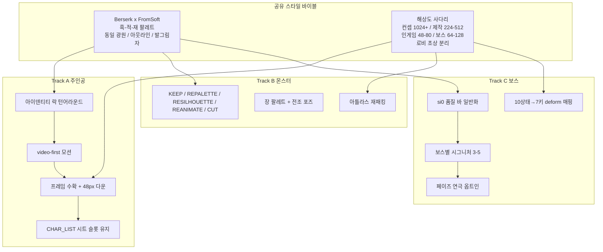
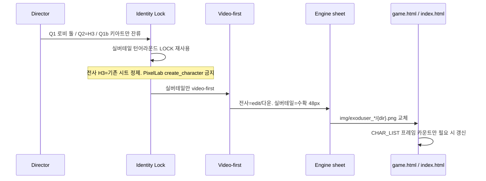
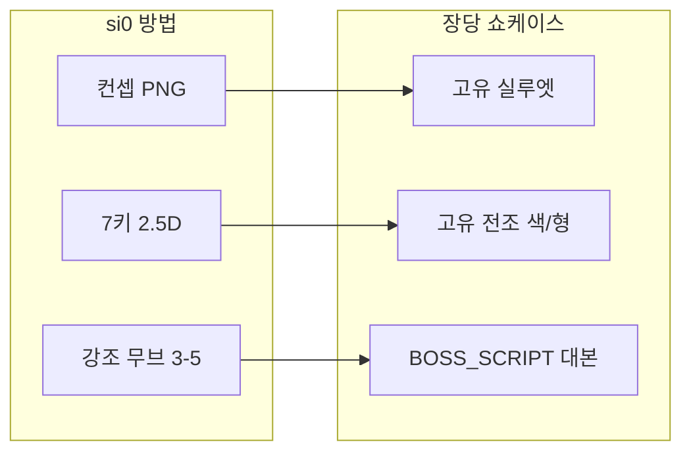
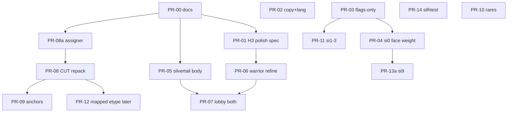

# 주인공 · 몬스터 · 보스 최적화 디자인 v1

| 항목 | 값 |
|---|---|
| 문서 ID | `캐릭터_몬스터_보스_최적화디자인_v1` |
| 게임 | HELL / EXODUSER (지옥의 길) |
| 작성 | EXODUSER design desk (rev.5, 2026-08-16 유저 확정 반영) |
| 날짜 | 2026-08-16 |
| 상태 | Draft rev.5 |
| 대상 독자 | 시니어 엔지니어 / 아트 리드 / 본인(디렉터) |
| 진실 공급원 | `docs/` + `game.html` / `index.html` 런타임. 본 문서의 수치는 코드·기존 docs에서 대조한 값만 사용한다. |
| 관련 폴더 | `docs/4.0케릭터스프라이트 디자인/`, `docs/5.0애니메이션파이프라인/`, `docs/8.0몬스터디자인/`, `docs/8.1보스디자인바이블/`, `docs/8.2레어몹디자인/`, `docs/archetypes/silvertail/`, `docs/1전체그래픽세팅/`, `docs/3.1 ui hud 디자인/캐릭터선택_리모델링_기획서.md` |

---

## Overview

주인공은 PixelLab 48px 시트에 얼굴·무기·실루엣이 뭉개져 로비 영상과 인게임 존재가 갈라진다. 몬스터는 etype 100종이 아니라 **전 장에 깔리는 ch1 8dir 40스킨 셔플**이 보인다(`_assignMobSkin`, `seed % 40`). `_getMappedEtype` 5스킨 접기는 그 경로가 실패할 때의 `_atlasE` 부채다. 보스는 이름 35종·기술 57종이 있어도 공용 5페이즈(힐+180f 무적+텔레+충격파+빨콩/색탄) + punch/kick 언어로 같은 싸움이 된다.

해결은 전량 리메이크가 아니다. **히어로 1종을 품질 기준(hero-first)으로 잠그고**, 몬스터는 `_assignMobSkin` 단일 작성자에 etype·장 바인딩을 넣은 뒤 KEEP/REPALETTE/RESILHOUETTE/REANIMATE/CUT 5등급(스킨당 정확히 1개)으로 솎으며, 보스는 si0의 `_drawStage1CodexBoss` + `STAGE1_CODEX_BOSS_MOTION` 7키를 테이블 구동으로 일반화해 **보스마다 3~5개 시그니처 + 고유 전조**를 공용 페이즈 머신 위에 얹는다. `_bPose`는 최후 폴백으로 남긴다. 런타임 포맷(`CHAR_LIST` 8방향 시트, `atlas_ch1_8dir_*` cell 256, `atlas_bosses.png`)은 유지한다. 주인공 생산 규칙은 실버테일 [G]를 video-first로 개정하고, PixelLab `create_character`는 주인공 경로에서 폐기한다.

---

## Background & Motivation

### 현재 상태 (코드 대조, 2026-08-16)

| 축 | 런타임 사실 | 문서가 말하는 것 | 괴리 |
|---|---|---|---|
| 플레이어 | `CHAR_LIST` 2종: `exoduser_warrior`, `exoduser_silvertail` (`game.html` 9088–9091). 둘 다 `fw/fh=48`. | `docs/미구현+구현예정.md`는 2026-08-16에 2종으로 정정됨(“전사 5스킨은 없음”). `docs/4.0케릭터스프라이트 디자인.md`는 실버테일 임시 공격 + 본 v1 포인터. | 구 5스킨 문구는 폐기됨. `img/players/` PixelLab은 선택 스킨이 아니라 생성 잔여물. |
| 전사 프레임 | `idleN:2, walkN:8, atkN:8, whirlN:1, throwN:1, chainN:0, dashN:1` | `docs/5.0애니메이션파이프라인.md` 플레이어 레이아웃은 idle4+walk8+atk16+whirl16+throw16+chain16+dash16=**92프레임** | 문서가 이상, 런타임이 빈약. 다수 상태(`hurt/die/block/ghost/dodge/...`)는 idle 프레임으로 폴백 (`_build8`). |
| 실버테일 | 시계 파일명 `12,1,3,5,6,7,9,11`. `atkN:0`. `_silvertailAttackPose()` + 칼끝 PNG 오버레이. `CHAR_LIST.desc`는 아직 “회전대검+쌍단검” (9090). | `SILVERTAIL_LOCKED_SPEC_v1_2.md` [A]–[F]/[H] 장비·실루엣 LOCK. [G]는 PixelLab mannequin 224→48로 LOCK되어 본 문서와 충돌. | 장비 LOCK은 유지. [G] 생산 규칙만 v1.2.1로 개정. 공격 PNG 없음. 로비 traits “쌍단검 기동” (`index.html` 2683). |
| 로비 | `CHAR_VISUALS` 초상/흉상/엠블럼/idle 영상 2종 (`idle_warrior.mp4`, `idle_silvertail.mp4`). | `캐릭터선택_리모델링_기획서.md` — 존재감, idle 루프, 실루엣. | 로비는 영상, 인게임은 48px. 두 해상도가 같은 캐릭터로 읽히지 않음. |
| 몬스터 | 메인 경로: `mkEn` → `_assignMobSkin` (`game.html` 24514, 17995–18004). 항상 `_mobCh=1`, `idx = (etype×7+homeX×31) % _MOB8_TOTAL(40)`. json `total:40`, 마지막 키 `blind_swordsman`. 8dir cell **256**. 레어도 이 경로( `mob_N.png` 로더 없음). | `몬스터_스킨_시스템.md` 표는 json 40종으로 정정. walk 시트는 skinless_hound 미완으로 39행. `_getMappedEtype`은 8dir 실패 후 폴백. | 전 장 = ch1 40스킨 셔플. PR-08a는 hell 0 역할 바인딩만. 2–7장 풀은 부채. |
| 보스 이름 | `HELL_BOSSES` 7장 35명 (`game.html` 13337–13345). | 애니 파이프라인 “완성 35/35”. | 완성 = PixelLab punch/kick 세트 존재. 전투 정체성 완성과 무관. |
| 보스 전투 | `_bossPhaseCheck` 30906–: 힐 / `reviveIframes=180` / atk×1.3 / spd×1.15 / maxPoise×1.2 / tp `80+_bp*25` / 충격파 / **블록7** `8+_bp*4`발. 짝수=`redBean` `#cc1100`, 홀수=HSL 색탄(`blackBean` **미설정**, 패링 가능). | `BOSS_BATTLE_SETTINGS.md`는 “빨콩 50% + 무지개 50%”로 적혀 실제 `blackBean`과 혼동됨. | 모든 보스가 같은 연극. 페이즈 색탄 ≠ 패링불가 무지개탄. |
| 보스 비주얼 | si0만 `_drawStage1CodexBoss` (`G.stage===0`). 7키 `STAGE1_CODEX_BOSS_MOTION`. 그 외 `atlas_bosses.png` 64px. `drawBossBody`/`_bPose`는 아틀라스·PNG·3D가 모두 없을 때 순위7 폴백. `_drawLargeBoss()`는 `return false`(9357) — 라이브 경로 아님. 3D는 hell0 Vinebound, 나머지 Meshy. | si0 P0=컨셉+2.5D. 3D는 챕터 메쉬. | 쇼케이스 정체성은 Codex 2.5D 일반화. `_bPose`에 넣지 않음. |

### 왜 주인공이 마음에 안 드는가 (진단)

48px에서 실패하는 이유는 “그림이 못생겨서”가 아니라 **다운스케일 후 남는 정보가 정체성 축이 아니기 때문**이다.

| 실패 모드 | 증거 | 48px에서 남는 것 |
|---|---|---|
| 얼굴 머시(face mush) | PixelLab mannequin 224→48 (`SILVERTAIL_LOCKED_SPEC` [G]). | 눈·입·투구 장식 1–2px. 초상과 불일치. |
| 무기 비가독 | 동 스펙: 단검은 1–2px. 전사 거대검도 시트에서 몸통과 같은 명도. | “검은 덩어리 + 막대기”. |
| 정체성 충돌 | `img/players/`에 Frost/Flame/Skeleton/HellRoadWarrior 등 동일 언어 양산. 선택 가능 전사는 1종인데 시각 어휘가 몬스터와 같음. | 플레이어가 잡몹 기사로 읽힘. |
| 8방향 불일치 | 실버테일 시계 파일 리맵 + `exoduser_silvertail_backup_*`. 전사는 방향명 파일. | 방향 전환 시 실루엣이 점프. |
| 공격 프레임 공백 | 실버테일 `atkN:0`. 전사 `atkN:8`이지만 whirl/throw/dash는 1프레임. | 공격은 VFX가 캐릭터를 대신함. 몸이 안 움직임. |
| 로비/인게임 이원성 | 로비는 영상(`idle_*.mp4`) + 누끼 PNG. 인게임은 48px 시트. | “선택 화면의 그 캐릭터”가 전장에 없음. |

`docs/1전체그래픽세팅/1전체그래픽세팅_MASTER.md`의 비전은 **캐릭터 = 베르세르크 작화 × FromSoftware 디자인**. PixelLab 기본 mannequin은 그 언어가 아니라 범용 다크판타지 치비/중형에 가깝다.

### 왜 보스전이 “기본만”인가 (진단)

기술 풀은 이미 크다. `BOSS_MOVES`는 `burst`~`rapidMissile`까지 **57행** (`game.html` 8477–8535, `burstCounter.idx=60` 불연속). `_BOSS_MOVESET[si]`는 챕터마다 같은 풀에 기술 몇 개를 **추가 해금**할 뿐, 보스별 대본이 아니다. 선택기는 `_bossScore` 가중합 + 콤보 테이블.

그 위에 `_bossPhaseCheck`가 20%마다 동일한 연출을 강제한다.

```
HP 임계 통과
 → HP를 페이즈 상한까지 회복
 → 무적 180f
 → atk×1.3, speed×1.15, maxPoise×1.2
 → 플레이어 뒤로 텔레포트 (80+_bp*25)
 → 충격파 (100+_bp*30, atk*(0.4+_bp*0.1))
 → 블록7: 8+_bp*4발. 짝수 redBean(#cc1100, homing), 홀수 HSL 색탄(blackBean 없음 → 패링 가능)
 → 셰이크 + slowMo + 포효
```

진짜 `blackBean`은 `#00aa00`이며 `_beanRoll` / `beanStorm` / `beanRain` 경로에만 붙고 패링 루프에서 skip된다. 페이즈 방사는 그걸 쓰지 않는다.

플레이어가 학습하는 것은 “흑요염의 내려찍기”가 아니라 “20%마다 무적 텔레포트 탄막”이다. 애니 원본은 거의 전부 `fight-stance-idle` / `cross-punch` / `high-kick` / `taking-punch` / `walking` (`docs/5.0애니메이션파이프라인.md` 보스 폴더 규격). 독버섯 거인과 화염 감옥지기가 같은 주먹·발차기를 쓴다.

si0만 예외다. 정지 컨셉 PNG + `_drawStage1CodexBoss`의 sx/sy/y/rot/glow 7키 (`idle/walk/windup/slash/slam/hit/death`)가 전조와 강타를 **몸 비율로** 읽히게 한다. 이것이 “실제 보스”로 느껴지는 이유이며, 본 문서의 품질 바다.

### 고통 포인트 (우선순위)

1. 주인공이 상점/키아트/로비의 얼굴이 되지 못함 (출시 블로커).
2. 보스전이 페이즈 연극 + 공용 탄막으로 수렴 (리텐션 블로커).
3. 전 장 ch1 40스킨 셔플 — 역할·장 팔레트와 무관 (`_assignMobSkin`). 5스킨 접기는 폴백 부채(부록).
4. PixelLab 재고 332종이 “완성”으로 기록되어 추가 생성을 유혹 (생산 함정).

---

## Goals & Non-Goals

### Goals

| ID | 목표 | 측정 |
|---|---|---|
| G1 | 주인공 1종을 48px에서도 식별 가능하게 | T1과 동일: 테스터 4명 중 3명, **3초**, ≥75% |
| G2 | 로비 초상/영상과 인게임 시트가 같은 캐릭터로 읽히게 | 턴어라운드 잠금본 대비 3뷰 일치 |
| G3 | 실버테일 장비·실루엣 LOCK 유지한 채 본체만 교체 | [A]–[F]/[H] 불변. **[G]는 v1.2.1에서 video-first로 개정**. [I] PixelLab 프롬프트는 폐기. 공격 PNG 전까지 절차 칼 오버레이 유지 |
| G4 | 몬스터는 100종 리부트가 아니라 배정+등급 재작업 | PR-08a: **ch1** 40스킨 각 1등급 + 역할 바인딩. 2–7장 풀은 PR-08b+ |
| G5 | 보스마다 고유 실루엣 + 고유 전조색/형 + 시그니처 3–5기 | 공용 punch/kick 언어 제거. 2.5D는 Codex deformer |
| G6 | 페이즈 머신 공유 연극을 줄이고 보스 대본을 올림 | `BOSS_SCRIPT` 없으면 레거시 100%. 플래그 기본 off(미기입=레거시) |
| G7 | 런타임 아틀라스 계약 유지 | 핫패스 PNG 스팸 금지 |

### Non-Goals

| 금지 | 이유 |
|---|---|
| `docs/2_3 돌진+패링+방패시스템/` 수정 | LOCKED. 보스 전조는 이 시스템 **위**에 얹는다. |
| 어택 티켓 실구현 | 핵슬래시. `atkTicketRequest`는 항상 true (`docs/9적ai패턴디자인`). |
| 무지개탄(`blackBean`) 패링 가능화 | 절대 규칙. `blackBean`=`#00aa00`, 패링 루프 skip (`game.html` 26406 등). 페이즈 블록7 색탄에 `blackBean:true`를 **새로 붙이지 않는다**. |
| `_SK_MUL.kiSlash` 또는 콤보 `×7.0` 변경 | 라이브는 `kiSlash:{b:4.0,g:3.36}` (36803, 2026-07-30 2배). Lv1 `_skMul`=4.0 → `meleeRef()*7.0*_skMul` = **28×**. 문서 14×(`b:2.0`)는 stale. Non-Goal은 수치를 14로 되돌리는 것이 아니라 **코드를 만지지 않는 것**. |
| 에너지쉴드 재설계 | 쉴드=추HP, DR→쉴드→HP. DOT 제외(`shieldHit` 예외). |
| 코딩 작업 중 PixelLab 캐릭터 신규 생성 | AGENTS.md. 본 기획은 파이프라인 교체를 **제안**할 뿐, 에이전트가 PixelLab gen을 돌리지 않는다. |
| 여광대/활 클래스 풀스펙 | `CHAR_LIST`에 없음. 설계 미정. 히어로 바만 상속. |
| 보스 35종 동시 리메이크 | 장당 쇼케이스 1종. si0가 이미 바. |
| 전 보스 3D GLB화 | `_b3`는 컨텍스트 한도·챕터 공용 메쉬. 정체성 경로가 아님. |
| git 롤백, python http.server | 프로젝트 절대 규칙. |
| 전투 공식 전면 재작성 | 전조 가독에 필요한 타이밍 표만. `BOSS_HP_MULT=8`, `BOSS_ATK_MULT=3`, 최종 `15`/`5` 유지. |

---

## Proposed Design

세 트랙은 **같은 시각 언어**를 공유하고, 생산 순서만 다르다.



---

### 공유 — 스타일 바이블 / 해상도 / 일관성 / 성능

#### 스타일 계약 (캐릭터·크리처 공통)

`1전체그래픽세팅_MASTER.md` 비전을 캐릭터 트랙에 구체화한다. 환경은 Ori식 발광을 유지해도, **생물은 귀엽거나 치비가 되면 안 된다.**

| 항목 | 강제 | 금지 |
|---|---|---|
| 톤 | 베르세르크 작화 × FromSoftware 갑주/기형. 멜랑콜리, 실루엣 대비. | PixelLab 기본 chibi, 매끈한 애니풍, 무지개 갑주. |
| 팔레트 | 무채 흑 `#0E0E10 / #1A1A1D / #2B2B2F`, 재, 혈적, 장 악센트 1색만. 실버테일 은발 `#C7C7C7`는 LOCK. | 고채도 풀바디, 장 악센트와 같은 색을 몸 전체에. |
| 광원 | 화면 좌상 45°, 키 1 + 림 약. 전 트랙 동일. | 뷰마다 광원 반전. |
| 아웃라인 | 1px 암색 (`#0A0A0C` 계열), 내부 라인은 명도 분리로. | 흰 아웃라인, 두꺼운 카툰 스트로크. |
| 발그림자 | 플레이어만 `drawP` **48516** `rgba(0,0,0,.25)` ellipse. 적 8dir 그림자는 `sa*.18` (4513, 4537). **스프라이트에 그림자를 베이크하지 않음** — 몹 시트에 0.25를 구워 넣지 말 것. | 스프라이트 하단 타원 그림자 구워넣기 (아틀라스 배칭·적 알파와 충돌). |
| 배경 | 플랫 키잉 가능 단색. game-asset-core 기본. | 씬 배경, 바닥 텍스처. |

마스터의 “금지 키워드: 그로테스크, 단순 고어, 비대칭 살덩이”는 **환경/톤 문서의 금지**다. 몬스터 실루엣은 기형일 수 있으나, 살점 노이즈로 실루엣을 죽이면 48px에서 전부 같은 덩어리가 된다. 기형은 **큰 축 1개**(뿔, 촉수, 등돌기, 거대 무기)로만 읽히게 한다.

#### 해상도 사다리

| 단계 | 해상도 | 용도 | 비고 |
|---|---|---|---|
| 컨셉 / 키아트 | 1024+ | 디렉터 락, 로비 누끼 소스, 마케팅 | 인게임에 넣지 않음 |
| 제작 마스터 | 224–512 | 턴어라운드, video-first 소스 | 실버테일 구 파이프 224는 여기 |
| 인게임 플레이어 | **48×48** | `CHAR_LIST.fw/fh` | 바꾸지 않음. 가독은 실루엣으로 |
| 인게임 8dir 몹 | **셀 256 균일** (`atlas_ch1_8dir.json`) | 표시는 엔진이 스케일 | 스킨별 cell 32/48 변경 **금지**. `ATLAS_ENEMY_LAYOUT.cell`(32–80)은 구 etype 시트(`atlas_walk`) 전용 |
| 인게임 보스 2D | 64 (아틀라스) 또는 Codex PNG | `ATLAS_BOSS_LAYOUT.cell=64` | 쇼케이스 Codex: `dw=e.r*6.1`, `dh=e.r*9.2`. `_btScaleMul=4.0`은 3D/테스트 배율. `_drawLargeBoss`는 stub |
| 로비 초상 / idle 영상 | 별도 (현 `assets/charselect/*`) | 존재감 | 48px 업스케일 금지. 다운만 허용 |

#### 일관성 파이프라인 (video-first, PixelLab-first 대체)

주인공·쇼케이스 보스·레어몹:

```
identity lock (턴어라운드 8뷰 또는 4뷰)
  → image_edit 체인으로 뷰 회전 (game-character-consistency)
  → image_to_video / reference_to_video 로 제자리 모션
  → ffmpeg 수확 → 루프 프레임 선별
  → 플랫 배경 복원
  → 엔진 셀 크기로 다운
  → 기존 아틀라스 패커에 삽입
```

잡몹 fodder는 스타일 앵커 시트(장당 4실루엣)가 락된 뒤에만 PixelLab/양산 허용.

#### 성능 계약

| 계약 | 값 | 출처 |
|---|---|---|
| 플레이어 | 방향별 가로 스트립 → `_build8` 캔버스 아틀라스 → `SpriteAnimator` | `game.html` `_load8Dir` |
| 몹 8dir | idle 8텍스처 + walk 8텍스처, 본체 512 + walk 512 | `몬스터_스킨_시스템.md` |
| 보스 2D | `atlas_bosses.png` 1장 또는 si0 단일 PNG | 파이프라인 문서 |
| 핫패스 | 프레임별 개별 PNG `drawImage` 금지 | 기존 규칙 |
| 3D 보스 | 옵션 오버레이. 본게임 정체성 경로 아님. 컨텍스트 소실 문서화 | `BOSS_BATTLE_SETTINGS.md` §6–7 |

---

## Track A — 주인공 (불만 최우선)

### A.1 런타임 계약 (유지)

`game.html` `CHAR_LIST` (9088–9091):

| id | 이름 | folder | fw/fh | idle | walk | atk | whirl | throw | chain | dash |
|---|---|---|---|---:|---:|---:|---:|---:|---:|---:|
| `exoduser_warrior` | 엑소듀서 전사 | `img/exoduser_warrior` | 48 | 2 | 8 | 8 | 1 | 1 | 0 | 1 |
| `exoduser_silvertail` | 실버테일 | `img/exoduser_silvertail` | 48 | 2 | 8 | 0 | 0 | 0 | 0 | 0 |

로더: `_loadCharAtlas` → `_load8Dir` → `_build8`. 방향키 `_CHAR_DIRS` = south, south-east, east, north-east, north, north-west, west, south-west. 실버테일만 `_SILVERTAIL_CLOCK_FILES`로 `6/5/3/1/12/11/9/7`에 매핑.

`_CHAR_ANIMS`는 idle/run/atk1–3/hurt/die/bash/block/charge_*/ghost/dodge/crossbow/whirlwind/stun/gSlam*/chain/dash 등. `_build8`은 없는 클립을 idle 또는 atk로 폴백한다. **시트 슬롯과 폴백 테이블을 깨지 않는다.** 새 아트는 같은 파일명·같은 셀·같은 프레임 오프셋으로 갈아끼운다.

로비 `index.html` `CHAR_VISUALS`는 동일 2 id + `portrait/bust/emblem/idleVid/poster`. 인게임 시트와 **아이덴티티만** 공유하고 해상도는 분리한다.

`img/players/` 하위 PixelLab 폴더(`48px_dark fantasy warrior 8dir_*`, Frost/Flame/Skeleton 등)는 **선택 스킨이 아니다.** 분류: 아카이브. CHAR_LIST에 올리지 않는다.

### A.2 히어로-퍼스트 품질 바

클래스를 늘리기 전에 **얼굴이 되는 1명**의 제작 품질을 고정한다. 나머지는 이 바를 통과해야 `CHAR_LIST`에 남거나 추가된다.

| 검사 | 기준 |
|---|---|
| 48px 실루엣 | 머리 장식 1 + 무기 축 1 + 하단 천/망토/스커트 1. 세 축이 흑백 실루엣에서 읽힘. |
| 무기 | 플레이어 고유 무기 실루엣이 몹 무기와 겹치지 않음. |
| 8방향 | 인접 방향 전환 시 머리/무기 점프 없음. |
| 공격 | 본체가 윈드업-스트라이크-리커버를 몸으로 보여 줌. VFX만으로 때리지 않음. |
| 로비 | idle 영상/초상이 인게임 3축과 동일. |

여광대·활 캐릭터는 `docs/미구현+구현예정.md`에만 있다. 본 문서는 클래스를 발명하지 않는다. 추가 시 위 바 + 동일 해상도 사다리를 강제한다.

### A.3 주인공 방향 — **확정 (2026-08-16)**

| 항목 | 확정 |
|---|---|
| 플레이어블 | `CHAR_LIST` 2종 유지 (전사 + 실버테일). 클래스 추가 없음 |
| 로비 | **둘 다** 표시 (`CHAR_VISUALS`, idle 영상, 초상) |
| 키아트 / Steam | **실버테일 1명** (Q1b 확정, 2026-08-16). 전사는 선택 가능 클래스 |
| 전사 미학 | **H3 현행 정제.** H1 흑철 거대검 / H2 재투구는 **기각**. 실루엣·포즈·아키타입을 새로 그리지 않음 |

H3 작업 범위 (이것만):

| 한다 | 안 한다 |
|---|---|
| 팔레트 정리, 아웃라인 1px, 무기/몸 명도 분리, 48px 3축 가독 | 새 투구, 새 실루엣, 새 아키타입, PixelLab `create_character` |
| 기존 `img/exoduser_warrior/{dir}.png` edit / 다운스케일 재처리 | 24클립 video-first 전량 재촬영 (정합성 깨진 방향만 예외) |
| 기존 `idle_warrior.mp4` 유지 또는 동일 실루엣에서 재크롭 | H1/H2 턴어라운드 |

기각된 후보(기록만):

| 안 | 이름 | 상태 |
|---|---|---|
| H1 | 흑철 거대검 | 기각 |
| H2 | 재투구 기사 | 기각 |
| H3 | 현행 실루엣 정제 | **LOCK** |

실버테일은 장비 v1.2 불변. 본체는 계속 video-first 교체(H3와 **밀도만** 맞춤, 실루엣은 LOCK).

### A.4 파이프라인 (주인공 전용)



단계:

1. **Identity** — 실버테일: 기존 refs 턴어라운드 재사용, PixelLab 본체 폐기. 전사(H3): 현 시트 실루엣 LOCK. 새 턴어라운드 없음.
2. **Motion** — 실버테일만 `image_to_video` 제자리. 전사는 기존 프레임 `image_edit`/다운스케일. 정합성 깨진 방향만 클립 예외.
3. **Harvest** — 실버테일 idle2+walk8. 전사 프레임 수는 `CHAR_LIST` 유지(2/8/8).
4. **Downsample** — 제작 마스터 → 48. 단검은 실루엣 축에 넣지 않음.
5. **Swap** — 폴더/파일명 유지. 캐시버스트.

### A.5 실버테일 LOCK 분할 (v1.2 → v1.2.1)

`SILVERTAIL_LOCKED_SPEC_v1_2.md`를 **통째로 [A]–[I] 불변**이라고 하면 생산 방법이 자기모순이다. 분할:

| 블록 | 상태 | 내용 |
|---|---|---|
| [A]–[F], [H] | **불변** | 장비 수, 허브, ㄱ자 접힘, 단검 1, 정면/후면/측면 규칙, 3축 실루엣 |
| [G] | **v1.2.1 개정** | PixelLab `mannequin` 224→48 **폐기**. 생산 = identity lock → video-first → 48px 다운. **유지하는 계약만**: 8dir, 시계 파일명 `12,1,3,5,6,7,9,11`, idle2+walk8, `atkN=0`까지는 절차 칼, contain+투명 배경 |
| [I] | 폐기 | PixelLab LOCKED PROMPT. 새 본체는 Imagine/edit-chain 프롬프트 (별도 부록). 장비 문장은 [A]–[F]를 따른다 |

구현자 지시: “[A]–[I] 전부 동결”이라고 쓰지 말 것. 후속 PR에서 `SILVERTAIL_LOCKED_SPEC_v1_2.md`에 날짜 절을 추가해 [G]만 고친다 (2_3가 아님).

| 유지 | 교체 | 보류 |
|---|---|---|
| ONE BLADE. 허브, ㄱ자, 단검 1, 포니테일, 칼날 스커트, 뷰 규칙 | PixelLab 본체 8방향 PNG → video-first 본체 | 공격 전개 시트. 전까지 `_silvertailAttackPose` + `blade_tip_api_v1_cropped.png` |
| 시계 파일명, `atkN:0` | `CHAR_LIST.desc`(9090) + 로비 traits “쌍단검” → 단검 1 | v1.1 스킬 수치 |

`docs/4.0케릭터스프라이트 디자인.md`의 임시 공격 표(몸 4프레임 60ms, 등칼 90°, `_silvNeckLift=11`)는 공격 시트가 올 때까지 **구현 진실**이다. 새 본체는 목 피벗이 같은 상대 좌표를 유지해야 칼이 골반에 꽂히지 않는다.

### A.6 전사 H3 폴리시 스펙 (새 바이블 아님)

PR-01 산출물은 짧은 `docs/archetypes/warrior/WARRIOR_H3_POLISH_SPEC_v1.md`다. 실버테일급 캐릭터 바이블이 **아니다**.

| KEEP | POLISH |
|---|---|
| 현 8dir 실루엣, 거대검+흑갑 읽힘, `CHAR_LIST` 2/8/8/1/1/0/1 | 팔레트 무채+장 악센트 금지, 아웃라인, 검신 명도, 48px 3축 |
| `idle_warrior.mp4` 구도 | 로비 초상은 동일 실루엣에서 다운 (48px 업스케일 금지) |
| whirl/throw/dash 1프레임 폴백 | 문서 92프레임 목표는 폐기 |

PixelLab `create_character`로 전사 재생성 금지.

### A.7 로비 / 시네마 / 인게임

| 매체 | 소스 | 규칙 |
|---|---|---|
| 인게임 | 48px 8dir 시트 | 실루엣 3축 |
| 로비 초상 | `assets/charselect/*_cut.png` 등 | 마스터에서 다운. 48px 업스케일 금지 |
| 로비 idle 영상 | `idle_warrior.mp4` / `idle_silvertail.mp4` | **둘 다** 유지. 21:9 규칙 유지 |
| 시네마틱 / 키아트 | `docs/cinematic/`, `refs/2026-08-02_keyart/`, `refs/2026-07-27_silvertail_keyart/` | Steam/itch 키아트 얼굴 = **실버테일** (Q1b). 08-02 전사/장 11장 + 07-27 실버테일 고유 6장 |

### A.8 유지할 것

- `CHAR_LIST` / `_load8Dir` / `_build8` / `SpriteAnimator`
- 실버테일 시계 파일 + 절차 칼 + VFX 시트 (`silvertail_violet_arc_anim_api_v2/v3`)
- 로비 `CHAR_VISUALS` 슬롯 구조
- 기검참 판정·콤보 `×7.0`·`_SK_MUL.kiSlash` 불변, E 칼등, 패링 입력 (2_3 불변)

---

## Track B — 몬스터 (최적화, 100종 리메이크 금지)

### B.0 배정 계약 (실행 전제 — PR-08a)

장 가독성(G4)은 등급표만으로 성립하지 않는다. KEEP/CUT 후 `seed % 40`이면 슬라임이 다시 `apostle_knight`를 받는다.

**단일 작성자**: `_assignMobSkin` (`game.html` 17995, `mkEn` 24514에서 1회).  
**금지**: `drawEnBody` 14924–14930과 `_applyMobSkin` 18010–18016의 `_skinSeqIdx++` 덮어쓰기. pending 잔여가 있어도 시퀀셜로 쓰지 않고 `_assignMobSkin`을 다시 호출한다.

```javascript
// 목표 계약 (필드명 동결). PR-08a = ch1 only.
const MOB8_ROLE = {
  swarm:     ['blood_swarm'],
  archer:    ['bone_archer'],
  quadruped: ['corrupted_wolf','skinless_hound','grotesque_quadruped'],
  tank:      ['deformed_giant','hive_bloater','carapace_predator'],
  blob:      ['rotting_slime_mass','apostle_mass','flesh_eye_mass'],
  crawler:   ['crawling_horror','needle_tentacle','bone_centipede_pro'],
  // index = etype-90. 셔플 금지. HUD 문자열과 무관.
  rare:      [/*90*/'apostle_knight',/*91*/'hive_bloater',/*92*/'void_cultist',
              /*93*/'plague_doctor_pro',/*94*/'chain_wraith',/*95*/'eye_stalker_pro',
              /*96*/'soul_flame',/*97*/'gut_witch',/*98*/'flesh_eye_mass',/*99*/'headless_knight'],
  melee:     /* 장 풀 ∩ 휴머노이드 KEEP/REPALETTE/REANIMATE/RESILHOUETTE */
};
// hell 0만 본 PR에서 채운다. [1]..[6]은 PR-08b+ 부채. 완성 시스템이 아님.
const MOB8_CHAPTER = {
  0: { anchors:['forest_watcher','plague_doctor_pro','spine_beast','rotting_slime_mass'],
       pool: /* B.4에서 CUT이 아닌 스킨 */ }
  // 1: undefined — 벌레굴 팔레트/앵커 미발행
  // 2..6: undefined
};
const ETYPE_ROLE = {
  3:'swarm', 13:'swarm', 53:'swarm', 64:'swarm', 76:'swarm',
  1:'archer', 21:'archer',
  22:'quadruped', 30:'quadruped', 43:'quadruped',
  4:'tank', 19:'tank', 28:'tank', 32:'tank', 39:'tank',
  25:'blob', 72:'blob',
  90:'rare',91:'rare',92:'rare',93:'rare',94:'rare',
  95:'rare',96:'rare',97:'rare',98:'rare',99:'rare'
  // 그 외 'melee'
};
function _assignMobSkin(e){
  if(e.ib){ _assignBossSkin(e,G.stage); return; }
  // 레어: early-return 금지. 엔진에 mob_9x.png 로더가 없다 (2026-08-16 대조).
  // 레어 아틀라스가 생기기 전까지 8dir에 남긴다. _mob8dir를 비우면 _getMappedEtype→0 스켈레톤.
  e._mobCh = 1;
  const isRare = !!(e._isRare || (e.etype>=90 && e.etype<=99));
  var skin;
  if(isRare){
    const rares = MOB8_ROLE.rare;
    skin = rares[((e.etype|0)-90)] || rares[0]; // 고정 슬롯. seed 셔플 금지
  }else{
    const hell = (typeof SI_TO_HELL!=='undefined' && SI_TO_HELL[G.stage]) || 0;
    const ch = MOB8_CHAPTER[hell] || MOB8_CHAPTER[0]; // [1..6] 미발행 = 임시 부채
    const role = ETYPE_ROLE[e.etype] || 'melee';
    const roleList = (MOB8_ROLE[role]||[]).filter(function(s){ return ch.pool.indexOf(s)>=0; });
    const list = roleList.length ? roleList : ch.pool;
    const seed = ((e.etype||0)*7 + ~~((e._homeX||e.x)*31)) & 0x7fffffff;
    skin = list[seed % list.length];
  }
  const m = _ch8Atlas[1] && _ch8Atlas[1].meta && _ch8Atlas[1].meta.mobs[skin];
  e._mob8Skin = skin;
  e._mob8Col = m ? m.col : 0;
  e._mob8Row = m ? m.row : 0;
  e._mob8dir = true;
  e._mobSkinPending = false;
}
```

| 바인딩 | 내용 |
|---|---|
| 장 → 풀 | **PR-08a = hell 0만.** `MOB8_CHAPTER[1..6]`는 미발행. `\|\| [0]` 폴백은 **임시 부채**이지 2–7장 완성 시스템이 아니다. 장 팔레트/앵커는 PR-08b(2장)·08c(3장)·…에서 발행한다. |
| etype → 역할 | `ETYPE_ROLE` 화이트리스트. 빈 교집합이면 장 풀 전체로 폴백 (크래시 금지) |
| 레어 90–99 | **8dir에 잔류.** early-return 금지. `skin = MOB8_ROLE.rare[(etype\|0)-90] \|\| rare[0]`. **seed % len 금지** (잡몹만 시드). `img/mobs/mob_N.png`는 핫패스 로더 아님 |
| json 진실 | col/row/`total`은 `img/atlas_ch1_8dir.json`만. `몬스터_스킨_시스템.md` 표는 그에 맞춤 |

CUT 스킨은 `pool`에서 빠진다. 아틀라스 슬롯은 재패킹 PR까지 남아도 배정되지 않는다 (`boss_ch1_stag` 포함). Q4를 기다리지 않아도 잡몹 풀에서 퇴장 가능.

`_getMappedEtype`은 이 계약과 무관. **부록 A.** PR-12는 8dir 바인딩이 랜 뒤에만.

### B.1 두 겹의 진실 (폴백은 부록)

| 층 | 내용 | 경로 |
|---|---|---|
| 로직 etype | 0–89 일반 + 90–99 레어 | HP/AI. 스킨이 아님 |
| **라이브 스킨** | ch1 8dir **40종** 셔플 | `_assignMobSkin` → `atlas_ch1_8dir_*` cell 256 |
| 폴백 스킨 | `_getMappedEtype` 5테마 | 8dir 실패 시 `_atlasE` / `atlas_walk` |

### B.2 분류 5등급 (스킨당 정확히 1개)

진실 목록: `atlas_ch1_8dir.json` `mobs` 40키. 실사 체크리스트(`?silhtest=1` 흑백 48px)가 등급을 바꿀 수 있으나 **항상 1칸만** 남긴다.

| 등급 | 정의 | 작업 | 8dir cell |
|---|---|---|---|
| KEEP | 실루엣 고유 + 1장 팔레트 | 손대지 않음. 앵커 후보 | 256 유지 |
| REPALETTE | 형은 OK, 색만 장 위반 | 팔레트 | 256 |
| RESILHOUETTE | 패밀리 중복이지만 1축 살릴 가치 | 큰 축 1개 후 다운 | 256 |
| REANIMATE | 형은 OK, punch/kick/gait 불일치 | video-first idle/walk(+atk) | 256 |
| CUT | 패밀리 초과·보스 슬롯·임시명 | `pool`에서 제거. 재패킹 시 슬롯 환수 | — |

**패밀리 (3개 초과 시 1 KEEP + (목없음이면 1 KEEP) + 나머지 CUT):**

| 패밀리 | 멤버 |
|---|---|
| knight | apostle_knight, headless_knight, fallen_paladin, rot_knight, black_castle_guardian, blind_swordsman |
| crawler | crawling_horror, needle_tentacle, bone_centipede_pro (`flesh_crawler`는 패밀리 CUT) |
| hound | corrupted_wolf, skinless_hound, grotesque_quadruped |
| humanoid_melee | bloated_warrior, iron_butcher_pro, iron_torturer, flesh_executioner, gas_zombie |
| archer | bone_archer, etype1_archer |

8dir에서 스킨별 cell 32 금지. swarm 32는 `ATLAS_ENEMY_LAYOUT` etype 3 구시트만.

### B.3 가독 규칙

| 규칙 | 내용 |
|---|---|
| 고유 실루엣 | 장당 앵커 4종은 흑백 48px에서 서로 구분. |
| 장 색가족 | `스테이지_몹분배.md` 금지색 + `HELL_THEMES` 악센트. |
| 전조 포즈 | attack 첫 1–2프레임은 “팔/입/침을 모은” 읽히는 포즈. 일반 펀치 중간 프레임 금지. |
| 4dir vs 8dir | 런타임 잡몹은 **8dir cell 256**. 구 etype 시트만 4dir/32. 보스는 Codex 2.5D 또는 64px 아틀라스. |
| 셀 크기 | 8dir 균일 256. `ATLAS_ENEMY_LAYOUT.cell`은 폴백 시트 전용. |

장 팔레트 (`game.html` `HELL_THEMES` 13328–13335):

| 장 | 악센트 | 벽/바닥 | 몹 주색 | 금지 (분배 문서) |
|---|---|---|---|---|
| 1 썩은 숲 | `#66ee55` | `#2a4020` / `#0e1a0c` | 녹갈, 썩은 살 | 화염, 얼음, 심해 |
| 2 벌레굴 | `#aacc44` | `#2e3018` / `#0e1008` | 연두/갈/살 | 얼음 |
| 3 지옥의 겨울 | `#7a201b` | `#20262b` / `#080b0e` | 회청·시체백색, 희미한 적/blue 눈만 | 화염·밝은 cyan |
| 4 화염지대 | `#ff8844` | `#3e1c22` / `#180a0c` | 적갈 | 얼음 |
| 5 군단 | `#ffcc44` | `#3c3624` / `#18140c` | 회/뼈 | — |
| 6 사도 | `#bb77ff` | `#2a1e3e` / `#0c0a18` | 보라/흑 | — |
| 7 지옥성 | `#cc88ff` | `#1c1038` / `#060410` | 혼합 | — |

### B.4 ch1 40스킨 등급 (json 순서, 스킨당 1칸)

진실: `img/atlas_ch1_8dir.json` (`cell:256`, `cols:8`, `rows:5`, `total:40`). 실사(`?silhtest=1`)가 바꾸면 이 표만 고친다. **후보/또는 금지.**

1장 앵커 4: `forest_watcher`, `plague_doctor_pro`, `spine_beast`, `rotting_slime_mass`.

| idx | col | row | 스킨 | 패밀리 | 등급 | 이유 |
|---:|---:|---:|---|---|---|---|
| 0 | 0 | 0 | blood_swarm | swarm | REANIMATE | punch 금지. cell 256 유지 |
| 1 | 1 | 0 | apostle_mass | blob | RESILHOUETTE | 눈/입 1축 |
| 2 | 2 | 0 | apostle_knight | knight | KEEP | 기사 패밀리 대표 |
| 3 | 3 | 0 | soul_flame | — | REPALETTE | 발광을 장 악센트로 |
| 4 | 4 | 0 | hive_bloater | tank | KEEP | 팽창 실루엣 |
| 5 | 5 | 0 | spine_beast | — | KEEP | 앵커. 척추 축 |
| 6 | 6 | 0 | flesh_crawler | crawler | CUT | crawling_horror에 흡수 |
| 7 | 7 | 0 | carapace_predator | tank | KEEP | 갑각 |
| 8 | 0 | 1 | bone_centipede_pro | crawler | KEEP | 지네 gait |
| 9 | 1 | 1 | gas_zombie | humanoid_melee | REPALETTE | 형 유지, 1장 녹갈 |
| 10 | 2 | 1 | needle_tentacle | crawler | REANIMATE | 촉수. punch 폐기 |
| 11 | 3 | 1 | rotting_slime_mass | blob | KEEP | 앵커. 슬라임 |
| 12 | 4 | 1 | flesh_eye_mass | blob | KEEP | 정지 8dir (워킹 없음) |
| 13 | 5 | 1 | corrupted_wolf | hound | KEEP | 사족 돌진 전조 |
| 14 | 6 | 1 | crawling_horror | crawler | KEEP | crawler 대표 |
| 15 | 7 | 1 | eye_stalker_pro | — | KEEP | 눈 축 |
| 16 | 0 | 2 | iron_butcher_pro | humanoid_melee | RESILHOUETTE | 갈고리 1축, 전사와 분리 |
| 17 | 1 | 2 | plague_doctor_pro | — | KEEP | 앵커. 새부리 |
| 18 | 2 | 2 | grotesque_quadruped | hound | KEEP | 사족 기형 |
| 19 | 3 | 2 | black_castle_guardian | knight | CUT | 7장 정체성 + 기사 초과 |
| 20 | 4 | 2 | poison_mushroom_giant | — | KEEP | 1장 테마. Q4와 무관히 잡몹 KEEP |
| 21 | 5 | 2 | forest_watcher | — | KEEP | 앵커. 장 테마 |
| 22 | 6 | 2 | boss_ch1_stag | — | CUT | 보스 슬롯. 배정 풀에서 즉시 제외 |
| 23 | 7 | 2 | headless_knight | knight | KEEP | 목없음 1축 (기사 2번째 KEEP) |
| 24 | 0 | 3 | plague_censer | — | KEEP | 향로 |
| 25 | 1 | 3 | skinless_hound | hound | REANIMATE | walk 미완 기록. 늑대와 형 분리 |
| 26 | 2 | 3 | deformed_giant | tank | KEEP | 크기 축 |
| 27 | 3 | 3 | gut_witch | — | KEEP | 비대칭 1축 |
| 28 | 4 | 3 | iron_torturer | humanoid_melee | CUT | butcher와 겹침 |
| 29 | 5 | 3 | jaw_stalker | — | KEEP | 턱 |
| 30 | 6 | 3 | fallen_paladin | knight | CUT | 기사 초과 |
| 31 | 7 | 3 | flesh_executioner | humanoid_melee | CUT | 휴머노이드 초과 |
| 32 | 0 | 4 | void_cultist | — | REPALETTE | 보라→1장 녹갈 |
| 33 | 1 | 4 | skull_brute | — | REPALETTE | 해골 양산색 |
| 34 | 2 | 4 | chain_wraith | — | KEEP | 사슬 |
| 35 | 3 | 4 | bone_archer | archer | KEEP | 원거리 대표 |
| 36 | 4 | 4 | bloated_warrior | humanoid_melee | CUT | 플레이어 전사 충돌 |
| 37 | 5 | 4 | rot_knight | knight | CUT | 기사 초과 |
| 38 | 6 | 4 | etype1_archer | archer | CUT | 임시명. bone_archer에 흡수 |
| 39 | 7 | 4 | blind_swordsman | knight | CUT | 40번째 검사. 기사 초과 |

기사 결과: KEEP `apostle_knight` + `headless_knight`. CUT 4 (`fallen_paladin`, `rot_knight`, `black_castle_guardian`, `blind_swordsman`).

1장 `pool` = 위 표에서 CUT이 아닌 28종. CUT 12종은 배정 금지. 재패킹은 PR-08.

### B.5 레어몹 (etype 90–99)

표시 진실: `RARE_ETYPE.name` (`game.html` 24148–24159, HUD가 읽는 긴 표기). 8.2 짧은 이름은 **문서 별칭**만. 실루엣 PR에서 인게임 문자열을 바꾸지 않는다.

라이브 렌더: 레어도 `mkEn` → `_assignMobSkin` → ch1 8dir. `img/mobs/mob_90.png` 로더는 **없다**. 배정은 `MOB8_ROLE.rare[etype-90]` 고정(시드 셔플 없음). HUD 문자열은 `RARE_ETYPE.name` 불변.

| etype | 표시 (`RARE_ETYPE.name`) | 8.2 별칭 | 8dir 슬롯 (`rare[i]`) | 등급 | 이유 |
|---|---|---|---|---|---|
| 90 | 방랑 기사 | 방랑기사 | `apostle_knight` | RESILHOUETTE | 망토/문장 기사 축 |
| 91 | 보물 악마 | 보물악마 | `hive_bloater` | KEEP | 자루/팽창 실루엣 |
| 92 | 거울의 사도 | 거울사도 | `void_cultist` | RESILHOUETTE | 히어로 재색 전 임시 |
| 93 | 상인 악마 | 상인악마 | `plague_doctor_pro` | KEEP | 상점과 구분되는 부리 |
| 94 | 사슬의 죄수 | 사슬죄수 | `chain_wraith` | REANIMATE | 사슬 전조 |
| 95 | 시간의 사도 | 시간사도 | `eye_stalker_pro` | RESILHOUETTE | 시계/눈 1축 |
| 96 | 탐욕의 사도 | 탐욕사도 | `soul_flame` | REPALETTE | 금 악센트만 |
| 97 | 저주받은 쌍둥이 | 쌍둥이 | `gut_witch` | RESILHOUETTE | 비대칭 한 몸 |
| 98 | 차원 균열체 | 차원균열체 | `flesh_eye_mass` | REANIMATE | 비인간. punch 금지 |
| 99 | 죽음 그 자체 | 죽음 | `headless_knight` | KEEP | 낫/후드 1축 |

### B.6 PixelLab의 남은 가치

332 ID는 자산이 아니라 **재고**다. 중복 이름, 32–128 혼재, 4dir/8dir 혼재 (`pixellab_종류분류.md`).

허용:

- 스타일 앵커 4종이 락된 뒤, 같은 패밀리 fodder 양산
- 기존 시트의 walk 프레임을 참고 모션으로만 사용

금지:

- 주인공/쇼케이스 보스/레어 90–99의 신규 PixelLab `create_character`
- “완성도 리스트 상위 = 품질”로 착각. 상위는 애니 방향세트 양일 뿐 punch/kick 세트다.

### B.7 아틀라스 예산

| 파일 | 역할 | 정책 |
|---|---|---|
| `img/atlas_ch1_8dir_{dir}.png` | 런타임 메인 | cell **256** 균일, 8×5. CUT 후 재패킹해도 cell 불변 |
| `img/atlas_ch1_8dir.json` | col/row/`total` 진실 | `_MOB8_TOTAL`과 동기. 문서 표는 json을 복사 |
| `img/atlas_ch1_8dir_walk_{dir}.png` | walk 오버레이 | 스킨별 4프레임. 없으면 idle |
| `img/mobs/atlas_walk.png` | 폴백 etype 행 | `_getMappedEtype` 전용. 다양성 수정 경로 아님 |
| `img/mobs/mob_N.png` | 디스크 잔여 | **핫패스 로더 없음.** 레어는 8dir. PR-10이 로더를 신설하기 전 쓰지 않음 |
| `img/ch1_8dir/{name}/` | 소스 | KEEP/재작업. CUT는 아카이브 |

8dir 바인딩(PR-08a) 없이 `_getMappedEtype`를 풀지 않는다.

---

## Track C — 보스 (비주얼 + 전투)

### C.1 품질 바: si0 흑요염 파괴자

왜 이 보스만 “보스”로 느껴지는가.

| 요소 | si0 | 나머지 34 |
|---|---|---|
| 소스 | 단일 컨셉 PNG `assets/sprites/boss/stage1_codex_lava_warbringer.png` | PixelLab 폴더 + punch/kick |
| 모션 | `_drawStage1CodexBoss`: sx/sy/y/rot/glow 7키 | 아틀라스 64px 또는 `drawBossBody` 타원+곤봉 |
| 전조 | windup에서 신장·들림·글로우 증가 | 주먹 프레임 재생 |
| 스케일 | `dw=e.r*6.1`, `dh=e.r*9.2`. `_drawLargeBoss`는 stub(`return false`, 9357) | `_btScaleMul=4.0`은 3D/테스트. 2D 정체성 경로 아님 |
| 전투 의도 | DS1식 전조 학습 (`BOSS_00_...DESTROYER.md`) | 공용 `_BOSS_MOVESET` + 페이즈 연극 |

일반화할 것:

1. **정지 마스터 1장**으로도 정체성이 선다 (실루엣이 강하면 프레임이 적어도 된다).
2. 상태 → 변형 테이블은 **`STAGE1_CODEX_BOSS_MOTION` 7키를 일반화**한 것. `_bPose`가 아니다.
3. 무브는 기존 `_BOSS_MOVESET[si]`에 **들어 있는 id**만 face가 될 수 있다. 없으면 Set에 삽입을 명시.

일반화하지 말 것:

- 35종 전부 단일 PNG+squash. 인간형 검사 보스는 `renderer:'atlas'`가 맞다.
- `_bPose` 9파츠 확장으로 버섯/기생 정체성을 만들기. 그건 순위7 타원+곤봉이다.
- 전 보스 3D Vinebound. `_drawLargeBoss`를 라이브 경로로 적기.



### C.2 공유 페이즈 머신 비판과 상층 설계

`_bossPhaseCheck` (`game.html` 30906–)는 난이도 램프가 아니라 **정체성 세척기**다. HP를 되돌리고, 3초 무적이고, 같은 텔레포트와 같은 탄막을 쏜다. `BOSS_PHASES`의 spdM/teleM/cdM (1.15→1.75, 텔레 0.75→0.25, CD 0.50→0.15)만으로도 후반은 빨라진다.

페이즈 연극은 `BOSS_SCRIPT[si].phaseFx`로만 끈다. **엔트리가 없거나 `phaseFx` 키가 없으면 `_bossPhaseCheck` 블록 1–8 전부 현행.** PR-03은 스키마+읽기만 넣고 si0 엔트리를 만들지 않는다. si0 전투 변경은 PR-04 플레이테스트 노트 이후.

기본 전투 수학(HP×8, 포이즈, 패링)은 그대로. 포이즈·그로기·패링·방패는 2_3 불변.

`phaseFx` 키와 `_bossPhaseCheck` 블록 대응 (키 이름 동결, `_phaseHeal` 같은 별칭 금지):

| 키 | 생략 시 | `false` / 값 | 패치 위치 (30906–) |
|---|---|---|---|
| `heal` | 블록1 실행 | false → HP 회복 스킵 | 30913–30915 |
| `iframes` | 180 | number=프레임, `false`=스킵 | 30917 `reviveIframes` |
| `statBump` | 블록3 실행 | false → atk/spd/poise/cd 스킵 | 30918–30922 |
| `teleport` | 블록5 실행 | false → 텔레 스킵 | 30927–30939 |
| `shockwave` | 블록6 실행 | false → 충격파 스킵 | 30940–30947 |
| `beanSpray` | 블록7 실행 | false → 방사 스킵. **true여도 `blackBean`를 붙이지 않음** (현행: redBean + HSL 색탄, 패링 가능) | 30948–30953 |

블록 4(상태 리셋)·8(연출)은 페이즈 진입 자체에 묶인다. `phaseFx`가 있어도 HP 임계 전환은 일어난다.

피커는 `_bossPickMove`가 아니라 `_bossScore` 루프 (31058–31076) + 콤보 (31084–31087). `_ms.has`가 없으면 점수 -1.

### C.3 시그니처 무브 — 새 시스템이 아니라 대본

새 탄도 공식을 만들기 전에, 이미 있는 id를 **그 보스의 얼굴**로 고정한다.

장당 쇼케이스 1종의 1차 매핑 (이름 = `HELL_BOSSES`, 기술 = 기존 id):

규칙: `face`의 모든 id는 **그 si의 `_BOSS_MOVESET`에 이미 있어야** 한다. `_bossScore`는 없는 id에 -1을 준다.

**단계 분리 (혼용 금지):**

| 단계 | PR | `_ms.has` | `support` | `comboFilter` | 하는 일 |
|---|---|---|---|---|---|
| A | PR-04 | **현행 `_BOSS_MOVESET[si]` 유지** | 넣지 않음 | 기본 `'moveset'` (미기입) | `faceWeight`만 |
| B | PR-04b (플레이테스트 노트 후) | `face ∪ support`로 축소 가능 | ≤4 | `'face+support'` | 셋 축소 + 콤보 필터 |

PR-04 가산 위치 (`_bossScore` 30386 공식 **뒤**, 난수 곱 **후**):

```javascript
const score = (distFit*1+repeatPen*.6+counterAdj*.7+comboBonus*1.2+phasePref*.5+novelty)*(.85+Math.random()*.3);
const scr = BOSS_SCRIPT[G.stage];
const fw = (scr && scr.faceWeight != null) ? scr.faceWeight : 2.0;
if(scr && scr.face && scr.face.indexOf(mv.id)>=0) return score + fw;
return score;
```

난수 뒤에 +2.0을 더하므로 combo 항(2.4×1.2=2.88, 이후 ×0.85~1.15)과 별개로 face가 top 후보에 남는다. `_ms` 교체 없음. si0 19종 풀 유지 (`beanStorm`/`multiDash`/`grab` 등 잔류).

단계 B(표의 support4)는 **문서 목표**이지 PR-04 구현이 아니다.

| si | 이름 | renderer | face (`_BOSS_MOVESET` 안) | support4 (PR-04b+) | Set 삽입 | phaseFx |
|---|---|---|---|---|---|---|
| 0 | 흑요염 파괴자 | `codex2d` | `slam`,`lavaPools`,`charge`,`slashCombo`,`groundFissure` | (04b) `sweep`,`jump`,`shock`,`fan` | 없음 | PR-04 생략. heal 끄기는 플레이테스트 후 |
| 1 | 독버섯 거인 | `codex2d` | `summon`,`poisonTrail`,`mine`,`slam` | `slashCombo`,`charge`,`burst`,`fan` | 없음 | 생략=레거시 |
| 2 | 숲의 사냥꾼 | `codex2d` | `cageTrap`,`rapidMissile`,`multiDash`,`fan` | `charge`,`slashCombo`,`elemBall`,`jump` | 없음 | 생략 |
| 3 | 숲의 기생수 | `codex2d` | `seekerMines`,`grab`,`tideWave`,`summon` | `slam`,`charge`,`poisonTrail`,`fan` | 없음 | 생략 |
| 9 | 여왕 구더기 | `codex2d` | `summon`,`beanRain`,`donutSlam` | `poisonTrail`,`vortex`,`charge`,`spin` | 없음 (`_ch2Base`) | 생략 |
| 10 | 얼음 망령 | `atlas` 또는 `codex2d` | `laser`,`safeCorner`,`fanWave` | `charge`,`fan`,`beanStorm`,`shock` | 없음 (`_ch3Base`) | 생략 |
| 14 | 화염 악마 | `codex2d` | `meteor`,`lavaPools`,`fireRain` | `charge`,`slam`,`fan`,`burst` | 없음 (`_ch4Base`) | 생략 |
| 21 | 전쟁의 잔해 | `atlas` | `shieldBash2`,`crescendoCombo`,`judgeCut`,`phantomSwords` | `slashCombo`,`charge`,`sweep`,`swordWave` | **없음**. `mirrorGuard`/`rewindStrike`는 si22/23에서만 해금 — face로 쓰지 않음 | 생략 |
| 31 | 대사도 | `codex2d` | `itemSteal`,`soulAnchor`,`doppelganger` | `slashCombo`,`charge`,`darkZone`,`mirrorClone` | 없음 (si31에 itemSteal 있음) | 생략 |
| 34 | 지옥 군주 | `codex2d` | 별 PR에서 5개 선정 | ≤4 | `null` 무브셋(풀 49+). face만 가중 | 최종 전용은 별 문서 |

`beanStorm`/`beanRain`/`_beanRoll`만 `blackBean`(패링 불가). 페이즈 블록7과 face 가중은 그걸 바꾸지 않는다. `_PARRYABLE_ATK`(30389) 멤버십은 face/support 추가로 자동 변경되지 않는다. 새 id를 Set에 넣을 때만 따로 적는다 (2_3 문서 수정 아님).

`teleShape`: 현행 전조는 charge 빨간 레인 + `addTxt`뿐. `none`이면 그 상태. 다른 값은 **windup 동안 Canvas 도형만** 추가한다. 판정·패링 색언어는 바꾸지 않는다.

### C.4 애니메이션 상태 재매핑

`_getBossAnimState()` 반환 10종은 **유지** (`보스_스켈레탈_애니메이션.md` 수정 금지 목록에 포함). 에셋만 교체.

| 상태 | 의미 | 에셋 목표 | PixelLab 구매핑 |
|---|---|---|---|
| idle | 호흡 | 고유 idle | fight-stance-idle |
| walk | 접근 | 종에 맞는 gait | walking-4-frames |
| windup | 전조 | **종 고유 들기/모으기** | cross-punch 앞 또는 fireball |
| attack | 타격 | 시그니처 히트 포즈 | cross-punch |
| breath | 후딜/회복 | 어깨 떨림, 반격 창 | breathing-idle 또는 idle |
| stagger | 그로기 | 포이즈 브레이크 | taking-punch |
| death | 사망 | 2초 (`_bGetDeathT`) | falling-back-death (다수 없음) |
| rage | HP≤50% idle | 균열/발광 | idle 재탕 |
| rage_windup | 분노 전조 | windup + 스케일 | high-kick |
| rage_attack | 분노 타격 | 더 큰 히트 | high-kick |

`ATLAS_BOSS_LAYOUT`: cell 64, idle4/windup4/attack4/breath6/stagger3/death6 = 27프레임. `renderer:'atlas'` 쇼케이스만 이 슬롯을 다른 그림으로 채운다.

### C.4.1 Codex 2.5D 일반화 (쇼케이스 정체성 경로)

`_drawStage1CodexBoss` + `_stage1CodexBossMotionKey` + `STAGE1_CODEX_BOSS_MOTION`을 **si 테이블 구동**으로 승격한다. `G.stage===0` 하드게이트를 `script.renderer==='codex2d'`로 바꾼다.

`_bPose` / `drawBossBody`는 아틀라스·Codex·3D가 모두 없을 때의 **순위7 폴백**. 쇼케이스 정체성을 여기에 넣지 않는다.

10상태 → 7 deform 키 (`_stage1CodexBossMotionKey`와 동일 우선순위):

| `_getBossAnimState` | 7키 | 비고 |
|---|---|---|
| death | `death` | hp≤0, `eDeath` |
| stagger | `hit` | stunned / eHit / eKB / eStagger |
| attack, rage_attack | `slam` if s에 Slam/Jump/Meteor, else `slash` | 현 9328–9333 |
| windup, rage_windup | `windup` | Wind/Aim/Hold/eWindup |
| walk | `walk` | eWalk/eChase/eApproach/bossRec |
| idle, breath, rage | `idle` | rage는 glow만 가산 |

`motionTable`은 `{sx,sy,y,rot,glow}` 7키. `glow`/`scale`은 엔트리별 (`si0` 기본 `rgba(255,70,20,.45)`, `6.1`/`9.2`).

비인간 쇼케이스(버섯, 기생, 여왕, 화염) = `codex2d` + 전용 PNG. 인간형(si21 잔해, 서리 기사류) = `atlas`. 버섯에 `_bPose` 곤봉을 휘두르게 두지 않는다.

### C.5 3D 오버레이의 위치

`_b3animate` / Vinebound Sentinel은 **1장 프레젠테이션**이다. hell 0만 전용 GLB, 나머지 Meshy fallback (`BOSS_BATTLE_SETTINGS.md`). 보스별 정체성이 아니다.

정책:

- 정체성 = 2D 실루엣 + 전조 + 대본
- 3D는 옵트인 스킨. `_b3Active`가 2D를 끄므로 쇼케이스 QA는 **`_b3Active=false`**
- `_drawLargeBoss`는 stub. 호출하지 않음
- 35 GLB 제작은 Non-Goal. `_b3animate` 재작성 없음

### C.6 이름 충돌 (문서 수정 대상, 코드 이름은 `HELL_BOSSES`)

`1장_썩은숲_보스_애니메이션_작업기준.md` vs `스테이지_몹분배.md`:

| si | `HELL_BOSSES` / CH1 코멘트 | 분배 문서 런타임 자산 |
|---|---|---|
| 0 | 흑요염 파괴자 | 일치 |
| 1 | 독버섯 거인 | Forest Guardian |
| 2 | 숲의 사냥꾼 | Slime Beast |
| 3 | 숲의 기생수 | 촉수의 어미 (si29) |

**확정 (Q4, 2026-08-16):** `HELL_BOSSES` 이름을 진실로 한다. PixelLab 폴더명(Forest Guardian / Slime Beast / 촉수의 어미)에 맞춰 개명하지 않는다. punch/kick 시트는 Codex 2.5D 또는 새 실루엣으로 **교체**. 분배 문서의 자산 줄은 이름에 맞게 고친다.

### C.7 생산 순서

1. PR-03: `BOSS_SCRIPT` 스키마 + 읽기. **si0 엔트리 없음 = 전투 0변화**
2. PR-04: si0 `face` 가중만. phaseFx 생략
3. PR-11: si1–si3 Codex deformer + `face`/`faceWeight`만 (Q4 해소. 셋 축소는 PR-04b)
4. 장당 쇼케이스 PR-13a–f (한 장 = 한 PR)
5. punch/kick 폐기 / Codex 또는 atlas 재수확

---

## API / Interface Changes

전투 공개 API를 부수지 않는다. 추가만.

### 보스 대본 (`BOSS_SCRIPT` — 스키마 동결)

`BOSS_MOVES` / `BOSS_PHASES` / `_BOSS_MOVESET` **id 순서 불변**. 희소 배열. `BOSS_SCRIPT[si]` falsy ⇒ 그 보스 100% 레거시.

```javascript
/** @typedef {'codex2d'|'atlas'|'fallback'} BossRenderer */
/**
 * @typedef {Object} BossScript
 * @property {string} id
 * @property {BossRenderer} [renderer='atlas']
 * @property {string} [skin]               // codex2d PNG 경로
 * @property {{idle,walk,windup,slash,slam,hit,death}} [motionTable] // {sx,sy,y,rot,glow}
 * @property {{fill:string}} [glow]
 * @property {{dwMul:number, dhMul:number}} [scale] // default 6.1, 9.2
 * @property {string} [silhouette]         // 문서용
 * @property {string} [teleColor]
 * @property {'none'|'line-slash'|'circle'|'cone'|'ring'|'cross'} [teleShape='none']
 * @property {string[]} face               // 3–5, 반드시 현행 _BOSS_MOVESET[si] 안
 * @property {string[]} [support]          // ≤4. PR-04에서는 넣지 않음
 * @property {number} [faceWeight=2.0]     // 난수 곱 이후 가산 (아래 읽기 규칙)
 * @property {'moveset'|'face+support'} [comboFilter='moveset'] // 기본=레거시 셋. face+support는 PR-04b
 * @property {{heal?:boolean,iframes?:number|false,teleport?:boolean,shockwave?:boolean,beanSpray?:boolean,statBump?:boolean}} [phaseFx]
 */
const BOSS_SCRIPT = []; // 비어 있음 = 전 보스 레거시. PR-03 착지 상태.
```

읽기 규칙:

1. 엔트리 없음 → `_bossPhaseCheck` 1–8, `_BOSS_MOVESET[si]`, 기존 렌더 분기 그대로. **si0 포함 전투 0변화.**
2. 엔트리 있고 `phaseFx` 생략 → 페이즈 연극 현행. `face`만 있으면 **가중만** (`comboFilter` 기본 `'moveset'` = `_ms` 불변). `face+support` 셋 축소는 PR-04b.
3. `phaseFx.beanSpray===true`여도 spawn에 `blackBean`를 넣지 않음.
4. `teleShape!=='none'`은 windup Canvas 도형. `_PARRYABLE_ATK`와 무관.
5. `renderer==='codex2d'`만 일반화 deformer. `'fallback'` = 현 `drawBossBody`.

PR-03 착지 예: `const BOSS_SCRIPT=[];` + 가드 함수. `BOSS_SCRIPT[0]` 할당 금지.

### 플레이어 시트

인터페이스 변경 없음. `CHAR_LIST` 필드 유지.

### 몬스터 배정

`MOB8_CHAPTER` / `ETYPE_ROLE` / `MOB8_ROLE`는 코드 상수. 등급표는 `docs/8.0몬스터디자인/몬스터_스킨_등급표.md`로 이관 가능하나 **배정 계약은 game.html이 진실**.

---

## Data Model Changes

| 데이터 | 변경 | 마이그레이션 |
|---|---|---|
| 세이브 `P/G/INV` | 없음 | — |
| `CHAR_LIST` / `CHAR_VISUALS` | 에셋 교체. 필드 추가 없음 (버전 쿼리만) | 로컬 `_charIdx` 유지 |
| `atlas_bosses.json` | 쇼케이스 프레임 UV 교체 | `?v=` 캐시버스트 |
| `atlas_ch1_8dir.json` | CUT 재패킹 시 키 감소 | 배정은 pool로 이미 제외. 세이브 대상 아님 |
| `BOSS_SCRIPT` | 신규 희소 배열 | 미정의=레거시. PR-03은 빈 배열 |
| `2_3` / 포이즈 / 패링 | 없음 | — |

`docs/15 세이브+데이터구조/` 변경 없음.

---

## Alternatives Considered

| # | 대안 | 장점 | 단점 | 판정 |
|---|---|---|---|---|
| 1 | PixelLab 유지, 프롬프트만 튜닝 | 재고 332 활용, 파이프 익숙 | 주인공 불만의 원인이 모델 바이어스(휴머노이드 punch, 224→48 머시). 이미 LOCK 후 gen을 전제로 했고 결과가 거절됨 | 주인공/쇼케이스 **기각**. fodder만 조건부 |
| 2 | 하이브리드: Imagine/video-first 히어로+보스, PixelLab 잡몹 | 품질을 얼굴에 집중. 기존 아틀라스 유지. 본 환경 툴과 정합 | 파이프 2개. 스타일 드리프트 위험 → 앵커 시트로 완화 | **채택** |
| 3 | 전부 수작업 픽셀 / 외주 | 최고 통제 | 35보스+100몹+8dir는 일정 파탄. EA/데모 동기화(`Claude.md`)와 충돌 | 히어로 키아트·초상만 허용 |
| 4 | 전 보스 si0식 2.5D | 전조 가독, 시트 비용 0 | 인간형 검사/군단 보스에 squash는 싸 보임. `_drawStage1CodexBoss` 하드코드 35복제는 유지비 | **비인간/거대 보스만** |

기각 상세:

- **3D-first 전 보스**: 이미 hell 0 vs fallback이 갈리고, 테스트베드 컨텍스트 소실이 문서화됨. 정체성 문제가 아니라 렌더 레이어 문제.
- **클래스 5종+스킨 5종 동시 발표**: `CHAR_LIST`에 2명만 있다. 얼굴이 정해지기 전 클래스 추가는 양산 PixelLab의 재연.

---

## Security & Privacy Considerations

| 항목 | 내용 |
|---|---|
| 위협 | 아트 파이프라인은 로컬 에셋. 온라인 PII 없음. |
| 생성 툴 | Imagine/video URL은 만료됨. 프로덕션 에셋은 반드시 `img/` `assets/`에 영구 저장 (에이전트 규칙). |
| 치트 | 보스 대본 디버그(`_dbgScores`, `?bosstest=N`)는 기존과 동일. 페이즈FX 플래그를 콘솔로 켜도 경제/세이브에 영향 없음. |
| 패링 규칙 | 대본이 탄종을 바꿔도 `blackBean` 패링 불가. 실수로 `noParry`를 빼는 변경은 보안이 아니라 **디자인 레그레션**으로 QA. |

---

## Observability

| 층 | 기존 | 추가 |
|---|---|---|
| 로그 | `[STAGE1_BOSS]`, `[ATLAS-E]`, `[PROJ_ATLAS]` | `[HERO_ATLAS] char=id frames=`, `[BOSS_SCRIPT] si= fx=` |
| 인게임 디버그 | 보스 스코어/CD 오버레이 (`game.html` ~50268) | `face` 가중 표시, `phaseFx` on/off |
| 테스트 | `?bosstest=N`, `game_boss3d_test.html` (iframe=본게임) | `?silhtest=1` 흑백 실루엣 모드 (플레이어/몹/보스) |
| 메트릭 | 없음 (싱글플레이) | QA 체크리스트 통과율만 문서 |
| 알림 | — | 아틀라스 로드 실패는 기존 console.warn. 절차 플레이어 원 폴백이 보이면 시트 실패 |

성능: 아틀라스 교체는 GPU 텍스처 1–16장. 인스턴스 한도 512는 불변. 프레임 PNG 스팸이 생기면 `_ensGLMode` 경로를 벗어난 것이므로 즉시 회귀.

---

## Rollout Plan

Q1/Q2/Q4는 2026-08-16 확정. 아래는 의존 DAG이지 캘린더가 아니다. 키아트 1장만 Q1b.



| 단계 | 플래그 | 롤백 |
|---|---|---|
| 히어로 시트 | 파일 교체 + `?v=` | 이전 PNG를 `*_bak`로 유지 (이미 warrior에 `.bak*` 존재). git reset 금지, 파일 스왑으로 롤백 |
| 보스 대본 | `BOSS_SCRIPT[si]` 유무 | 키 삭제 = 레거시 페이즈 머신 |
| 몹 CUT | json에서 키 제거 | json 백업 복원 |
| 3D | `_b3Active` | false면 2D |

DEMO/EA 동기화는 `Claude.md` 규칙: `game.html`/`index.html` 수정 시 복사+sed. 에셋은 `img/` `assets/` `sprites` 통째.

---

## Risks

| 심각도 | 위험 | 완화 |
|---|---|---|
| High | H3인데 전사를 새로 그리면 두 번째 거절 | PR-01 KEEP 목록. PixelLab 재생성·H1/H2 금지 |
| High | 100종 리부트 유혹 | 5등급 표 없는 작업 거부 |
| High | PR-03에서 si0 heal을 꺼 품질 바 전투가 일주일 만에 변함 | PR-03 빈 배열. phaseFx는 PR-04+ 플레이테스트 후 |
| Med | video-first 8dir 정합성 실패 | 방향별 별 클립, edit-chain, 플립 테스트 |
| Med | 8dir 아틀라스 재패킹이 WebGL UV를 깨뜨림 | json cell/col/row 계약 테스트, `_ens8GL` 한도 |
| Med | 3D 켜면 2D 쇼케이스 QA 불가 | QA는 `_b3Active=false` |
| Med | 로비 문구 “쌍단검” vs LOCK 단검1 | CHAR_VISUALS 수정 PR을 실버테일 본체와 묶음 |
| Low | `BOSS_MOVES` 49 vs 57 문서 드리프트 | 대본 PR에서 목록 동기화. 순서/id 변경 금지 |
| Low | 보스 HP 문서 ×8 vs ×24 (`몬스터_공격시스템.md`) | 본 문서는 코드 `BOSS_HP_MULT=8` + 레벨 커브 별층으로 인용. 공식 재설계 안 함 |

---

## Open Questions

Q1/Q2/Q4/Q1b는 Key Decisions. 잔류:

| # | 질문 | 선택지 | 막히는 것 |
|---|---|---|---|
| Q8 | 여광대/활 | 히어로 바 이후 / 무기 시스템만 / 무기한 보류 | CHAR_LIST 추가 |
| Q9 | 3D 보스 | 1장만 유지 / 장당 1 GLB / 폐기 | `_b3` 유지비. 정체성 경로 아님 |

---

## Acceptance Tests

사람이 보는 테스트. 자동화는 보조.

| ID | 테스트 | 통과 |
|---|---|---|
| T1 | 48px 실루엣 | 플레이어·ch1 앵커 4·쇼케이스 보스를 흑백. **4명 중 3명, 3초**, 이름 맞추기 (≥75%, G1과 동일) |
| T2 | 전조 가독 | 60fps 근접에서 windup 중 “피해야 할 쪽”을 맞힘. 펀치 모션이 아니어도 됨 |
| T3 | 장 팔레트 | **PR-08a 후**: 1장 스크린샷에서 금지색 몸 없음. **2–4장 T3는 PR-08b+** (`MOB8_CHAPTER[1..3]`). 탄/VFX 제외 |
| T4 | 로비 존재감 | idle 영상과 인게임 south idle을 나란히 두고 같은 3축 |
| T5 | 실버테일 LOCK | 정면: 중앙 클린, 좌 단검 힐트, 우 tip. 후면: 허브+ㄱ자+tip |
| T6 | 보스 대본 | 쇼케이스 1회 클리어 클립에서 시그니처가 공용 텔레포트보다 많이 보임 |
| T7 | 패링 회귀 | 빨콩 E. `blackBean`(#00aa00) 패링 불발. **페이즈 블록7이 `blackBean:true`를 새로 붙이지 않음** (색탄은 패링 가능 유지) |
| T8 | 아틀라스 | 핫패스에 `img/ch1_8dir/**/frame_*.png` 직접 로드 없음 |
| T9 | 기검참 | `_SK_MUL.kiSlash`와 콤보 `×7.0` 불변 (라이브 b:4.0 → Lv1 28×). 14×로 되돌리지 않음 |
| T10 | 쉴드 | 보스 전조 VFX가 HP/쉴드 분배 순서를 바꾸지 않음 |

---

## References

| 문서 / 코드 | 쓰는 이유 |
|---|---|
| `game.html` `CHAR_LIST`, `_load8Dir`, `_build8`, `_silvertailAttackPose` | 플레이어 계약 |
| `index.html` `CHAR_VISUALS` | 로비 |
| `game.html` `BOSS_MOVES`, `BOSS_PHASES`, `_BOSS_MOVESET`, `_bossPhaseCheck`, `_getBossAnimState`, `_drawStage1CodexBoss`, `drawBossBody`, `ATLAS_ENEMY_LAYOUT` | 보스/몹 런타임 |
| `docs/archetypes/silvertail/SILVERTAIL_LOCKED_SPEC_v1_2.md` | 실버테일 LOCK |
| `docs/4.0케릭터스프라이트 디자인/4.0케릭터스프라이트 디자인.md` | 임시 공격 오버레이 |
| `docs/5.0애니메이션파이프라인/5.0애니메이션파이프라인.md` | 아틀라스, 35보스 목록, 매핑 |
| `docs/5.0애니메이션파이프라인/보스_스켈레탈_애니메이션.md` | 10상태, 9파츠 |
| `docs/5.0애니메이션파이프라인/몬스터_스킨_시스템.md` | 8dir WebGL |
| `docs/8.0몬스터디자인/*` | 332 재고, 분배, 공격 |
| `docs/8.1보스디자인바이블/BOSS_BATTLE_SETTINGS.md` | 아레나, 페이즈, 3D |
| `docs/8.1보스디자인바이블/BOSS_00_FOREST_NORMAL_OBSIDIAN_FLAME_DESTROYER.md` | 품질 바 |
| `docs/8.2레어몹디자인/8.2레어몹디자인.md` | 90–99 |
| `docs/9적ai패턴디자인/9_적AI패턴디자인.md` | FSM, 티켓 무제한 |
| `docs/3.1 ui hud 디자인/캐릭터선택_리모델링_기획서.md` | 로비 존재감 |
| `docs/1전체그래픽세팅/1전체그래픽세팅_MASTER.md` | 비전 공식 |
| `docs/10ai에셋프롬프트모음/` | 스타일 레퍼런스 PNG |
| `docs/미구현+구현예정.md` | 여광대/활 미구현 (CHAR_LIST 절은 본 작업에서 갱신) |
| game-asset-core / game-animation-frames / game-character-consistency | video-first 규율 |

---

## Key Decisions

| 결정 | 근거 |
|---|---|
| 히어로-퍼스트. 클래스 확장은 바 통과 후 | 불만은 주인공 작화. `CHAR_LIST`는 2명뿐 |
| 실버테일 [A]–[F]/[H] 불변, [G]만 v1.2.1 video-first | [A]–[I] 통째 동결은 생산 모순 |
| PixelLab `create_character`는 주인공 경로 폐기 | 사용자 거절 + AGENTS |
| `_assignMobSkin` 단일 작성자. 레어는 8dir 잔류 (early-return 금지) | `mob_9x.png` 로더 없음. 비우면 스켈레톤 폴백 |
| PR-08a는 ch1(hell 0)만. `[1..6] \|\| [0]`은 임시 부채 | 전 장 숲 풀을 완성 시스템으로 동결하지 않음 |
| PR-04는 `faceWeight`만. 셋 축소는 PR-04b | si0 19종 풀·페이즈 연극 유지 |
| 8dir cell 256 균일, 스킨당 등급 1개, json=진실 | 40종 포함 `blind_swordsman`. 39종 표는 stale |
| 전사 5스킨 폐기 (구 Q3) | `CHAR_LIST` 2종. `미구현+구현예정.md` 정합 |
| 잡몹 런타임 8dir (구 Q6) | 4dir/32는 구 etype 시트만 |
| **Q1 확정**: 로비는 둘, 플레이어블 2종 | 2026-08-16 유저 |
| **Q1b 확정**: Steam/itch 키아트 얼굴 = 실버테일 | 2026-08-16 유저. 전사는 선택 클래스 |
| **Q2 확정 = H3**: 현 전사 실루엣 정제. H1/H2 기각 | 아키타입 재설계 금지 |
| **Q4 확정**: `HELL_BOSSES` 이름 유지, PixelLab 자산 교체 | 폴더명으로 보스 개명 금지 |
| si0 깊이 우선 (구 Q5) | 품질 바가 이미 있음. 1장 4보스는 `HELL_BOSSES` 이름 유지 + 자산 교체 |
| 페이즈 힐: 엔트리 없으면 레거시. 쇼케이스만 나중에 끔 (구 Q7) | PR-03에서 si0를 건드리지 않음 |
| 쇼케이스 2.5D = Codex deformer 일반화. `_bPose`는 폴백 | si0가 실제로 쓰는 경로 |
| face는 `_BOSS_MOVESET[si]` 안에 있거나 Set 삽입을 명시 | si21에 mirrorGuard 금지 |
| `BOSS_SCRIPT` 스키마 동결, 빈 배열=레거시, faceWeight +2.0 | 피커는 `_bossScore` |
| `_getBossAnimState` 10상태 유지. 7키는 deform 매핑 | 스켈레탈 문서 수정금지 |
| `_SK_MUL.kiSlash` / ×7.0 / 2_3 / 티켓 / blackBean / 쉴드 불변 | 라이브 kiSlash는 28×(b:4.0). 14× stale |
| 키아트 얼굴 = 실버테일 | Q1b 확정. 로비/인게임은 둘 다 진행 |

---

## PR Plan

**단독 머지 가능을 주장하지 않는다.** 아래 DAG만 진실. 코드+docs 동시. PixelLab `create_character` 없음.

### Video-first 클립 예산

| 대상 | 클립 수 | 수확 | 선별 |
|---|---:|---|---|
| 실버테일 play-sprite | 8dir × idle/walk = **16** (`atkN=0`) | `ffmpeg -i clip.mp4 -vf fps=12 f%03d.png` (6s → ~72장) | idle 2 / walk 8 |
| 전사 H3 | **0 기본.** 깨진 방향만 예외 클립 (상한 8) | 기존 PNG `image_edit`/다운 | `CHAR_LIST` 2/8/8 유지 |
| 쇼케이스 Codex 보스 | **0 클립** (마스터 PNG 1 + motionTable) | — | — |
| ch1 앵커 4 REANIMATE | 4 × 8dir × 2(idle+walk) = **64** (attack은 2차) | 동일 | idle 4 / walk 4 (walk 아틀라스 계약) |

한 클립 = 제자리 1동작, 카메라 고정, 6s, 480p. 소유: 아트 리드. 엔지니어는 패커만.

### PR-00 — 문서 정합 + [G] 개정 절 + 스킨 표

- **제목**: `docs: hero/mob/boss opt design v1 rev.2`
- **파일**: 본 문서, `4.0케릭터스프라이트 디자인.md`, `미구현+구현예정.md`, `SILVERTAIL_LOCKED_SPEC_v1_2.md`에 [G] v1.2.1 날짜 절, `몬스터_스킨_시스템.md` 40종 col/row
- **의존**: 없음
- **내용**: CHAR_LIST 2종. 스킨 표=json. 코드 없음.

### PR-02 — 실버테일 카피 단검 1

- **제목**: `fix: silvertail dagger count copy`
- **파일**: `game.html` `CHAR_LIST.desc`(9090), `index.html` `CHAR_VISUALS.traits`, `docs/16번역·로컬라이제이션/번역대상_전체목록.md`, **26** `lang_*.js`
- **의존**: 없음
- **내용**: “쌍단검” 제거. 스킬/판정 불변. 번역 규칙 준수.

### PR-03 — BOSS_SCRIPT 플래그만 (전투 0변화)

- **제목**: `feat: BOSS_SCRIPT empty schema guards`
- **파일**: `game.html` (`BOSS_SCRIPT=[]`, 가드), `BOSS_BATTLE_SETTINGS.md`
- **의존**: 없음
- **내용**: 읽기 헬퍼. **`BOSS_SCRIPT[si]` 할당 없음.** `_bossPhaseCheck` 분기만 추가하고 기본 경로는 현행. si0 행동 변화 0. 2_3 불변.

### PR-14 — 실루엣 QA

- **제목**: `chore: ?silhtest=1`
- **파일**: `game.html`
- **의존**: 없음
- **내용**: 흑백 스프라이트. 티켓 도입 아님.

### PR-08a — `_assignMobSkin` 단일 작성자 + **ch1** 바인딩

- **제목**: `feat: bind 8dir skins by ch1 role (hell 0 only)`
- **파일**: `game.html` (`_assignMobSkin`, `drawEnBody` pending, `_applyMobSkin`), B.0 상수
- **의존**: PR-00
- **내용**: 시퀀셜 덮어쓰기 삭제. `MOB8_CHAPTER[0]` + `ETYPE_ROLE` + `MOB8_ROLE.rare`. 레어 early-return **없음**. CUT 키는 hell0 pool에서 제외. `_getMappedEtype` 무변경. `MOB8_CHAPTER[1..6]` 미발행 — `|| [0]`은 임시 부채로 주석.

### PR-08b — (부채) hell 1–3 팔레트 풀

- **제목**: `feat: MOB8_CHAPTER hell 1-3 pools`
- **파일**: `game.html` `MOB8_CHAPTER[1..3]`
- **의존**: PR-08a, 장 앵커 아트
- **내용**: 2–4장 금지색(T3)을 여기서야 구현. PR-08a에서 하지 않음.

### PR-08 — CUT 재패킹

- **제목**: `art: repack ch1 8dir atlas after CUT`
- **파일**: `atlas_ch1_8dir*`, json, `몬스터_스킨_시스템.md`
- **의존**: PR-08a
- **내용**: cell 256 유지. `_MOB8_TOTAL` = 남은 키. GPU UV 테스트.

### PR-01 — 전사 H3 폴리시 스펙

- **제목**: `docs: warrior H3 polish spec`
- **파일**: `docs/archetypes/warrior/WARRIOR_H3_POLISH_SPEC_v1.md`
- **의존**: 없음 (Q2=H3 확정)
- **내용**: KEEP/POLISH 표만. 새 아키타입 바이블 아님. H1/H2·PixelLab 재생성 금지.

### PR-05 — 실버테일 본체

- **제목**: `art: silvertail body video-first`
- **파일**: `img/exoduser_silvertail/{12,1,3,5,6,7,9,11}.png`, `_SILVERTAIL_ASSET_VERSION`
- **의존**: PR-00 ([G] 개정). **PR-01 비의존.** 로비는 둘 다 — 실버테일 본체는 키아트(Q1b)와 무관
- **내용**: 16클립. idle2+walk8. `atkN=0`. `_silvNeckLift=11`.

### PR-06 — 전사 H3 정제

- **제목**: `art: warrior 48px H3 polish`
- **파일**: `img/exoduser_warrior/*.png`, `5.0` 92프레임 표 정정
- **의존**: PR-01
- **내용**: 기존 프레임 edit/다운. 기본 0클립. 팔레트·아웃라인·무기 대비. 프레임 수 불변. whirl/throw/dash 1프레임 폴백.

### PR-07 — 로비 (둘 다)

- **제목**: `art: lobby portraits both heroes`
- **파일**: `assets/charselect/*` (전사+실버테일)
- **의존**: PR-05 **그리고** PR-06 (둘 다 본체/정제 후)
- **내용**: 로비에 둘 다. 48px 업스케일 금지. Steam 키아트는 실버테일(별도 마케팅 산출, 본 PR 아님).

### PR-04 — si0 `faceWeight`만

- **제목**: `feat: si0 faceWeight on _bossScore`
- **파일**: `game.html` `_bossScore` 반환부, `BOSS_SCRIPT[0]={id,face,faceWeight:2.0}` (`support`/`phaseFx`/`comboFilter` **없음**)
- **의존**: PR-03
- **내용**: 난수 곱 **후** `return score + (face.has(mv.id)?faceWeight:0)`. `_BOSS_MOVESET[0]` 19종 유지. `_ms` 교체 없음. 콤보 필터 없음. 신규 탄종 없음.

### PR-04b — (플레이테스트 후) 셋 축소

- **제목**: `feat: optional comboFilter face+support`
- **파일**: `game.html` `_bossScore` `_ms.has`, `BOSS_COMBOS` 필터
- **의존**: PR-04 + 플레이테스트 노트
- **내용**: `comboFilter:'face+support'`일 때만 유효셋 축소. 기본 `'moveset'`. si0에 켜기 전 노트 필수.

### PR-09 — 앵커 4 REANIMATE

- **제목**: `art: reanimate four ch1 anchors`
- **파일**: `img/ch1_8dir/{forest_watcher,plague_doctor_pro,spine_beast,rotting_slime_mass}/`
- **의존**: PR-08
- **내용**: 64클립. cell 256.

### PR-10 — 레어 90–99 실루엣 (8dir 위)

- **제목**: `art: rare mob 8dir silhouette pass`
- **파일**: `img/ch1_8dir/{MOB8_ROLE.rare}/` 또는 신규 `img/atlas_rare_8dir_*` + `_assignMobSkin` rare 분기, `8.2레어몹디자인.md` (표시명은 `RARE_ETYPE.name` 불변)
- **의존**: PR-08a (레어는 8dir에 남아 있음)
- **내용**: 기본은 8dir 셀 교체. **로더를 바꿀 때만** 신설: `_loadRare8DirAtlas()` + `e._mobCh='rare'` (가칭) 후 `_assignMobSkin`이 그 아틀라스 col/row를 씀. `img/mobs/mob_N.png`를 draw하는 경로는 만들지 않음(엔진에 없음). HUD 문자열 변경 금지.

신설 로더 계약 (PR-10이 8dir을 떠날 때):

```javascript
// 존재하지 않는 경로. 추가할 때만 이 이름.
function _loadRare8DirAtlas(){ /* atlas_rare_8dir_{dir}.png + json, cell 256 */ }
// _assignMobSkin 레어 분기: e._mobCh 를 rare 아틀라스 키로. early-return 여전히 금지.
```

### PR-11 — 1장 si1–si3 Codex

- **제목**: `feat: ch1 showcase bosses codex2d + scripts`
- **파일**: `game.html` deformer 일반화 (`_drawStage1CodexBoss` 테이블화), `BOSS_SCRIPT[1..3]`, PNG
- **의존**: PR-03. **Q4 해소(이름 유지·자산 교체).** **PR-04 비의존.** Codex deformer는 본 PR.
- **내용**: `_bPose` 확장 없음. 3D 없음. `HELL_BOSSES` 이름 유지. punch/kick 자산을 Codex/새 실루엣으로 교체. 스크립트는 `face` + `faceWeight`만.

### PR-12 — `_getMappedEtype` (후순위)

- **제목**: `fix: mapped etype fallback only`
- **파일**: `game.html` 17795, `atlas_walk`, `5.0`
- **의존**: PR-08a (라이브 다양성은 이미 8dir)
- **내용**: 폴백 부채. 다양성 수정으로 포장하지 않음.

### PR-13a–f — 장당 쇼케이스 (PR 6개)

| PR | si | 의존 |
|---|---|---|
| 13a | 9 여왕 구더기 | PR-03, PR-11 deformer |
| 13b | 10 얼음 망령 | PR-03 |
| 13c | 14 화염 악마 | PR-03 |
| 13d | 21 전쟁의 잔해 | PR-03. face는 `_ch5Base`만 |
| 13e | 31 대사도 | PR-03 |
| 13f | 34 지옥 군주 | PR-03 |

한 PR = 한 장. punch/kick 제거. Codex 또는 atlas.

### DAG 한 줄

`00 ∥ 02 ∥ 03 ∥ 14` → `08a → 08 → 09` 및 `03 → 04` (04b는 플레이테스트 후) 및 `00 → 05`. `00 → 01 → 06`. `05+06 → 07`. `03 → 11 → 13a–f`. `08b`는 2–4장 풀. `12`는 마지막. 키아트=실버테일(마케팅).

---

## 부록 A — `_getMappedEtype` 폴백 부채

라이브가 아님. 8dir 실패 시에만 (`game.html` 17795–17803). PR-12 전용.

| etype | 매핑 | 메모 |
|---|---|---|
| 0–9 | 개별 | LAYOUT 이름과 장 주석이 어긋날 수 있음 |
| 10–19 | 미지정 → 0 | melee 폴백 |
| 20–29 | 81 iceSkin | 코드상 얼음 묶음. LAYOUT 주석 “1장”은 오류 |
| 30–39 | 80 bugSkin | etype 60 `huntDog`가 이 블록에 끼어 있음 |
| 40–69 | 83 abyssSkin | 3장이 한 몸 |
| 70–79 | 82 lavaSkin | |
| 80–84 | 개별 | |
| 85–89 | 84 lightSkin | |
| 그 외 | 0 | |

---

## Revision Summary

- 2026-08-16: 초안. 코드 대조.
- 2026-08-16 rev.2: 리뷰 19항 반영. 배정 계약, Codex 2.5D API, [G] 분할, kiSlash 28×, 페이즈 색탄≠blackBean, si21 face 정정, 40스킨 1등급, PR DAG, Q5–Q7 결정화.
- 2026-08-16 rev.3: 레어=8dir 잔류(스케치에 early-return 없음). PR-08a=ch1 only. PR-04=faceWeight only(난수 후 가산). `RARE_ETYPE.name` 표시 진실. [G]/[I] PixelLab 잔문 폐기. crawler 패밀리=MOB8_ROLE.
- 2026-08-16 rev.4: 레어 `skin = rare[etype-90]` 고정(시드 셔플 금지). PR-11 의존=PR-03+Q4, deformer는 PR-11, 스크립트는 faceWeight만.
- 2026-08-16 rev.5: 유저 확정. Q1=로비 둘. Q1b=키아트 실버테일. Q2=H3. Q4=`HELL_BOSSES` 유지·자산 교체. PR-01 H3 폴리시. PR-06 클립 축소. PR-11 언블록.
