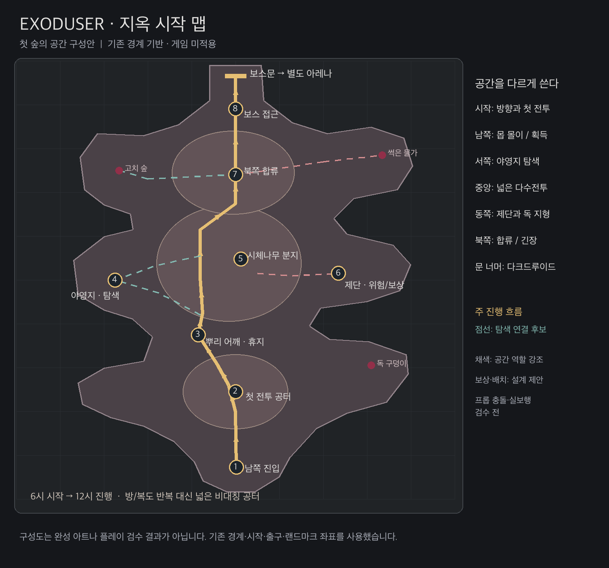
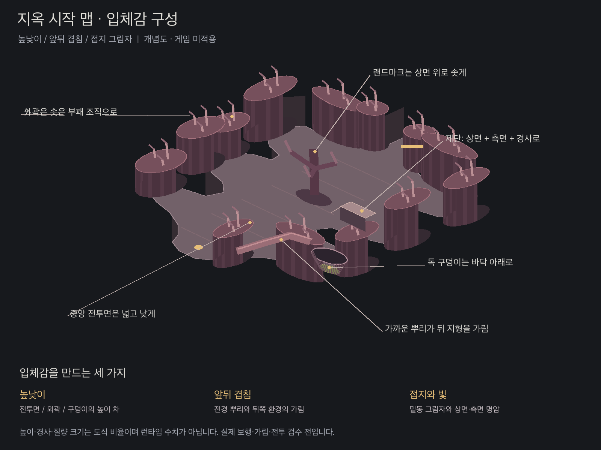

# CH1-1 지옥 시작 맵 — 핵앤슬래시 레퍼런스 공간 구성

상태: **DESIGN CANDIDATE / 게임 미적용 / 실제 이동·전투·시각 인수 전**.

2026-10-04 사용자 음성 요청에 따라, 디아블로 등 핵앤슬래시 게임을 참고하여 지옥에서 시작하는 첫 맵의 공간 구성을 작성했다. 첫 대상은 현재 CH1-1 썩은 숲이다. 아래 신규 역할·보상·연결은 설계 제안이며, 기존 구현 상태와 구분한다.

## 1. 레퍼런스를 공간으로 옮기는 기준

| 확인한 개발 자료 | 적용할 원리 | EXODUSER에 적용하는 방식 |
|---|---|---|
| 디아블로 IV 베타 회고: 반복 되돌아가기 감소, 주요 목표를 주 경로 가까이 배치 | 탐험 이후 진행이 이어져야 함 | 서쪽 탐색 연결 후보는 중앙 분지로 재합류. 보스 접근 목적은 북쪽 랜드마크로 읽힘 |
| 디아블로 IV 환경 제작: 실제 게임 카메라에 맞춰 디테일을 더하거나 빼며 플레이 공간 가독성 확보 | 전체 평면도와 플레이 화면을 함께 설계 | 중앙은 넓고 낮은 피부 전투면. 부패한 생체나무·뿌리·독 구덩이는 외곽과 측면에 묶음 |
| PoE2 Act 3 개선 공지: 접근 불가 문으로 이어지는 긴 막다른 길 문제 수정 | 긴 탐색은 도달 목적이나 반환 수단이 필요 | 길 끝에 의미 없는 빈 공간을 만들지 않음. 야영지·고치 숲·썩은 물가의 역할과 보상을 구별 |

이는 자료에서 도출한 설계 원리다. 여러 게임의 맵이 모두 같다는 결론이나 개별 맵의 실측 결과가 아니다. 기존 [Diablo형 필드 재구축 계획](DIABLO_FIELD_REBUILD_PLAN_20260923.md)의 넓은 비대칭 분지·짧은 전이·연속 외곽 원칙을 현재 첫 숲에 연결한다. 별도 Rootworld QA 맵 좌표를 본편에 가져오지 않는다.

자료:

- [디아블로 IV 던전 동선 개선](https://news.blizzard.com/en-us/article/23938289/diablo-iv-open-beta-retrospective-transforming-feedback-into-change)
- [디아블로 IV 환경 제작](https://news.blizzard.com/en-us/article/23788294/diablo-iv-quarterly-updatemarch-2022)
- [PoE2 Act 3 지역 개선](https://www.pathofexile.com/forum/view-thread/3748698)

## 2. 실제 경계와 공간 역할

구성도의 외곽선은 `assets/map/ch1/production_finish/layout.js`의 53점 boundary 그대로다. 200×200 타일, 타일 40px인 현재 본편을 기준으로 한다. START `(100.5,185.5)`, 중앙 시체나무 `(102.5,90.5)`, gate y5 / exit y7은 이동시키지 않았다.

| 번호 | 기존 공간 / 앵커(tile) | 구성할 플레이 경험 | 공간의 차이 |
|---|---|---|---|
| 1 | south_entry / `(100,185)` | 지옥에 도착, 북쪽 진행 방향과 첫 적 인지 | 남쪽 문턱에서 피부 공터로 시야가 열림 |
| 2 | first_clearing / `(100,151)` | 다수 적 몰이·첫 획득·장비 비교 | 넓은 저대비 바닥, 측면 독 지형과 비대칭 개방 |
| 3 | root_bend / `(83,125)` | 이동·짧은 휴지·야영지 발견 | 바닥 폭과 시선 방향 변화. 새 좁은 복도를 만들지 않음 |
| 4 | west_camp / `(45,100)` | 생존 흔적 탐색·국소 교전·보상 목적 | 낮고 긴 외곽 뿌리와 버려진 야영지. 재합류 후보 연결 |
| 5 | corpse_basin / `(102,90)` | 넓은 중앙 다수전투·빌드 효과 확인 | 기존 시체나무 양쪽 우회와 열린 여백. 중앙 장애물 추가 없음 |
| 6 | east_terrace / `(147,97)` | 위험을 읽고 제단에 접근·탐색 보상 | 기존 서쪽 경사로를 사용하는 고저차. 신규 피해 지형은 이번에 구현하지 않음 |
| 7 | north_fork / `(100,52)` | 북서·북동 탐색 후 북쪽 접근으로 합류 | 서쪽 고치와 동쪽 썩은 물가의 서로 다른 실루엣 |
| 8 | north_exit / `(100,22)` | 관문 인지·보스 접근의 긴장 | 외곽 질량이 북쪽 문을 프레이밍. 확정 통행 여백 보존 |

문 너머는 기존 별도 보스 아레나와 다크드루이드 배정이다. 구성도에 새 보스방을 필드 안쪽으로 삽입하지 않았다. 지옥의 표현은 건강한 자연숲 대신 피부 바닥·낮은 동맥·부패 목질·생체 조직으로 통일하며 [현행 맵 콘셉트](맵디테일.md)를 따른다.

## 3. 동선과 진행 조건

- 황색 선은 남쪽에서 북쪽으로 향하는 **방향 안내용 후보선**이다. 모든 필수 전투를 생략하고 곧장 보스문을 통과하는 공략 경로가 아니다.
- 현재 [지역 클리어 게이트](REGION_CLEAR_GATE_20260930.md)의 **4지역 전부 클리어** 조건을 유지한다. 남서·남동, 북서·북동에 있는 각 담당 앵글러와 지역 전투를 완료한 뒤 관문으로 수렴해야 한다. 사이드의 추가 보상 선택과 필수 지역 클리어는 별개다.
- 서쪽 야영지 점선은 진입 후 중앙으로 재합류하는 후보다. 동쪽 제단은 기존 서측 경사로로 접근하고 복귀한다. 제단 반대쪽 절벽에 새 출입구가 있다고 주장하지 않는다.
- 고치 숲과 썩은 물가 점선은 탐색 목적의 방향 표시다. 보상 종류·확률·엘리트 수·트리거·상호작용은 아직 새로 확정하거나 구현하지 않았다.
- 넓은 공터가 서로 이어지는 연속 필드를 유지한다. 각 번호는 방 또는 새로운 벽 경계를 뜻하지 않는다. S자 단일 길, 방→좁은 목→방 반복으로 만들지 않는다.

## 4. 구성도 확인 범위

| 항목 | 실제 확인 | 한계 |
|---|---|---|
| 원본 경계 | 53개 꼭짓점 그대로 사용 | 프롭·언덕 collision 전체를 이미지에 그린 것은 아님 |
| 후보 선분 | 0.25타일 이하 간격으로 boundary 내부 여부 검사: main 779 / west 337 / east 152 / cocoon 218 / pool 273 표본, 외부 0 | point-in-polygon 확인만 수행. 선의 폭·프롭 충돌·ramp·실제 플레이 통행 보증 아님 |
| PNG | 1500×1400, 한글 레이블·범례·미적용 상태를 시각 확인 | 완성 배경, 게임 카메라, 전투 이미지 아님 |
| 코드·에셋 | 런타임 변경 없음, 기존 베이크·NAV·세이브 유지 | 적용·native·청취 인수 없음 |

경계 소스 SHA-256: `94b974df0ea090bd0cedb4f492777194e3b5938bcace6a7db2fd879b89a20dab`.

## 5. 제작 연결

이 구성도를 MASTER 단계 후보로 사용한다. 이후 LEFT/RIGHT/TOP/SOUTH 외곽 질량 → 중형 접합 → 피부 바닥과 접지 → 실제 다수전투 공간 → 랜드마크 → 작은 이야기 디테일 → 8카메라/기술 검수 순으로 진행한다. 기존 베이스와 레이어를 부분 수정하며, geometry 변경이 필요하면 해당 LOCK·실제 프롭·4지역 진행을 대조한다. 구성도만으로 production placement 또는 시각 PASS를 확정하지 않는다.

## MAP PRODUCTION REPORT

| 구분 | 이번 결과 |
|---|---|
| STAGE | CH1-1 썩은 숲 / MASTER 구성 후보 |
| MASTER | 현재 53점 silhouette / 8개 region 역할 / 남북 방향 / 서·동 탐색 후보 |
| OUTER MASS | LEFT·RIGHT: 연속 부패 고목, TOP: 관문 프레임, SOUTH: 진입 문턱의 설계 의도. 새 외곽 제작·hole 제거 없음 |
| LARGE | 기존 생체나무·시체나무 활용 의도. 신규 원화·composite·overlap 변경 없음 |
| MEDIUM | 뿌리·조직 연결 의도. 새 접합 제작·잔여 hole 검수 없음 |
| GROUND | 공통 피부 바닥·낮은 동맥·기존 접지 유지. 새 texture 변경 없음 |
| PLAYABLE | 넓은 첫 공터·중앙 분지 / 뿌리 어깨 travel·breathing / 북쪽 threat. 실제 이동·전투 가독성 검수 전 |
| LANDMARK | 기존 시체나무·야영지·제단·고치·물가. 좌표 변경 없음 |
| CAMERA QA | START / EARLY / ARENA / SIDE L / SIDE R / LANDMARK / LATE / EXIT 모두 게임 화면 검수 전 |
| TECH QA | candidate 선분 boundary 검사만 수행. collision / pageerror / 404 / seam / loading / performance 새 검사 없음 |
| FILES | 본 문서·PNG·게임 콘텐츠 초안의 연결. concurrent/unrelated 파일 쓰기 없음 |
| GIT | 설계 문서·PNG 소유 범위에 한정하여 보존. 런타임 배포 없음 |
| VISUAL VERDICT | **RETOUCH — 구성도 후보; 게임 환경 PASS 아님** |
| NEXT PASS | 실제 프롭·ramp·4지역 전투 동선과 후보선 대조, 현재 베이스에서 외곽 질량과 전투 가독성 검수 |

## 6. 입체감 보충 — 사용자 음성 교정

사용자는 앞선 구성도의 부족한 기준을 **입체감**으로 명확히 했다. 평면 동선도와 함께 아래 깊이 관계 도식을 작성했다. 실제 게임의 지형·높이·렌더링을 이번에 변경한 것은 아니다.

| 표현 | 구성할 관계 | 구현 시 보존할 조건 |
|---|---|---|
| 외곽 높이 | 넓고 낮은 전투면보다 부패 고목·생체 조직이 솟아 있음. 상면과 수직 측면 명암 분리 | 본편 NAV·중앙 전투 여백 보존. 도식의 원통형 기호는 깊이 설명용이며 생산 아트 형상으로 채택하지 않음. 최종 외곽은 연속된 불규칙 mass로 연결 |
| 독 구덩이 깊이 | 지면의 찢어진 입구 → 수직 내벽 → 낮은 독액 표면 | 기존 구덩이 위치·충돌·피해 계약 보존. 새 hazard 또는 실제 z 수치 확정 없음 |
| 제단 단차 | 상면·측면·접지와 서쪽 경사로가 함께 읽힘 | 기존 hill·ramp 수학과 통행 계약 보존. 도식의 높이 값으로 런타임을 덮어쓰지 않음 |
| 전경 가림 | 가까운 뿌리/가지는 먼 환경과 겹치며 거리감 형성 | 실제 플레이어·적·탄 가독성, 기존 foreground 플래그·페이드 계약 대조 필요 |
| 접지 그림자 | 밑동과 바닥 사이 접촉, 상면·측면의 밝기 차 | 북서 키라이트/남동 그림자 현행 SSOT와 같은 기준으로 검수 |

도식의 투영·높이·기호 크기는 설명용 비율이다. 실제 게임 카메라나 높이 데이터의 측정 결과가 아니다. 원형 질량 반복·asset island·중앙 가림은 공통 제작 가이드가 금지하므로 최종 생산 아트로 그대로 옮기지 않는다. 외곽 명암과 깊이를 실제 베이스에서 만들어야 한다.

이번 보충의 MAP PRODUCTION REPORT는 위 표와 같다. 추가 FILES는 본 문서와 깊이 관계 PNG, CAMERA QA는 도식 확인만/게임 미실시, TECH QA는 런타임 변경 없음, VISUAL VERDICT는 **RETOUCH — 깊이 관계 개념도, 완성 환경 아님**이다. NEXT PASS는 실제 카메라에서 상면·측면·구덩이·가림·접지의 깊이 차와 다수전투 가독성 대조다.

## 7. 실제 코드 보강 상태

10월4일 사용자 “게임에 입체감 / 레퍼런스대로” 후 [제단 도랑 내벽 코드 보강](CH1_ALTAR_MOAT_20261001.md#6-2026-10-04--게임-렌더러의-수직-내벽-보강)을 직접 적용했다. §1~6의 구성도 자체는 여전히 설계 후보이며 새 동선/전체맵이 게임에 반영된 것은 아니다. 코드 변경은 기존 도랑 내벽 한 슬라이스; 실제 실행 앱 반영·게임 화면 인수·전체 입체감 완료는 미확인이다.
