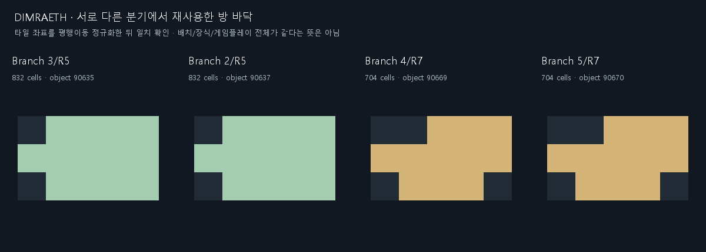
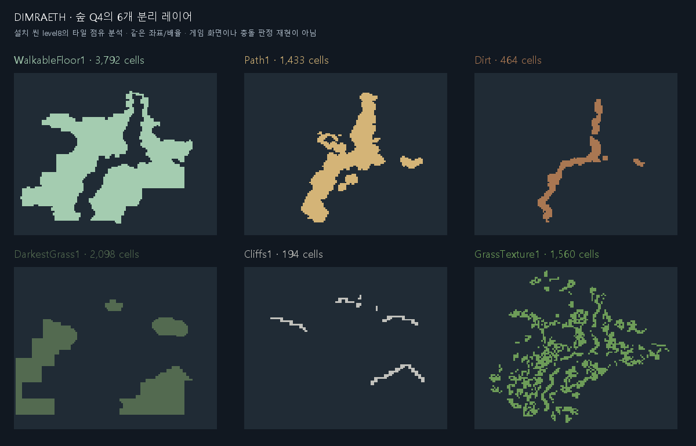

# Dimraeth 맵 구조 조사 및 EXODUSER 적용안

작성: 2026-09-16 · 상태: **조사 완료 / 적용안 제안 / production 미적용**

## 1. 결론

가장 유용한 참고점은 **수작업 구역의 재사용, 지형 레이어 분리, 플레이 공간과 배경 경관의 분리**다. EXODUSER에는 이를 바탕으로 **구역 모듈을 빌드 시 조합하고 배경·충돌 데이터를 함께 저장하는 생성 파이프라인**을 제안한다.

Dimraeth 공식 소개는 수작업 픽셀 월드를 명시한다. 개발자 Shindaru도 Steam의 9월 7일 답변에서 절차 던전 구간은 아직 구현하지 않았다고 설명했다. 따라서 아래 제안은 Dimraeth의 랜덤 생성 알고리즘을 발견했다는 뜻이 아니다. [공식 소개](https://store.steampowered.com/app/2402680/Dimraeth/), [개발자 답변](https://steamcommunity.com/app/2402680/discussions/0/588436698285028269/).

## 2. 조사 범위와 근거 수준

| 항목 | 확인 내용 | 한계 |
|---|---|---|
| 설치 경로 | `E:\steam\steamapps\common\Dimraeth` | 원본 읽기만 수행 |
| 엔진 | Unity `6000.0.61f1`, IL2CPP, metadata version `31` | C# 원본/네이티브 메서드 본문을 복원하지 않음 |
| 씬 목록 | BuildSettings의 씬 26개 중 환경 씬 5개 조사 | 26개에는 메뉴/벤치마크가 포함되므로 맵 수로 해석 금지 |
| 구조 근거 | Unity GameObject/Transform/Tilemap 직렬화 레코드와 타일 좌표 | 모든 커스텀 MonoBehaviour 필드를 읽을 수 있는 것은 아님 |
| 기호 근거 | IL2CPP 메타데이터의 타입·필드·메서드 이름 | 이름만으로 알고리즘·실행 순서·성능을 확정하지 않음 |
| 화면 근거 | 타일 점유 좌표로 만든 분석 도표 | 실제 게임 실행 화면/전체 충돌 재구성이 아님 |
| 실행 검증 | 이번 조사는 정적 파일 분석 | Dimraeth 플레이·프레임 성능·EXODUSER 적용 QA 미실행 |

### 씬별 정적 집계

| 파일 | 씬 | Tilemap 객체 | 레이어 전체 타일 항목 | SpriteRenderer 객체 |
|---|---|---:|---:|---:|
| level2 | TheLostCaverns | 87 | 84,336 | 4,008 |
| level8 | WildwoodForestPartI | 128 | 203,883 | 17,552 |
| level10 | WildwoodForestCorrupted | 26 | 41,421 | 3,143 |
| level20 | TheGoblinCaves | 104 | 95,214 | 6,585 |
| level25 | TheForestThrone | 46 | 89,926 | 953 |

타일은 레이어 사이에서 중복될 수 있다. 객체 집계에는 비활성 객체와 장식/VFX 등이 포함될 수 있다. 위 숫자는 고유 이동 타일 수, 동시 표시량 또는 draw call 수가 아니다. 파일 SHA256과 근거 레코드는 [evidence.json](reference/dimraeth_20260916/evidence.json)에 보관한다.

## 3. 실제로 확인한 구조

### 3.1 구역에 역할을 부여하고 방 바닥을 재사용한다

동굴에는 `Q1 Spawn`, `Q2 Hall`, `Q3 Statue`, `Q4 Crystal Cavern`, `Q7.5 Hand Vista`, `Q10 Arena` 같은 그룹이 있다. 고블린 동굴에는 `Branch 1`~`Branch 5`, `R0 Hub`, `Q1 Entrance`, `Q2 Goblin King`이 있다. 이름과 계층은 시작·중심·전투·조망 구역을 구분한 제작 구조를 보여준다. 전체 실제 이동 그래프는 추가 검증이 필요하다.

서로 다른 분기의 바닥 좌표를 평행이동으로 정규화한 뒤 정렬·SHA256 비교했다.

| 씬/그룹 | 비교 객체 ID | 동일 점유 셀 | 모양 해시 앞 16자리 |
|---|---|---:|---|
| level20 / Branch 3/R5 ↔ Branch 2/R5 | 90635 ↔ 90637 | 832 | `a85ab519fac06b81` |
| level20 / Branch 4/R7 ↔ Branch 5/R7 | 90669 ↔ 90670 | 704 | `e16b4c7bff7917f2` |

**바닥 점유 모양의 일치**를 확인했다. 방 전체의 그림·적 배치가 같거나 이 방들이 실행 시 무작위 조립된다는 증거는 아니다.



### 3.2 이동 바닥과 길·흙·풀·절벽을 별도로 표현한다

숲 `NavMesh/Grid/Q4/Tilemap1`의 예:

| 레이어 | 타일 항목 | 관찰/적용 의미 |
|---|---:|---|
| WalkableFloor1 | 3,792 | 이동 바닥으로 명명된 기본 면 |
| Path1 | 1,433 | 바닥 전체와 구분되는 시각적 길 |
| Path1/Dirt | 464 | 길 안의 흙 변주 |
| DarkestGrass1 | 2,098 | 넓은 어두운 풀 면 |
| Cliffs1 | 194 | 부분적인 절벽 경계 |
| GrassTexture1 | 1,560 | 풀 질감 세부 |

이동 가능 영역 전체를 길 그림 하나로 칠하지 않는 구조를 참고할 수 있다. EXODUSER에서는 `floor → shadow/soil → edge transition → sparse detail`의 분리 마스크로 연결한다. **경계 거리 기반 블렌딩은 우리 적용 제안**이며 Dimraeth의 내부 생성 알고리즘으로 확인한 것은 아니다.



### 3.3 실제 플레이 공간과 조망 배경이 분리돼 있다

왕좌 씬에는 `ForestThrone (Walkable)`, `ThroneHall (Walkable)`과 `ThroneHallVista`, `ThroneHallVista2`, `VistaGround`, `VistaCliffs`, `VistaCanopy`, `VistaTrees` 계층이 별도로 있다. EXODUSER의 PLAY/RIM/OUTER 및 BACK/MID/FRONT 구조와 잘 맞는다. 좁은 이동 면적 바깥에 큰 숲·절벽·건축 실루엣을 두는 제작 구조를 참고한다.

### 3.4 이동 마스크·경로 그래프·게이트 관련 기호가 있다

| 타입/기호 | 확인된 이름 | 해석 범위 |
|---|---|---|
| WalkabilityMaskManifest | `PixelsPerUnit`, `HighwayNodePixels`, `HighwayEdges`, `RouteGates`, `RuntimeDataResourcePath` | 이동 마스크와 희소 경로 그래프 자료 구조를 시사 |
| WalkabilityMaskWorld | `TryFindRoute`, `RunAStar`, `LineOfSightWalkable`, `ThinToSkeleton`, `BuildGates`, `MergeOpenedGateRegions`, `RouteVersion` | 경로 탐색과 게이트 상태 반영 기능을 시사 |
| MapPortal | `MapA`, `MapB`, `PointA`, `PointB` | 맵 사이 연결 자료를 시사 |
| RandomEventCollider 및 이벤트 기호 | `TryTriggerRandomEvent`, `randomEventCooldowns`, `ResetEventSpawns` | 지형과 별도로 변동 이벤트를 관리할 여지가 있음 |
| TilemapDepthGenerator | `waterTilemaps`, `landTilemaps`, `deepPoints`, `maxDepthDistance` | 물/육지 깊이 처리 관련 도구로 보이며 던전 생성기의 증거가 아님 |

`DungeonManager`, `Generator`라는 단어만으로 절차 지형 생성이 있다고 판단하지 않는다. 위 기호는 랜덤 생성·확률·네트워크 동작 전체를 입증하지 않는다.

## 4. EXODUSER 적용 우선순위

아래는 **새 제안**이다. 현재 구현 상태를 뜻하지 않는다.

| 우선 | 적용 항목 | EXODUSER에서의 방법 | 기대 효과/제약 |
|---|---|---|---|
| 1 | 역할이 있는 구역 모듈 | 전투터·이동구역·휴식구역·랜드마크 주변을 제작하고 연결 소켓으로 조합 | 단일 경로의 폭만 바꾸는 반복을 줄임. 같은 방 실루엣의 연속 사용은 제한 |
| 1 | 충돌과 배경을 한 세트로 출력 | 빌드 시 geometry·오브젝트·배경 청크를 생성/검수하고 같은 variant로 로드 | 베이크된 벽과 실제 이동 경계 불일치를 예방 |
| 2 | 바닥/길/경계/오염 마스크 분리 | 길은 넓은 이동 바닥 안에 표시하고 외곽 큰 덩어리와 지면을 연결 | 경계의 잘린 띠, 바닥에 떠 있는 구조물 개선 |
| 2 | PLAY와 vista 분리 | 구역에 대응하는 큰 외곽 덩어리를 먼저 배치하고 배경으로 베이크 | 이동 폭을 확보하면서 세계 규모감 유지 |
| 3 | 구역 그래프 검증 | 시작→출구, 필수 전투터, 선택 구역을 연결 그래프로 사전 검증 | 고립된 필수 구역이 조용히 삭제되는 문제 예방 |
| 3 | 지형과 이벤트 슬롯 분리 | 검수된 맵의 encounterSlots에 기존 소환굴/이벤트를 조건부 배치 | 배경 재제작 없이 플레이 변주. 기존 스폰 예산/전투 규칙 유지 |
| 후순위 | 희소 경로 그래프 | 실제 AI 경로 비용 측정 후 필요할 때만 별도 검토 | 현재 충돌/AI를 전면 교체할 근거는 없음 |

Dimraeth의 작은 방·좁은 목을 그대로 복제하면 EXODUSER의 다수 몬스터 전투에 맞지 않을 수 있다. 전투 회피폭·캐릭터 반경·필수 진입 폭은 해당 stage LOCK을 따른다. 어택 티켓은 도입하지 않는다. 수천 개의 Unity SpriteRenderer를 브라우저 런타임 객체로 옮기는 방식도 채택하지 않는다.

## 5. 현재 생성기에 연결할 위치

라인은 조사일 스냅샷이며 이후 수정 시 함수명으로 찾는다.

| 위치 | 현재 역할/관찰 | 제안 연결 |
|---|---|---|
| `game.html:16157` `_MAP_COMPOSE` | landmark/mega/rim/handProps/basin/path 등의 구성 | 기존 배치 자료와 호환되는 모듈 출력 어댑터 |
| `game.html:24249` `buildMapCache` | 맵 렌더 캐시 | 생성 결과의 배경을 기존 캐시/청크 계약으로 연결 |
| `game.html:26387` `_tValidateConnectivity` | 시작점에서 닿지 않는 floor를 wall로 변경 | 이 함수 **전에** 모든 필수 구역·소켓 연결을 확인하고, 이후 필수 면적 손실도 검사 |
| `game.html:27215` `_buildWalkPathRLE` | 경로점/선분을 따라 원형 영역을 합침. 기본 최소 폭 70, authoredWidth 최소 폭 18 | 모듈 자체의 비대칭 면과 별도의 연결부를 컴파일. 잠금 stage 폭을 일괄 변경하지 않음 |
| `game.html:27226` `_buildBasinRLE` | 타원형 영역과 출입 연결 생성 | 단일 분지 외에 역할별 region geometry를 공급 |
| `game.html:27260` `_cloneField11` | 200×200 템플릿 복제 및 구성별 tileRLE 선택 | 별도 opt-in 생성 variant 입력 지점 검토 |
| `game.html:27433` `genFromTemplate` | rooms·통로·tileRLE를 런타임 맵으로 변환 | 기존 진입점 유지. **tileRLE와 rooms를 함께 출력**하여 스폰/클리어 메타데이터도 일치 |
| `game.html:28898` `isW` | 타일·오브젝트 등 실제 충돌 판정 | 그대로 사용하고 QA에서 모듈 통로와 충돌체의 간섭 확인 |
| `game.html:55826` `drawMM` | 실제 맵 기반 미니맵 | 생성 variant의 이동 면과 일치하는지 검수 |

`tileRLE`의 에디터 floor 값 `1`은 `genFromTemplate`에서 런타임 floor `0`으로 변환된다. 이 표현 차이를 어댑터에서 명시해야 한다. `genGauntlet`은 폴백 용도로 유지한다.

CH1-1은 기존 64개 배경 청크와 canonical collision이 짝을 이룬다. 같은 배경 아래에서 지형만 무작위 변경하면 안 된다. 새 형태에는 대응 배경을 함께 생성해야 한다.

## 6. 구체적인 1차 구현안 — 아직 미구현

### 입력/출력 계약 제안

| 제안 필드 | 내용 | 구분 |
|---|---|---|
| regionModules | 역할, 로컬 floor mask, outer footprint, 지면 마스크, 배치 제한 | 새 빌드 입력 |
| sockets | 로컬 위치/방향, 연결 폭, 입구 앞 여유 공간 | 새 빌드 입력. 자동 회전/반전 허용을 뜻하지 않음 |
| regionGraph | 주동선·분기·재합류·필수 노드 | 새 빌드 입력 |
| groundMasks | 길·그늘·오염·외곽 전이 | 새 빌드 입력 |
| encounterSlots | 구역 역할과 기존 스폰 규칙에 맞는 후보 위치 | 새 빌드 입력 |
| seed / variantId / generatorVersion | 동일 생성기 버전/입력에서 동일 결과를 재현 | 새 빌드 메타데이터 |
| collisionHash / bakeId | 지형·충돌과 대응 배경의 짝 식별 | 새 검증 메타데이터 |
| tileRLE / rooms / 스폰·handProps 자료 | 현재 템플릿 및 배치 계약으로 변환 | 기존 런타임 형식에 맞출 출력 |

이 필드들은 설계 제안이며 지금 `game.html`이 읽는다는 뜻이 아니다. `sockets`도 Dimraeth에서 추출한 필드가 아닌 EXODUSER용 제안이다.

### 제작 순서

1. **MASTER PLAN:** 본편 CH1-1과 분리한 썩은숲 테스트 템플릿에 6~8개 역할 구역, 3개 조합 변형을 시범 제작한다. 이는 이번 제안의 실험 범위이며 전역 LOCK 수치가 아니다. 시작은 6시, 출구는 12시, 상단 통로를 보장한다.
2. **LARGE OUTER MASS:** 각 구역 주변 큰 숲/절벽 덩어리와 배경 깊이를 먼저 설계한다. 전체 조립 결과에서도 큰 실루엣이 반복되지 않아야 한다.
3. **MEDIUM CONNECTION:** 소켓을 연결하고 큰 덩어리 사이 틈을 메운다. 모든 구역을 방-복도 반복으로 만들지 않고 기존 topology archetype의 분기/재합류를 사용한다.
4. **GROUND CONNECTION:** 그늘·흙·오염·경계 마스크를 합성해 구조물과 지면을 연결한다. 광원과 시점이 있는 에셋은 회전/반전을 자동 허용하지 않는다.
5. **PLAYABLE/COMBAT:** 기존 stage 폭/반경 규칙으로 이동·회피·다수 적 접근을 확인한다. `_tValidateConnectivity` 전후에 필수 구역과 스폰 도달성을 확인한다.
6. **LANDMARK/CENTER:** 주요 랜드마크 1개, 보조 2~4개라는 가이드 기준과 구역 역할을 맞춘다. 실제 좌표는 테스트 stage 설계에서 정한다.
7. **SMALL DETAIL:** 구조 QA 후 기존 scatter의 비겹침·5타일 간격·방 전체 분산 규칙으로 세부 장식을 배치한다.
8. **CAMERA QA → TECH QA:** 아래 게이트를 통과한 변형만 배경/충돌을 묶어 저장한다. 런타임에서는 검수된 variant를 선택해 `genFromTemplate`으로 로드한다.

### 적용 시 필수 검증 — 이번 조사에서는 미실행

| 게이트 | 합격 조건 |
|---|---|
| 재현성 | 같은 seed·버전·모듈 입력의 출력 일치 |
| 연결성 | START→EXIT, 필수 구역/스폰/소켓의 실제 도달 가능. 정리 함수가 필수 구역을 삭제하면 실패 |
| collision | 타일뿐 아니라 `isW`의 실제 오브젝트 충돌과 캐릭터 반경을 반영 |
| 제작 계약 | 200×200, 남쪽 시작/북쪽 출구, stage LOCK 폭/좌표, scatter 조건 준수 |
| 배경 대응 | collisionHash/bakeId 짝 검증, 벽-바닥 불일치와 청크 이음새 없음 |
| 카메라/전투 | START/EARLY/ARENA/SIDE L/SIDE R/LANDMARK/LATE/EXIT에서 구조와 적 판독 가능 |
| 런타임 | pageerror/asset 404 확인, 로딩과 전투 프레임 시간을 기존 같은 조건과 비교 |

## 7. 기존 SSOT와의 관계

- 선행 읽기: `_MAP_SSOT_INDEX.md`, `EXODUSER_MAP_PRODUCTION_GUIDELINE_v0.9.md`, `MAP_RUNTIME_ARCHITECTURE.md`, `MAP_QA_GATES.md`, `STAGE_SPATIAL_GRAMMAR.md`, `MAP_GRAMMAR_VARIANTS.md`.
- v0.9 제작 가이드가 금지하는 끝없는 S자 spine, 방-복도 반복, scatter부터 시작하는 제작 순서를 새 생성기에 넣지 않는다. 기존 잠금 stage 형상은 그대로 존중한다.
- 과거 공간 문서의 openness 65~72%를 새 목표로 채택하지 않는다. 최신 v0.9에서 면적/밀도 비율은 결과 진단 지표다.
- 구역 연결 폭은 stage LOCK이 우선이다. 일반 예시 수치로 이미 확정된 폭을 덮어쓰지 않는다.
- 이번 문서는 연구 자료다. 기존 stage LOCK, 구현 완료 상태, 전역 생성 규칙을 변경하지 않는다.

## 8. MAP PRODUCTION REPORT

```text
================= MAP PRODUCTION REPORT =================
STAGE: Dimraeth 정적 구조 조사 / EXODUSER 적용안 (실제 stage 제작 없음)

MASTER
- silhouette: 비대칭 구역 조합 제안; 실맵 형상 변경 없음
- regions: 역할 구역 6~8개 시범안; 미구현
- main route: 남쪽 START→북쪽 EXIT 유지 제안
- side spaces: 분기/재합류 구역 제안; 미구현

OUTER MASS
- LEFT: 구역별 큰 외곽 덩어리 제안; 미배치
- RIGHT: 동일
- TOP: 출구 통로 보장 제안; 미배치
- SOUTH: 시작 판독성 확보 제안; 미배치
- major holes: 실제 적용 맵이 없어 미평가

LARGE
- source assets: 기존 EXODUSER 에셋 활용 제안; Dimraeth 아트 런타임 반입 없음
- composites: 빌드 시 합성 제안; 미생성
- overlap: 미평가
- repeated silhouette: Dimraeth 바닥 832/704셀 중복 쌍 확인; 적용안 반복 QA 미실행

MEDIUM
- connections: 연결 소켓/구역 그래프 제안
- remaining holes: 미평가

GROUND
- shadow: 분리 마스크 제안
- contamination: 분리 마스크 제안
- structure integration: 지면 전이 후 bake 제안; 미구현

PLAYABLE
- main arenas: 구역 모듈 제안
- travel space: stage LOCK 폭 유지
- breathing space: 구역 역할로 분리 제안
- threat space: 기존 스폰 예산에 맞춘 encounterSlots 제안
- combat readability: 실행 QA 미실행

LANDMARK
- primary: 가이드의 1개 기준으로 시범 설계 예정
- secondary: 가이드의 2~4개 기준으로 시범 설계 예정
- tertiary: 구조 완료 후 소형 디테일; 미배치

CAMERA QA
- START: 미실행
- EARLY: 미실행
- ARENA: 미실행
- SIDE L: 미실행
- SIDE R: 미실행
- LANDMARK: 미실행
- LATE: 미실행
- EXIT: 미실행

TECH QA
- route: 기존 함수 정적 조사만 완료
- collision: 기존 isW/연결 정리 동작 정적 조사만 완료
- pageerror: 미실행
- 404: 미실행
- seam: 미실행
- loading: 미실행
- performance: 미실행

FILES
- stage-owned: 본 연구 문서, SSOT index의 참고 링크, reference/dimraeth_20260916의 JSON/PNG
- concurrent touched: 없음
- unrelated touched: 없음 (기존 tools/guard.baseline.json 변경 보존)

GIT
- staged: 위 연구 산출물만 대상으로 함
- commit: 연구 산출물 커밋은 저장소 이력 참조
- push: 없음
- deploy: 없음

VISUAL VERDICT: RETOUCH
적용안 미구현/카메라·전투 QA 전의 판정이며 Dimraeth 자체의 품질 판정이 아님.

NEXT PASS: 별도 테스트 템플릿에 모듈/소켓 컴파일러와 배경·충돌 동시 출력을 구현하고 검수.
```
